---
Category:
  - Web
Difficulty: Medium
Platform: HackTheBox
Status: 3. Complete
tags:
  - MySQL
  - addslashes
  - format-string
  - real_escape_string
  - vsprintf
  - SQL-Injection
---
>[!quote]
> I heard that `*real_escape_string()` / `addslashes()` functions protect you from malicious user input inside SQL statements, I hope you can't prove me wrong...


# Set up

- 

# Information Gathering

The challenge starts showing us just this simple PHP code that accepts a POST parameter, sanitizes it and then tries to perform a SQL query.

```php
<?php require 'config.php';

class db extends Connection {
    public function query($sql) {
        $args = func_get_args();
        unset($args[0]);
        return parent::query(vsprintf($sql, $args));
    }
}

$db = new db();

if (isset($_POST['pass'])) {
    $pass = addslashes($_POST['pass']);
    $db->query("SELECT * FROM users WHERE password=('$pass') AND username=('%s')", 'admin');
} else {
    die(highlight_file(__FILE__,1));
}
```

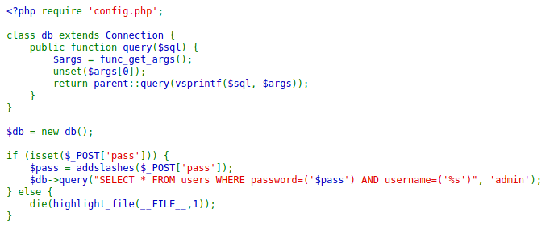

This code looks secure, but is it really?

Let's investigate the code better and try to understand what it does exactly.

1. First, the code **requires a config** file whose **content is unknown** to us.
2. Right after it defines a db class having a public function called `query`. The function accepts an argument, it divides it into different elements contained within the `$args` array, it clears the first `$args` element and finally **returns the results of a query composed using the `vsprintf()` function**.
3. Then it instantiates a `$db` object and checks if the `pass` POST parameter is set. If it's not, it prints the current page, otherwise it takes the content of the `pass` parameter, **sanitizes** it and finally it calls the `query` function **inserting the submitted input within the SQL query**.

Ok, everything's clear for now.

To better analyze the behavior of the code, let's create a local copy and add some debugging information.

```php
<?php

class db {
    public function query($sql) {
        echo "query: " . $sql . "<br>\\n";
        $args = func_get_args();
        echo "Args: " . $args[0] . "<br>\\n";
        unset($args[0]);
        echo "Num Args: " . count($args) . "<br>\\n";
        echo "Args: " . $args[1] . "<br>\\n";
        return vsprintf($sql, $args);
    }
}

$db = new db();

if (isset($_POST['pass'])) {
    echo "Pass: " . $_POST['pass'] . "<br>\\n";
    $pass = addslashes($_POST['pass']);
    echo "Pass after addslashes: " . $pass . "<br>\\n";
    $res = $db->query("SELECT * FROM users WHERE password=('$pass') AND username=('%s')", 'admin');
    echo "Res: " . $res . "<br>\\n";
} else {
    die(highlight_file(__FILE__,1));
}
```

We can remove both the `require` instruction as well as the definition of the parent `class Connection` and the `parent::query` function because we are not interested in executing the actual query, **we just want to analyze input behaviour**.

For testing purposes we can fire up an easy and fast php server using the `php -S IP:port` command and then browsing to that specific IP and port to verify that the PHP page is correctly hosted.

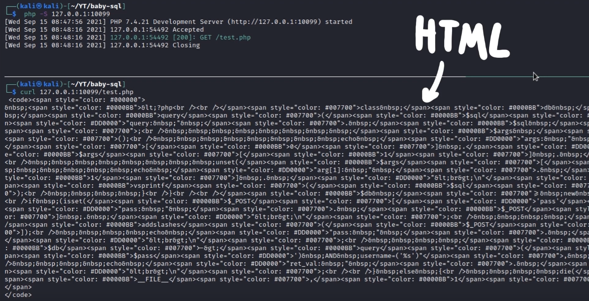

Good, the page works correctly! Let's see what happens when we send the `pass` parameter.

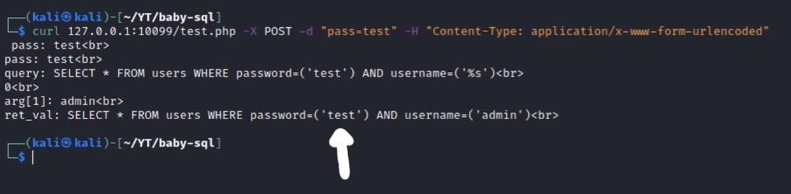

Makes sense, it is **inserted within the query and used as a password**. What happens if we insert a basic SQL injection payload instead?

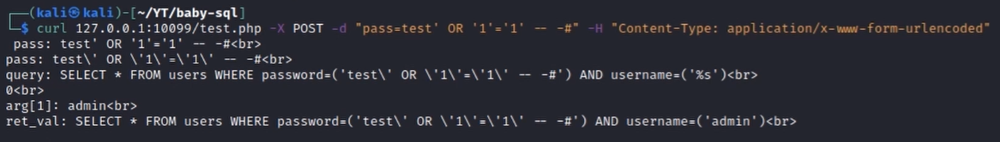

Mmmm... Interesting. **Quotes are escaped** after having been processed by the `addslashes()` function.

As mentioned within the official PHP documentation:

>[!info]
> addslashes returns a string with backslashes added before characters that need to be escaped. These characters are:
>- **single quote** (`'`)
>- **double quote** (`"`)
>- **backslash** (`\\`)
>- **NUL byte**

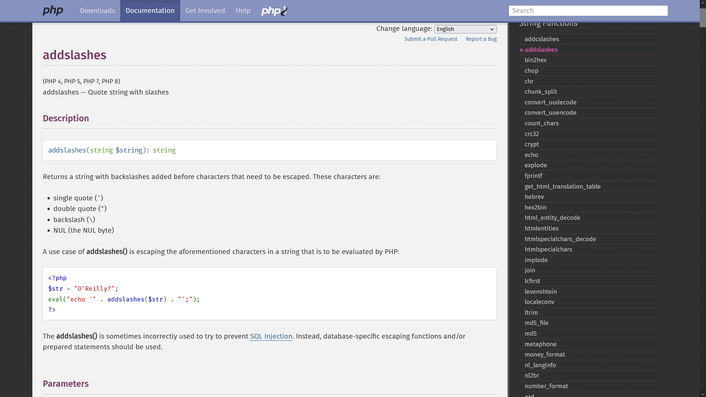

We can verify it by passing those symbols within the `pass` parameter.

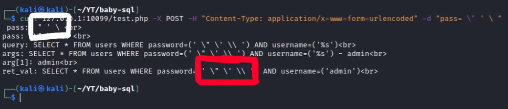

In the current situation the limit imposed by the `addslashes()` function **prevents us from escaping from the query and executing a sql injection**, however there is **still a function that is known to be vulnerable in other languages** like C and C++ and that perhaps **can help us break the restrictions**.

>[!info]
> `vsprintf` returns a formatted string. It operates as `sprintf()` but accepts an array of arguments. [...] A conversion specification follows this prototype:
`%[argnum$][flags][width][.precision]specifier.`
> 

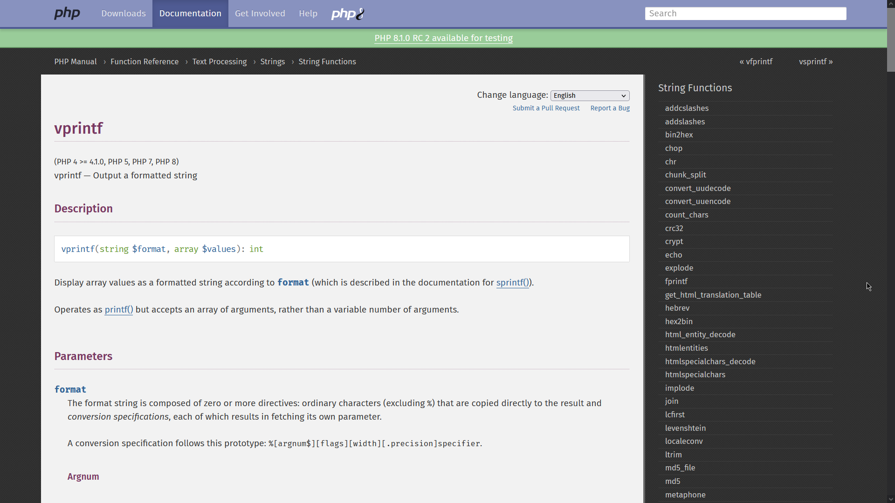

**Format strings** are special strings containing **placeholders** that will be substituted with future variables and that define in which format the variable will be processed and printed. They exist in almost every programming language: in python [^1], in C [^2], in PHP [^3], and so on.

[^1]: https://docs.python.org/3/tutorial/inputoutput.html#tut-f-strings
[^2]: https://devdocs.io/c/io/fprintf
[^3]: https://www.php.net/manual/en/function.fprintf.php

In our case for example `%s` is the placeholder that will be **substituted** with `$arg`.

# The Bug

Looking carefully at the source code however it is possible to notice that **we can control the format argument** through the pass parameter because the **symbols used to define conversion specification strings** (`%` and `$`) are **not sanitized** by the `addslashes()` function (which considers only `'` `"` and `\\`).

Continuing to read the documentation it is possible to find a **special flag** that allows **padding the result with arbitrary characters**.

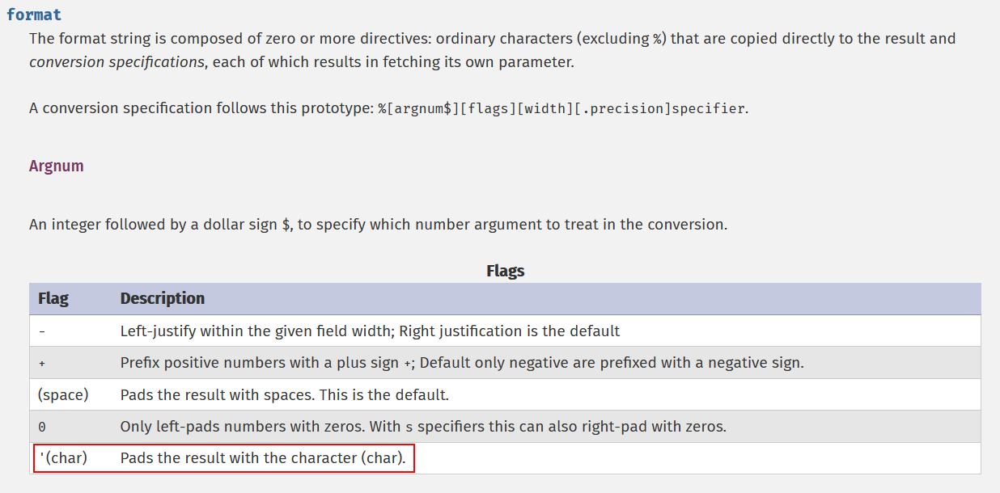

Since our input has already been sanitized when it is processed by the `vsprintf()` function, **we can inject any arbitrary character** and basically evade the query!

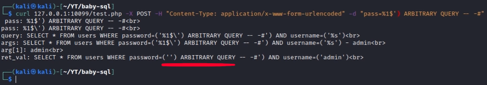

# Exploitation

Ok, now we can carry out our sql injection attack against the real target without big problems. Let's fire up **Burpsuite** and discover which kind of SQL Injection attacks we can perform.

**Basic UNION** queries seem **useless** because results are not shown within the server response.

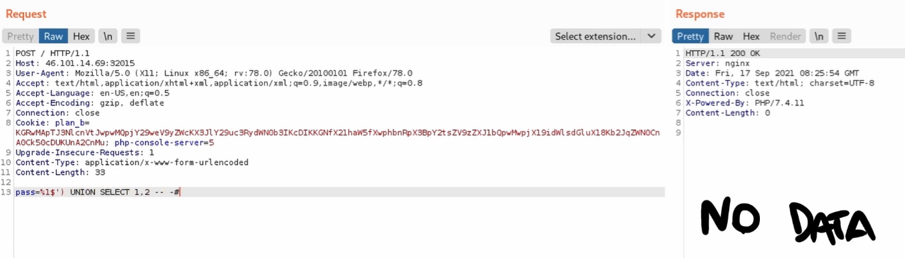

**Time-based** attacks **might work**, the server replies after the desired time so it may be possible to enumerate db data using timing.

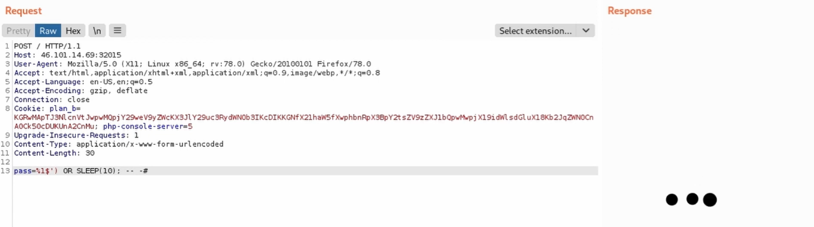

However the fastest technique is to execute arbitrary queries and **exfiltrate the results using error messages** since the server replies with verbose errors.

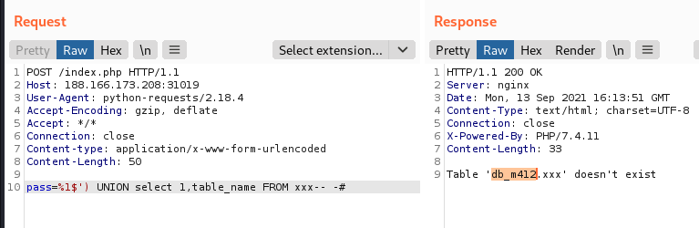

Oh, we also already got the name of the DB currently in use, cool!

First let's extract all the tables from the database. Let’s use the `extractvalue()` and `concat()` to execute the query and **extract its results within the errors**.

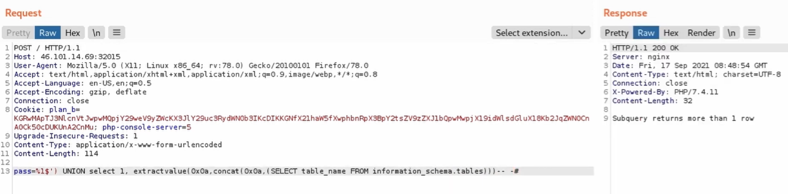

*Subquery returns more than 1 row*

That’s right, when using **error-based** SQL injection **results must be returned in one single row**, while the query we have performed returns a row for every table found. Let’s fix this by **grouping and concatenating** all the results within a single one.

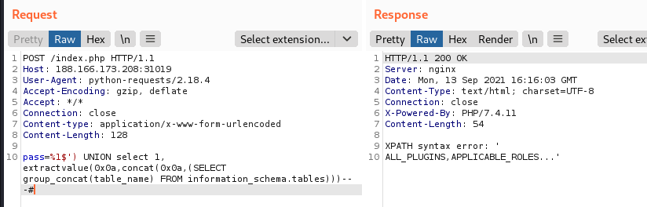

Shish, there are too many tables and the **output is cut off**. Let's try to introduce a `WHERE` statement to filter out undesired results.
Because we don't want to deal with other quotes or double-quotes, we can use the **hexadecimal representation** to specify filters. In this way we can extract only the tables contained within the desired database.

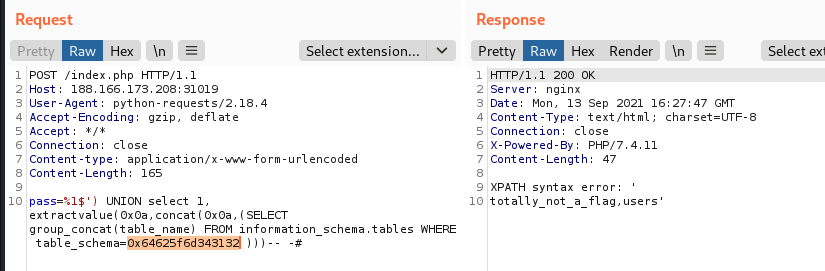

Nice, `totally_not_a_flag` sounds very interesting, let's enumerate its columns in the same way as before.

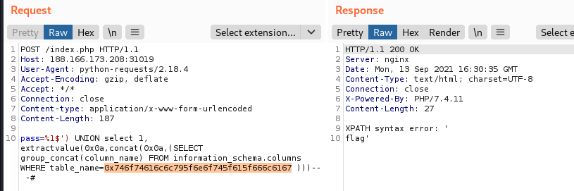

Mmmm… A single column named `Flag`: it sounds even more interesting this time.

Let's see what's contained inside this table:

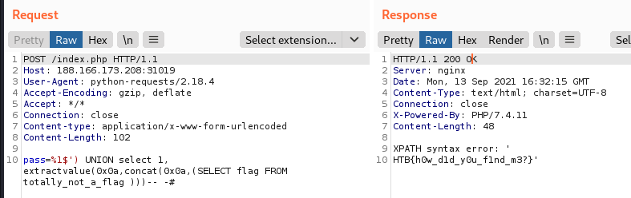

This time `addslashes()` doesn't protect you from malicious user input I guess.

# Flag

>[!success]
>`HTB{h0w_d1d_y0u_f1nd_m3?}`

# Video Writeup

<iframe width="660" height="415" src="https://www.youtube.com/embed/_ay4RyGzduw" title="YouTube video player" frameborder="0" allow="accelerometer; autoplay; clipboard-write; encrypted-media; gyroscope; picture-in-picture" allowfullscreen></iframe>

