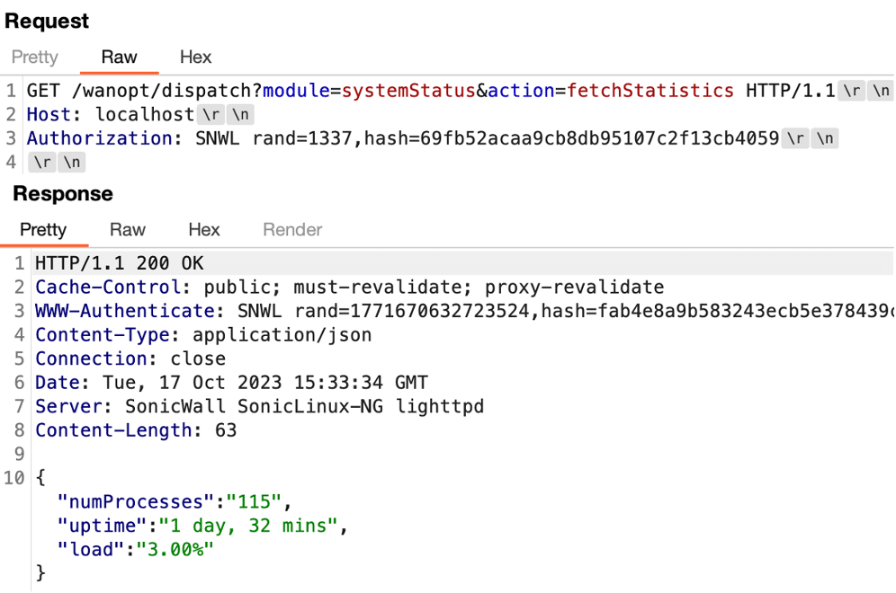

# SonicWall WXA – Authentication Bypass and Remote Code Execution Vulnerability

## Highlights

> The root of the vulnerability lies in the fact that the appliance exposes a dispatcher web service that leverages a hardcoded secret key to authenticate users invoking the API interface. An attacker that has reverse engineered the dispatcher service can recover this hard coded secret key and leverage it to authenticate to the service on all other instances of the WXA appliance.
> [View Highlight](https://read.readwise.io/read/01hhktnbrkwbnxrv3d0jyzrcvn)

> After successfully authenticating to the WXA appliance, we identified an endpoint that allowed for argument injection when the wget command was invoked. This vulnerability provided the attacker an arbitrary file write primitive, allowing the attacker to write arbitrary files anywhere on the system as the root user account.
> [View Highlight](https://read.readwise.io/read/01hhktp677m1b80myvcr8dy6j2)

> We then analyzed the getResponseHeader function and identified a hard coded secret of “somethingnew”, which was leveraged in a call to the “createSSOKey” function using a hash and rand value that appeared to be retrieved from the Authorization header (See Figure 5).
>  
> [View Highlight](https://read.readwise.io/read/01hhq3jpzgtzsd8rgrne5jfw30)

> We observed that the parseAuthorizationHeaderHash and parseAuthorizationHeaderRead functions read two variables from the Authorization header named rand and hash (See Figure 6).
>  
> [View Highlight](https://read.readwise.io/read/01hhq3kg7e1xs8e551k770fq8y)

> We then observed that the rand value was leveraged with the hardcoded secret in a call to the createSSOKey function. The resulting function computed an MD5 hash of the concatenation of the hardcoded secret with the rand value in the header (see Figure 7).
>  
> [View Highlight](https://read.readwise.io/read/01hhq3mmb6g67g62dsej1dvhnz)

> We then computed a valid hash value based on a rand value of 1337 and the hard coded secret of “somethingnew” we had retrieved from the source code, and the hash value ultimately allowed us to bypass authentication requirements (See Figure 8).
>  
> [View Highlight](https://read.readwise.io/read/01hhq3njgxze1wmxtbp0rr03m0)

> Achieving Remote Code Execution
>  We began examining the post-authentication attack surface of the application and identified an endpoint which invoked the wget parameter with an attacker-controlled URL. This endpoint was vulnerable to argument injection, which allowed an attacker to control both the downloaded data and the path on the disk where the data would be written.
> [View Highlight](https://read.readwise.io/read/01hhq3pv1v4trwcx0hdz6ktxeq)

> 
>  *Figure 9: The source code of the webRequest action in the wpstats module which contained an argument injection vulnerability.*
>  
> [View Highlight](https://read.readwise.io/read/01hhq3q8x27xqag0wqz0v6bgnh)

