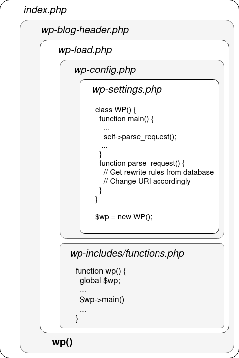

# WordPress for Security Audit


## WordPress Core

WordPress is neatly organized, and its webroot is meant to point to the root folder of the WordPress installation, which is composed of the following files and folders: [](https://read.readwise.io/read/01jh8eka8657r2t781pw9349tp)
 - `index.php` : the entrypoint for all requests on the REST API and the customer-facing part of the website;
 - `wp-admin/` : pages, libraries and resources specific to the admin dashboard;
	 - `admin-ajax.php` : endpoint responsible for handling AJAX requests from the clients browsers, used by some plugins and by the administration dashboard;
	 - `*.php` : all the features the administration dashboard offers;
 - `wp-includes/` : contains all core WordPress libraries code and resources;
 - `wp-content/` : contains the themes, plugins and user-uploaded files;
 - `wp-config.php` : contains most of the configuration data and secrets of the application;
 - `xmlrpc.php` : deprecated, used to integrate WordPress with third-party applications before the REST API was developed;
 - `wp-load.php` : bootstraps WordPress Core;
 - the rest of PHP files are there to handle specific features of WordPress (`wp-login.php` for login, `wp-activate.php` for email verification, …).

The core inner working logic of Wordpress can be summarized in the following [Request Lifecycle](Alex%20Thomas%20-%20WordPress%20Security%20Research%20Series%20WordPress%20Request%20Architecture%20and%20Hooks.md#The%20Request%20Lifecycle) flow.

## Authentication and Authorizations

### Authorizations

WordPress's authorizations are based on a capabilities mechanism [^1]. Users belong to groups, which aggregate specific rights to do specific actions, called capabilities.[](https://read.readwise.io/read/01jh8enndc9j79gafdpg6za7ah) It is also possible to give a capability directly to a user, without assigning it to a role. Roles can inherit from one another. [](https://read.readwise.io/read/01jh8epjf1tby3tjbetd4hk8ph)

The WordPress Core function to check the capabilities of the user initiating the current request is `current_user_can($cap)`. [](https://read.readwise.io/read/01jh8eqys5wcb4mayc65qjaf6t)

Beware of the false friend `is_admin()`, which returns true if the constant `WP_ADMIN` is defined (basically equivalent to checking if the URI is prefixed by `/wp-admin/`, as every page in there set the `WP_ADMIN` constant to true). [](https://read.readwise.io/read/01jh8es4kq8nfxx8q4vatkm81k)

Capabilities are designated by a string identifier (e.g. `"publish_posts"`), and consist in no more than that. Adding capabilities to roles and user is really straightforward in the code, and functions like `add_cap` and `current_user_can` only consist in adding, removing and checking for the presence of strings in a list. [](https://read.readwise.io/read/01jh8etnqjem371sb0wrhvk1ag)

Obtaining one of the following capabilities is interesting: [](https://read.readwise.io/read/01jh8evqdvb6byk04n66wtjnen)
 - `unfiltered_html`: allows you to insert malicious HTML tags (like javascript) in articles, opening the door for an XSS or a CSRF;
 - `install_themes`, `intall_plugins`: allows you to install a theme or a plugin of your choice, equivalent to a free PHP code execution;
 - `edit_themes`, `edit_plugins`: same thing, but with existing plugins and themes.

be careful with themes: a bug in a theme file is included in **every page**!

Plugins can register new capabilities and create roles with the function `add_role()` [](https://read.readwise.io/read/01jh8ex522rc4yp75sxg8r83qd) so a plugin defining new capabilities might contain the following:
```php
function myplugin_define_roles_and_caps() {
	$plugin_role_id = "mypluginrole";
	$plugin_role_displayname = "MyPlugin Role";
	$plugin_caps = array("myplugin_list_X" => true, "myplugin_do_Y" => false);
	// Create the role
	add_role($plugin_role_id, $plugin_role_displayname, $plugin_caps);
	// Grant the administrator with all the capabilities defined by this plugin
	$admin = get_role("administrator");
	if ( $admin ) {
		$admin->add_cap("myplugin_list_X", true);
		$admin->add_cap("myplugin_do_Y", true);
	}
}
 
add_action( 'plugins_loaded', 'myplugin_define_roles_and_caps' );
```
 
This code will be placed in the plugin’s `functions.php` file, which will be described in a following section about plugins. [](https://read.readwise.io/read/01jh8ezkpnezxb5t08fcbv8fpn)
### Authentication

Regarding authentication, WordPress uses a classic approach. [](https://read.readwise.io/read/01jh8f35txeckxn85236dknp6q) You enter your username and password, the password is salted and hashed using MD5 or bcrypt [](https://read.readwise.io/read/01jh8f47x94yy48pa0gpg4ztw7), and these credentials are checked against the ones stored in the database. If they match, WordPress grants you with a cookie named `wordpress_logged_in_[hash]` [](https://read.readwise.io/read/01jh8f4x8j8qthkhang3rw376w).

The content of the `wordpress_logged_in_[hash]` [](https://read.readwise.io/read/01jh8f79096kdgjx5dz0n6e82r) is generated by the function `wp_generate_auth_cookie`, and is relying on session tokens stored along an expiration date in the database. [](https://read.readwise.io/read/01jh8f7np1vbsrrh1frqgsfwcj)

This session token is the only thing preventing us to use directly the password hash of a user to forge a cookie[](https://read.readwise.io/read/01jh8fajtqzhx0hbtbkk2ebm06).


## Database structure

- `wp_users` : stores user data on the CMS, like login, password and registration date;
- `wp_posts` : stores the actual content of posts and pages of your WordPress site, along with information on the pages (title, status, …);
- `wp_comments` : stores the comments left by users on your posts, alongside additional data like the comment date, author account, author IP address, …;
- `wp_terms` : lists the terms (think of it like categories or tags for posts) of your site;
- `wp_term_relationships` : links posts to terms;
- `wp_term_taxonomy` : stores descriptions and links associated with a term;
- `wp_{user,post,comment,term}meta` : These tables follow a specific schema, with 3 main columns: `XXXX_id` acting as a foreign key to the `wp_XXXX` table, `meta_key` naming the attribute and `meta_value` containing its value. Note that these tables can also be used by plugins to add additional metadata like a rating feature.
	- `wp_usermeta` : stores attributes like users’ capabilities* and various options (`rich_editing`, `comment_shortcuts`, …);
	- `wp_postmeta` : stores attributes like the template page of a post;
	- `wp_commentmeta` : can be used by plugins to store any data needed alongside comments;
	- `wp_termmeta` : stores attributes such as a term’s descriptive image, used mainly by plugins;
- `wp_options` : stores the settings of the instance, including:
	- basic data like canonical_url and date_format;
	- mail server credentials;
	- widgets*;
	- user roles* (administrator, author, …) and associated capabilities;
	- ...

Note that some of these fields, marked with a \*, contain lists or dictionaries and are stored as a serialized object. [](https://read.readwise.io/read/01jh8fdqnrzcjjbwhj1z48s3jt)

## Hooks (Actions & Filters)

A **hook** [^2] is a list of functions (*callbacks*), along with a *string identifier* used to refer to the hook. Each callback is given a priority index in the hook when it is registered, which determines its order of execution. When the hook is triggered, callbacks are called in the defined order, one after the other. *Actions* and *filters* are wrapper concepts around the same class, `WP_Hook`. [](https://read.readwise.io/read/01jh8ffxd21h0s86e9zakaez36)


An ***action*** is a type of hook in which no data is passed from one callback to the next without needing a return value. [](https://read.readwise.io/read/01jh8fhb320m3v33y27xwca9rd)

```php
do_action($hook_name, $arg1, $arg2, ...) 
├─ callback1_priority_1($arg1, $arg2, ...) 
├─ callback2_priority_1($arg1, $arg2, ...) 
├─ callback3_priority_2($arg1, $arg2, ...) 
├─ ... 
├─ return ''
```

***Filters*** on the other hand chain the callbacks, and output the value of the final callback. They are meant to filter user-supplied values, or to inject data somewhere. [](https://read.readwise.io/read/01jh8fmbpwm1rmgbr1yqcpn596) They are extensively used when creating menus, where any core class or plugin can register a callback which takes a menu in input, and outputs the menu extended with the options provided by the class/plugin. [](https://read.readwise.io/read/01jh8fnx8pc1gxygwzdnqp1ha4)

```php
apply_filters($hook_name, $value, $extra_arg1, $extra_arg2, ...) 
├─ $value = callback1_priority_1($value, $extra_arg1, $extra_arg2, ...) 
├─ $value = callback2_priority_1($value, $extra_arg1, $extra_arg2, ...) 
├─ $value = callback3_priority_2($value, $extra_arg1, $extra_arg2, ...) 
├─ ... 
├─ return $value
```

Notice that `$value` is updated upon each callback execution, and the updated value is passed to the next callback. [](https://read.readwise.io/read/01jh8fpkrc8wxwe8cn31kcp8w7)

```php
do_action( 'wp_create_file_in_uploads', $file, $attachment_id ); // For replication
```

What does this `'wp_create_file_in_uploads'` action do? 
You start searching for calls to `add_action('wp_create_file_in_uploads'` and `add_filter('wp_create_file_in_uploads'` to see which callbacks are linked to this hook, and… nothing. [](https://read.readwise.io/read/01jh8frtyk2bbbf0kqwarf5rnc)

Some of these hook calls (annotated with a `// For replication` comment) are placed in the code to **act like anchor points** for plugin developers to register actions, to be notified or to tweak the behavior of WordPress to their needs. [](https://read.readwise.io/read/01jh8fv0e15ata3ycw8tf4f24v)

There is a special hook, registered with the name `'all'`, which is executed **every time** an action or a filter is triggered. [](https://read.readwise.io/read/01jh8fvpva1dk5acdzk41yxmjf)

We can see that behind the scenes of every hook is the (in)famous PHP function `call_user_func` or his sibling `call_user_func_array`. [](https://read.readwise.io/read/01jh8g03appcryk5zc4ta12f0h) If a WordPress plugin lets the user decide on the second argument passed to `add_action` / `add_filter` (a.k.a. the callback function name), it could be close to having an arbitrary code execution[](https://read.readwise.io/read/01jh8g0w9day14fkrxk9mcsd4d). 

>[!info]
*actions* and *filters* are just two ways of referring to the same objects of type `WP_Hook` and as such, a hook can act both as an action **and** as a filter. So don’t be surprised to see a mix of `add_action` and `add_filter` referring to the same hook name, it’s intended, and it acts on the same `WP_Hook` object behind the scenes. [](https://read.readwise.io/read/01jh8g38zze148f3erwqgyg8ze)

Below you can find some references to interesting and important actions and filters:
- [WordPress Action and Filter Hooks Relevant to Vulnerability Research](Alex%20Thomas%20-%20WordPress%20Security%20Research%20Series%20WordPress%20Request%20Architecture%20and%20Hooks.md#WordPress%20Action%20and%20Filter%20Hooks%20Relevant%20to%20Vulnerability%20Research)
## Routing & Rewrite Rules

[WordPress Core Request Handling](Alex%20Thomas%20-%20WordPress%20Security%20Research%20Series%20WordPress%20Request%20Architecture%20and%20Hooks.md#WordPress%20Core%20Request%20Handling)

- All the requests related to the customer-facing (*unauthenticated*) part of a WordPress-powered website are rewritten (according to the Apache/Nginx/IIS server configuration) and then managed by the `index.php` file at the webroot. [](https://read.readwise.io/read/01jhg9092anryzc0b7kgwkrxzx)

- Other requests, for example to the backend panel, are not rewritten and are directly handled by the corresponding PHP files, like any basic PHP website. All the files include the core WordPress classes and then immediately check if the user has permission to use the administrative feature. [](https://read.readwise.io/read/01jhg922rp4zqeteb8n8s1g1pd)

In the general case, the request is processed by the web server and lands on `index.php`. 
As WordPress internally decides on the action to take based on each query’s GET parameters, any “pretty” request URI (e.g. `/author/admin`) must be converted to the form `/index.php?var1=value1&var2=value2&...` 

Example: `/author/admin` -> `/index.php?author_name=admin`

This conversion is done in the `wp-include/rewrite.php` file with the help of the `rewrite_rules` option (stored in the `wp_options` table), a dictionary mapping regexps to parameters: [](https://read.readwise.io/read/01jhg94e5bn4mkqhc5byy86cja)
```php
php > var_dump($rewrite_rules);
array(96) {
["^wp-json/?$"]=>
string(22) "index.php?rest_route=/"
["^wp-json/(.*)?"]=>
string(33) "index.php?rest_route=/$matches[1]"
["^index.php/wp-json/?$"]=>
string(22) "index.php?rest_route=/"
["^index.php/wp-json/(.*)?"]=>
string(33) "index.php?rest_route=/$matches[1]"
["^wp-sitemap\.xml$"]=>
string(23) "index.php?sitemap=index"
...
```
 
The request URI is evaluated against each regexp one at a time [](https://read.readwise.io/read/01jhg9568qab3bv99c2ncnxw5z). It translates to the following code path, where a box in a box means the outer file includes the inner file:



>[!important]
>Every route triggers important and interesting hooks using different privileges: [Key Routes and Their Hooks](Alex%20Thomas%20-%20WordPress%20Security%20Research%20Series%20WordPress%20Request%20Architecture%20and%20Hooks.md#Key%20Routes%20and%20Their%20Hooks)
## WordPress APIs

Throughout the years, WordPress has seen 3 evolutions of API systems: **XML-RPC**, **admin-ajax** and the **REST API**. [](https://read.readwise.io/read/01jhg97y851vf7nm11mtqf50kg)

### XML-RPC

Is the oldest of all. It was originally made for integrating your WordPress blog with other blogging sites and applications, in order to receive updates, post comments and do everything you could do on the blog without using the blog’s UI. [](https://read.readwise.io/read/01jhg98seh006favkzhr5ne0f6)

You can interact with a blog’s XML-RPC API by sending HTTP POST requests to a file called `xmlrpc.php` usually located at the webroot of a WordPress server. [](https://read.readwise.io/read/01jhg99nxrvbw4fb7nj5a9bwg3)

As the name implies, the content of the POST request is an XML document describing what you want to do. [](https://read.readwise.io/read/01jhg9advy5tjf04m614zzycjc)

```xml
<?xml version="1.0"?>
<methodCall>
  <methodName>metaWeblog.newPost</methodName>
  <params>
    <param>
      <value>
        <string>YOUR_USERNAME</string>
      </value>
    </param>
    <param>
      <value>
        <string>YOUR_PASSWORD</string>
      </value>
    </param>
    <param>
      <value>
        <string>New Post Title</string>
      </value>
    </param>
    <param>
      <value>
        <string>Post Content</string>
      </value>
    </param>
    <param>
      <value>
        <string>category_slug</string>
      </value>
    </param>
  </params>
</methodCall>
```

This request is passed on to a `wp_xmlrpc_server` class, implemented in `wp-includes/class-wp-xmlrpc-server.php` by default (you could specify your own implementation via the `wp_xmlrpc_server_class` filter). [](https://read.readwise.io/read/01jhg9b6cp7x0rptnjms95yv8v)

The `methodName` value is checked against a large mapping of strings to function names (like `'metaWeblog.newPost'` ⇒ `'this:mw_newPost'` to follow on the example of a blog post creation, where `mw_newPost` is a method of the `wp_xmlrpc_server` class) and the corresponding function is called using the `apply_filters` method. [](https://read.readwise.io/read/01jhg9cghbrv6npgh27py3n97t)

>[!warning] Security issues
>XML-RPC is known for being an open-door to credentials brute forcing (using the `system.multicall` method) and denial of service attacks; [](https://read.readwise.io/read/01jhg9e5bqjms02xmtypr1zx6v)

### Admin-AJAX

It is used by WordPress itself in the UI of the blog. Its main purpose is to be used together with JavaScript to trigger actions and update data on a panel without triggering a full reload of the page. [](https://read.readwise.io/read/01jhg9fa74tm540qr52r2c3q2v)

While it is mainly used in the administration panel part of a WordPress blog, the list of actions handled by the admin-ajax mechanism include two unauthenticated ones (`heartbeat` and `generate_password`), and can be extended by plugins to handle other features. [](https://read.readwise.io/read/01jhg9fww8ysnd1tm6wgjvwbd1)

To interact with this API, a developer needs to send a GET (or POST) request to the `admin-ajax.php` file, located in the `wp-admin` folder [](https://read.readwise.io/read/01jhg9gn3xyr2e2dn3p01qrxp8). The specific action and parameters are provided through GET or POST classic parameters, and the authentication is handled the same way as everywhere else on the blog [](https://read.readwise.io/read/01jhg9h1qpczm9v15t9qq5efk9).

When a request is received and if the `action` parameter value matches with an AJAX action (as defined in `wp-admin/admin-ajax.php` and implemented in `wp-admin/includes/ajax-actions.php`), this action is triggered [](https://read.readwise.io/read/01jhg9jmwq20e8jsj7cz3cfkrc).

### REST API

It is the newest of all API mechanisms on WordPress. It uses JSON to transfer data, and follows the CRUD (Create, Read, Update, Delete) model [](https://read.readwise.io/read/01jhg9kckkkrht3a8ne37qhvs6). Its endpoints are accessible with the URI prefix `/wp-json/`, and plugins can register their own API routes via the `register_rest_route` function. [](https://read.readwise.io/read/01jhg9ksaqcjg1t1zjpps4b4xe)

To ensure that plugins do not conflict with each other or with the core, API routes are composed of a “namespace” and a “path”. 
For instance, in the `/wp-json/wp/v2/posts/123` route (which returns the content of the post with ID 123): [](https://read.readwise.io/read/01jhg9mv3xtkg1n8c957ta96ps)
 - `/wp-json/` is the URL prefix to trigger the WordPress REST API,
 - `wp/v2` is WordPress Core’s namespace,
 - `/posts/123` corresponds to the path.

The Rewrite API will transform this route to `/?rest_route=/wp/v2/posts/123`, as seen in the paragraph about WordPress routing. [](https://read.readwise.io/read/01jhg9ndmms71zh3zr6xp0ed6s)
Two types of authentication are accepted:
 - classic cookie authentication [](https://read.readwise.io/read/01jhg9nzkaxym9dsy53kav7043). However, to prevent CSRF attacks, this authentication needs to be used along with a CSRF nonce [^3], passed in the request header `X-WP-Nonce`. [](https://read.readwise.io/read/01jhg9pmmfvpsc4nvz0a7hrtat)
- basic authentication with an *Application Password*: Recent versions of WordPress have introduced the concept of *Application Password*, which you can generate from your account settings and work like API tokens. [](https://read.readwise.io/read/01jhg9q07qjb0jgtnxz5dhzzfw)

## Themes and Plugins

### Plugins

Plugins on WordPress are located under the `wp-content/plugins/` folder. They are usually contained in their own folder, and are made of at least one main file, named after the plugin, which acts as the entrypoint of the plugin [](https://read.readwise.io/read/01jhj4anj1gphbxdt65qexeckc).

>[!important]
>Plugins gets loaded on **every** subsequent request to the WordPress site. [^4]

They are discovered by WordPress using the `get_plugins()` function in `/wp-admin/includes/plugin.php`.[](https://read.readwise.io/read/01jhj4b8bt2hnzgch7qhgp4bm8)

These files are accessible from the webroot, at `yoursite.com/wp-content/plugins/hello-dolly/readme.txt` [](https://read.readwise.io/read/01jhj4ccx6xzadejqj1dbmhdsh). Plugins downloaded from GitHub or on the WordPress store usually contain a `LICENSE.txt`, `CHANGELOG.txt` or some other standard file which could leak info about the version of the plugin ([WPProbe](httpsgithub.comChocapikk%20-%20GitHub%20-%20ChocapikkWpprobe%20A%20Fast%20WordPress%20Plugin%20Enumeration%20Tool.md) enumerates plugins using this method). [](https://read.readwise.io/read/01jhj4d2rqhypdk2k8828q7kt4)

In order to access query parameters, plugins can use the global PHP variables `$_GET` and `$_POST`. WordPress automatically escapes *quotes* and *backslashes* in these arrays (using the `add_magic_quotes` function, which internally calls PHP's `addslashes` function) before any plugin can use them. [](https://read.readwise.io/read/01jhj4e7smw3v6tgcrj7m6mgnq)

Alternatively, to access GET request parameters, it is possible to register a query variable with the `query_vars` hook, and then to retrieve its value with the `get_query_var` function. [](https://read.readwise.io/read/01jhj4evacgvgz00gvjc10r0kj)

To sanitize these variables, WordPress offers a variety of filtering and escaping functions [](https://read.readwise.io/read/01jhj4fckkjgvfhdx1twmxnes8). To handle file upload, the function `wp_check_filetype` checks the uploaded file's extension and outputs its corresponding MIME type. [](https://read.readwise.io/read/01jhj4g2ft3e04gytep690mey3)

> Non-exhaustive list of WordPress escaping and sanitizing methods (43 methods) [](https://read.readwise.io/read/01jhj4g8dh0qpzhqbhpfwk8fjh)
- `sanitize_email()`
- `sanitize_file_name()`
- `sanitize_hex_color()`
- `sanitize_hex_color_no_hash()`
- `sanitize_html_class()`
- `sanitize_key()`
- `sanitize_meta()`
- `sanitize_mime_type()`
- `sanitize_option()`
- `sanitize_sql_orderby()`
- `sanitize_term()`
- `sanitize_term_field()`
- `sanitize_text_field()`
- `sanitize_textarea_field()`
- `sanitize_title()`
- `sanitize_title_for_query()`
- `sanitize_title_with_dashes()`
- `sanitize_user()`
- `sanitize_url()`
- `esc_attr()`
- `esc_html()`
- `esc_js()`
- `esc_textarea()`
- `esc_sql()`
- `esc_url()`
- `esc_url_raw()`
- `wp_kses()`
- `wp_kses_array_lc()`
- `wp_kses_attr()`
- `wp_kses_bad_protocol()`
- `wp_kses_bad_protocol_once()`
- `wp_kses_check_attr_val()`
- `wp_kses_decode_entities()`
- `wp_kses_hair()`
- `wp_kses_hook()`
- `wp_kses_html_error()`
- `wp_kses_js_entities()`
- `wp_kses_no_null()`
- `wp_kses_normalize_entities()`
- `wp_kses_post()`
- `wp_kses_split()`
- `wp_kses_stripslashes()`
- `wp_kses_version()`


## Themes

Themes, on the other side, are stored in `wp-content/themes` and are made of multiple template PHP files, which will be used to render the pages of the website in place of the default theme, as well as a main file, called `functions.php`. [](https://read.readwise.io/read/01jhj4h6t9wwmcfjh0r672k7xp)

```
example-plugin/ 
├── style.css 
├── index.php 
├── header.php 
├── footer.php 
└── functions.php
```

Themes might include templates for every page type (`author.php` when rendering `/author/<author_username>`, `date.php` when rendering posts by date, `single.php` when rendering a single post, …), as well as three specific templates for the *header*, *footer* and *sidebar* of the blog. The `index.php` file is used to render the pages when the specific template for a page is not found. Theme templates are included and rendered in `wp-includes/template-loader.php`[](https://read.readwise.io/read/01jhj4jre66jq2wyyjz792ahvb). 

All the functions `get_X_template` are defined in `/wp-include/template.php`, and use the `X_template` hooks to retrieve the right template. Themes can manifest themselves in these hooks using the `add_filter` function to declare their own templates. [](https://read.readwise.io/read/01jhj4kherkz7m9sj2khb95qt3)

### Blocks

WordPress also supports “block” templates [](https://read.readwise.io/read/01jhj4mhp1ckhnsyf8c2q09gnr), which are composed of HTML files instead of PHP, and include “blocks” using HTML comment syntax like:
```html
<!-- wp:query-pagination {"paginationArrow":"arrow","align":"wide","layout":{"type":"flex","justifyContent":"space-between"}} -->
<!-- wp:query-pagination-previous /-->
<!-- wp:query-pagination-next /-->
<!-- /wp:query-pagination -->
```
 
These files are parsed using the `WP_Block_Parser` class and then rendered using the `render_block` function in `wp-include/blocks.php`. [](https://read.readwise.io/read/01jhj4mxzd0z3p80e1hw02w47f)

This is a custom template engine, but its attack surface is inexistent as it only processes themes files [](https://read.readwise.io/read/01jhj4n6knxkp5jwmjkpkkvx8h).

## A note on static analysis

PHP has multiple hurdles, such as: [](https://read.readwise.io/read/01jhj4qdcyjd5b384pphpmf3cz)
 - multiple convoluted ways to call a function `f`, like `f()`, `call_user_func("f")`, `"f"()`, `"F"()`, …
 - dynamic typing, with loose comparisons and funny type juggling. This renders calls to `$obj->method()` hard to follow and taint as the static analyzer doesn’t know the type of (or the class implemented by) `$obj`

WordPress, like most of the CMSs, makes use of most of these language features. For example, the frequent use of `call_user_func()` by the hooks which use the name of a function as a string instead of the PHP function object, makes static analysis techniques really painful. [](https://read.readwise.io/read/01jhj4w31gny7kjjkr34a23y7x)

As such, these tools will find trivial source-to-sink paths (like an `add_action($_GET['param1'], $_GET['param2'])`), but might skip over some more convoluted data flows, and you should not rely 100% on them when auditing WordPress or any CMS, be it the core or a plugin. [](https://read.readwise.io/read/01jhj4wscc9jm883vawg2w6d4m)

[^1]: [Wordpress Roles and Capabilities](https://wordpress.org/documentation/article/roles-and-capabilities/); wordpress.org

[^2]: [Wordpress Hooks](https://developer.wordpress.org/plugins/hooks/); developer.wordpress.org

[^3]: [Wordpress Nonces](https://developer.wordpress.org/apis/security/nonces/); developer.wordpress.org

[^4]: [Plugin Loading](Alex%20Thomas%20-%20WordPress%20Security%20Research%20Series%20WordPress%20Request%20Architecture%20and%20Hooks.md#Plugin%20Loading)

