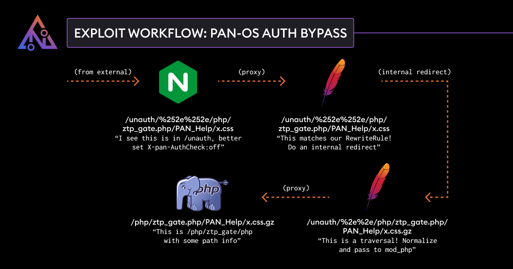

# Nginx/Apache Path Confusion to Auth Bypass in PAN-OS

.png)


## Weird Apache Behavior

If you have been following [🍊 Orange Tsai - Confusion Attacks Exploiting Hidden Semantic Ambiguity in Apache HTTP Server!](🍊%20Orange%20Tsai%20-%20Confusion%20Attacks%20Exploiting%20Hidden%20Semantic%20Ambiguity%20in%20Apache%20HTTP%20Server!.md), you may be suspicious of the above RewriteRule:
```xml
<Location "/">
	# ...
	RewriteRule ^(.*)(\/PAN_help\/)(.*)\.(css|js|html|htm)$ $1$2$3.$4.gz [QSA,L]
	# ...
</Location>
```
 
However, because this RewriteRule is in a location block, this rewrite happens in so-called ["per-dir" context](https://httpd.apache.org/docs/trunk/rewrite/tech.html#InternalAPI), which foils most of the attacks mentioned in the blog post. 
 
However, #Apache still has some interesting implementation details in how it processes this RewriteRule. To explain this better, let's consider this simplified configuration:
 ```xml
<Location "/">
	RewriteEngine On
	RewriteRule (.*)\.abc$ $1 [L]
</Location>
```

This rule strips the .abc extension from the end of a request, so `/foo/hello.html` and `/foo/hello.html.abc` end up requesting the same file. If we send a request to `/foo/hello.html.abc`, what happens in order is as follows:
 - mod_rewrite gets the requested file as `foo/hello.html.abc` and tests it against the rewrite rule.
 - Since the rule matches, mod_rewrite does the substitution and ends up with `foo/hello.html`
 - mod_rewrite then appends a slash as the front to get `/foo/hello.html` and does an "internal redirect" - this involves re-processing the request from the start as if the user had requested `/foo/hello.html` directly.

The fact that Apache issues an **internal redirect** to implement per-directory rewrite rules has a couple of interesting consequences, which are not well documented. 
 
 For example, environment variables set during the original request processing are dropped. Crucially for us, because the request is being processed twice, another effect is that the URL will be *url decoded twice*. 
 
 Any information security professional will know about URL encoding - if we request either of:
 - `/foo/hello.html`
 - `/foo/hello%25html`

We will see the contents of `/foo/hello.html`, since the request is URL decoded before processing. 
 
However, if we double encode and request `/foo/hello%252ehtml`, we will get a 404. This is because Apache only url decodes once, and a file `hello%25html` doesn't exist. 
 
However, if we request `/foo/hello%252ehtml.abc`, we do in fact see the content of `hello.html`! 
 The URL is being decoded twice; 
 - once on the initial request, and 
 - once on the internal redirect. 
 
 If the rule is applied multiple times, this can get even crazier; a request like `/foo/hello%25252ehtml.abc.abc` will work to triple decode the URL, etc.
[View Highlight](https://read.readwise.io/read/01jn1gsp1b0mn94zg3tfkr8sbz)

## The Bug

Let's return to PAN-OS and consider the following URL: `/unauth/%252e%252e/php/ztp_gate.php/PAN_help/x.css`
[View Highlight](https://read.readwise.io/read/01jn1gtbrcnfepxt3tywv8txea)

After the full re-write process, the path results in `/unauth/../php/ztp_gate.php/PAN_help/x.css.gz` which once normalized is `/php/ztp_gate.php/PAN_help/x.css.gz`. 

`mod_php` sees that this looks like a request for a path `SCRIPT_FILENAME=/php/ztp_gate.php` with some path info afterwards (`PATH_INFO=/PAN_help/x.css.gz`), so it will execute `/php/ztp_gate.php`. And since the `X-pan-AuthCheck` header was set to off by Nginx, no authentication is required!



