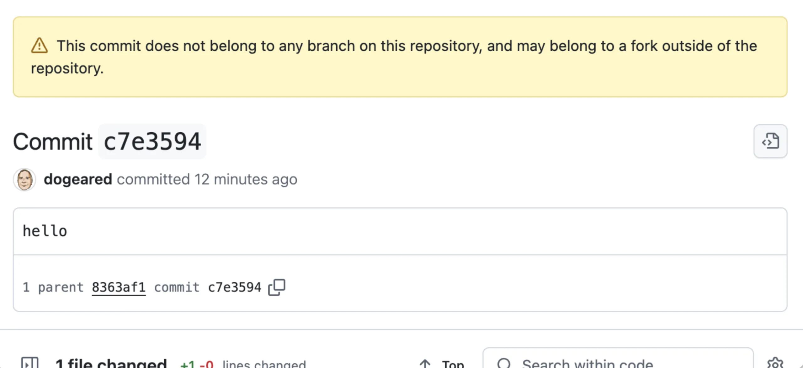

# Reconstructing the TJ Actions Changed Files GitHub Actions Compromise

This post is about a serious security exploit on a popular [GitHub Actions](../../Dev,%20ICT%20&%20Cybersec/Dev,%20scripting%20&%20OS/GitHub%20Actions.md) called [changed files](https://github.com/tj-actions/changed-files) (*tj-actions/changed-files*). About 23,000 GitHub repos use this Action as part of their CI and DevOps workflows. It allows you to track which files have changed across branches and commits. [](https://read.readwise.io/read/01jpwf0hyg6mb1c9a7zjv3xg7x)

An attacker with write privileges on the Action repo made a commit that caused **encrypted secrets to appear in plaintext in the GitHub Action logs**. This could lead to a devastating breach on a public repo where the Action logs are also public. [](https://read.readwise.io/read/01jpwf1b68q60a3tgznwn2x4m8)

## Key factors

The key enabling factors for this attack beyond just having write permissions were as follows:
• Changing existing release tags to point to the attack commit
• Having the attack commit orphaned from any branches, including the main branch

These factors added a bit of obfuscation to hide the attack. [](https://read.readwise.io/read/01jpwf37qzmjk5y5mgzyhhbv6t) However, the attack relied on making an external network call to pull down the attack code, which ultimately led to it being noticed by services that monitor anomalous network activity. [](https://read.readwise.io/read/01jpwf3nccph9ya04syhx175q9)

### On orphaned Git commits

Try this as an exercise. Create a new repo on GitHub and clone it locally. Create a branch and push it up to GitHub. Make a note of the commit hash. Then, delete the remote branch. You can still navigate to that commit, even though it is no longer associated with any existing branch. [](https://read.readwise.io/read/01jpwf4wc7fpj3t8aabd3443e5)

```bash
# Create a local repo and add the GitHub remote you just created
echo "# orhpan-branch-test" >> README.md
git init
git add README.md
git commit -m "first commit"
git branch -M main
git remote add origin git@github.com:dogeared/orhpan-branch-test.git
git push -u origin main

# Create a branch
git checkout -b orphan

# Add a commit and push
echo hello > hello.txt
git add -A .
git commit -m "hello"
git push origin orphan

# Commit is https://github.com/dogeared/orhpan-branch-test/commit/c7e359462f6afc144d7b4da6eb277d0338c675c9

# Delete the branch on GitHub and browse the link
```



This is an **orphaned Git commits**

### On GitHub Release tags
Unfortunately, developers sometimes assign some magical thinking to release tags on GitHub. If we’re told to use `v35` of a particular release, we reference that tag and assume that’s what we’ll be getting. Under normal circumstances, that is a reasonable assumption but GitHub tags are just convenient strings pointing to a particular commit [](https://read.readwise.io/read/01jpwf6x9j3pvyfdv9zedr6ysx)

```yaml
- name: Get changed files 
	id: changed-files 
	uses: tj-actions/changed-files@v35
```


The critical bit is the very last line, where a particular tag of the GitHub Action repo is referenced. The attacker **deleted the original version tags** and relocated them to the malicious commit, which was the orphaned commit. [](https://read.readwise.io/read/01jpwf8c22g63kytyyvy0rm5th)

```bash
git tag v35
git push --tags
```


The attacker could “point” people to the malicious commit simply by updating the `changed-files` GitHub Action code's repo. [](https://read.readwise.io/read/01jpwfa9rnbg4tgstm669aday9)

### On Leaking Secrets

Secrets are often required for building scripts to interact with other services or to provide necessary keys for building and running tests. [](https://read.readwise.io/read/01jpwfb4gpkz1ej2z54eqqn5wk)

The attacker altered TJ’s `changed-files` GitHub Action to download a script from a remote location, save it to a local file on the virtual machine the GitHub Action was running on, and then execute that script. [](https://read.readwise.io/read/01jpwfcgqkz2r5hm3s37yjatw0)

The above script, executed as root using the sudo command, interrogates process memory to find the decrypted secrets and output them into the Actions log. This is very damaging as the GitHub Actions logs on public GitHub repositories are also public by design. [](https://read.readwise.io/read/01jpwfe7kymgfbp49rf8b234cj)

## The Exploit in Action

I created a set of repos to demonstrate this exploit configured as closely as possible to the attacker's setup.
The first Git repository is where the custom GitHub Action is defined: [tj-changed-files-action-goof](https://github.com/snyk-labs/tj-changed-files-action-goof). [](https://read.readwise.io/read/01jpwfg7dxma5vj0nvpgym814z)

