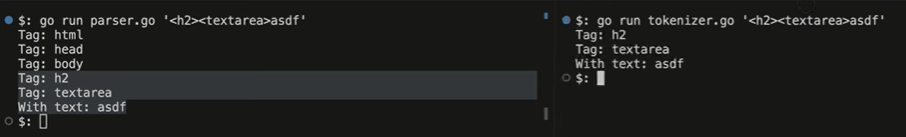
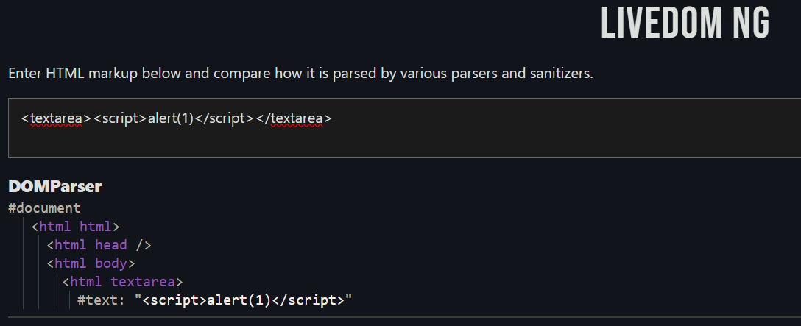
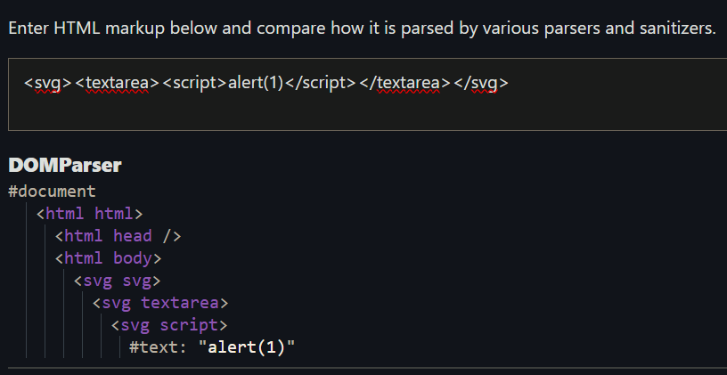

# $25k GitHub Account Takeover & justCTF 2023 CSRF+XSS Writeup

## Highlights

The mistake was made a few lines above this, here, when the **code was not parsed, but tokenized**.
> [View Highlight](https://read.readwise.io/read/01jcr6ndcsnzh6r5pzyfd9611y)

If you have a simple code like this, the outcome would be the same. But it becomes confusing when you introduce HTML namespaces, because **every HTML tag has a namespace**.
> [View Highlight](https://read.readwise.io/read/01jcr6nw1vd4rzx794vf9xvpyk)

Most of them, in most websites that we use, are just in the HTML namespace. But within the HTML, you can also embed objects from a math or SVG namespace. And the thing is, the same tag can behave differently in HTML namespace and in SVG namespace. For example, the text area tag in the HTML namespace can only contain text inside.
> [View Highlight](https://read.readwise.io/read/01jcr6pjfm33jd980edj6nqr8y)

But this stops being true when we wrap this in the SVG tag, **which changes the namespace**. 

And this is when we finally get to the difference between the tokenizer and the parser. The parser will apply these namespace rules to this, and we'll see the script tag being inside. The tokenizer will ignore the namespace, so it will still not see the XSS payload here. The browser, of course, parses our HTML, so this code will look innocent to the sanitizer, but it will execute in the browser, thus giving you the XSS.
> [View Highlight](https://read.readwise.io/read/01jcr6r59qsy22ej4qd95jx43n)

