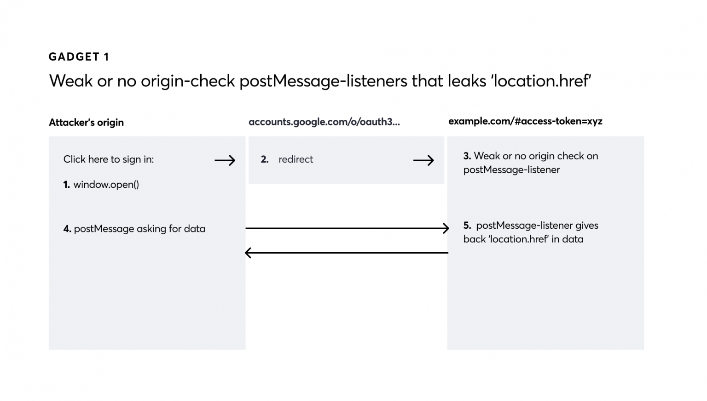
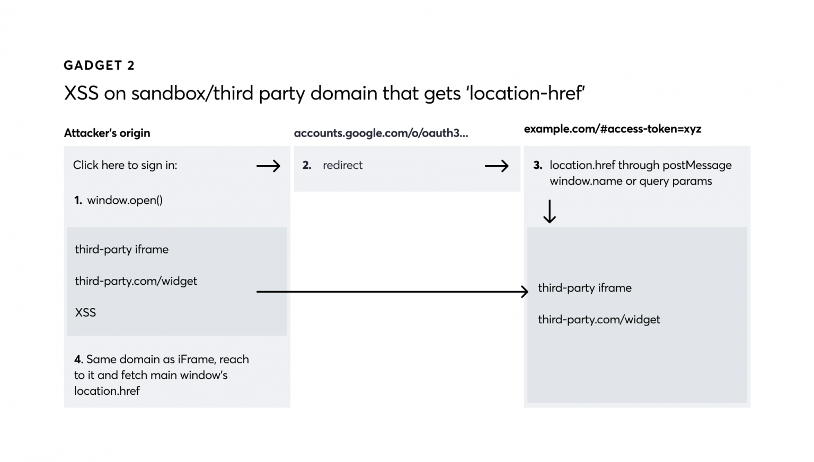
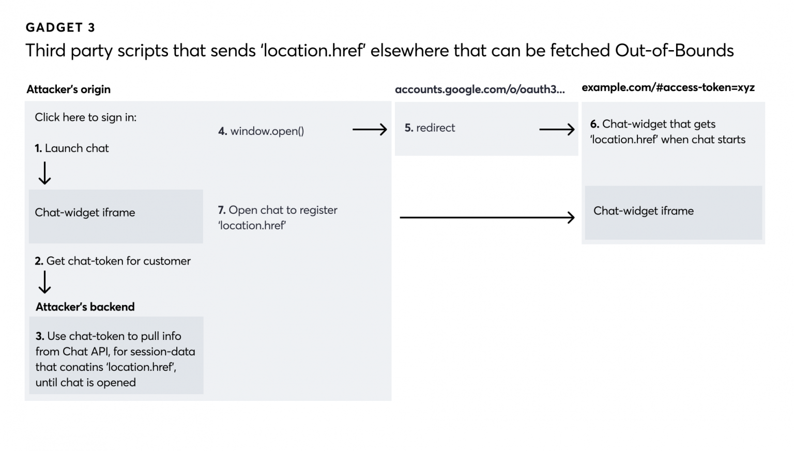

# Account Hijacking Using “Dirty Dancing” in Sign-in OAuth-flows

## Highlights

Combining response-type switching, invalid state and redirect-uri quirks using OAuth, with third-party javascript-inclusions has multiple vulnerable scenarios where authorization codes or tokens could leak to an attacker. This could be used in attacks for single-click account takeovers.

We’ll refer throughout the post to the sign-in flow of a website using a third-party service provider as an “OAuth-dance.”

# Explanation of different OAuth-dances

## Response types
First, there are different response types you can use in the OAuth-dance, the three most common ones are:

- `code` + `state`. The code is used to call the OAuth-provider server-side to get a token. The state parameter is used to verify the correct user is making the call. It’s the OAuth-client’s responsibility to validate the state parameter before making the server-side call to the OAuth-provider.
- `id_token`. Is a JSON Web Token (JWT) signed using a public certificate from the OAuth-provider to verify that the identity provided is indeed who it claims to be.
- `token`. Is an access token used in the API of the service provider.

## Response modes

 There are different modes the authorization flow could use to provide the codes or tokens to the website in the OAuth-dance, these are four of the most common ones:

- **Query**. Sending query parameters as a redirect back to the website (`https://example.com/callback?code=xxx&state=xxx`). Used for `code+state`. The code can only be used once and you need the OAuth client secret to acquire an access token when using the code.[This mode is not recommended for tokens](https://openid.net/specs/oauth-v2-multiple-response-types-1_0-09.html#id_token) since tokens can be used multiple times and should not end up in server-logs or similar. Most OAuth-providers do not support this mode for tokens, only for code.
	- `response_mode=query` is used by Apple.
	- `response_type=code` is used by Google or Facebook.

- **Fragment**. Using a fragment redirect (`https://example.com/callback#access_token=xxx`). In this mode, the fragment part of the URL doesn’t end up in any server-logs and can only be reached client-side using javascript. This response mode is used for tokens.
	- `response_mode=fragment` is used by Apple and Microsoft.
	- `response_type` contains `id_token` or `token` and is used by Google, Facebook, Atlassian, and others.
- **Web-message**. Using [PostMessage](../../Dev,%20ICT%20&%20Cybersec/Dev,%20scripting%20&%20OS/JavaScript%20&%20NodeJS.md#PostMessage%20and%20EventListener) to a fixed origin of the website: 
 `postMessage('{"access_token":"xxx"}','https://example.com')` 
 If supported, it can often be used for all different response types.
	 - `response_mode=web_message` is used by Apple.
	 - `redirect_uri=storagerelay://...` is used by Google.
	- `redirect_uri=https://staticxx.facebook.com/.../connect/xd_arbiter/...` is used by Facebook.
- **Form-post**. Using a form post to a valid `redirect_uri`, a regular POST-request is sent back to the website. This can be used for code and tokens.
	-  `response_mode=form_post` is used by Apple.
	- `ux_mode=redirect&login_uri=https://example.com/callback` is used by Google Sign-In (GSI).

> [View Highlight](https://read.readwise.io/read/01j7kdqjdwc63n3p9xfrdv54vp)

# Gadgets

[Gadget 1: Weak or no origin-check postMessage-listeners that leaks URL](https://labs.detectify.com/writeups/account-hijacking-using-dirty-dancing-in-sign-in-oauth-flows#gadget-1-weak-or-no-origin-check-postmessage-listeners-that-leaks-url)

> [View Highlight](https://read.readwise.io/read/01j7ke2weprqgztbv6m8m9n92t)

[Gadget 2: XSS on sandbox/third-party domain that gets the URL](https://labs.detectify.com/writeups/account-hijacking-using-dirty-dancing-in-sign-in-oauth-flows#gadget-2-xss-on-sandbox-third-party-domain-that-gets-the-url)

> [View Highlight](https://read.readwise.io/read/01j7ke36catpq4v495en5g3qvt)

[Gadget 3: Using APIs to fetch URL out-of-bounds](https://labs.detectify.com/writeups/account-hijacking-using-dirty-dancing-in-sign-in-oauth-flows#gadget-3-using-api-to-fetch-url-out-of-bounds)

> [View Highlight](https://read.readwise.io/read/01j7ke3gz9w1zxz9n1a1gpw04r)

[Other ideas for leaking URLs](https://labs.detectify.com/writeups/account-hijacking-using-dirty-dancing-in-sign-in-oauth-flows#other-ideas-for-leaking-urls)
 There are still other different types of gadgets waiting to be found. Here’s one of those cases I wasn’t able to find in the wild but could be a potential way to get the URL to leak using any of the response modes available.
 [A page on a domain that routes any postMessage to its opener](https://labs.detectify.com/writeups/account-hijacking-using-dirty-dancing-in-sign-in-oauth-flows#a-page-on-a-domain-that-routes-any-postmessage-to-its-opener)
 Since all `web_message` response types cannot validate any path of the origin, any URL on a valid domain can receive the postMessage with the token. If there’s some form of postMessage-listener proxy on any of the pages on the domain, that takes any message sent to it and sends everything to its `opener`, I can make a double-window.open chain
> [View Highlight](https://read.readwise.io/read/01j7ke597pzm4f46kcb0hhn5n4)

