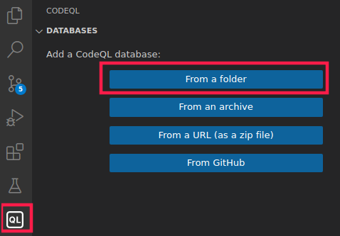

# Pre-Auth RCE With CodeQL in Under 20 Minutes


This write-up won’t be an intense discussion on security code review techniques this time. We’ll simply let do all the hard work by a third party: [CodeQL](../../Dev,%20ICT%20&%20Cybersec/Tools/CodeQL.md).

This will be a step-by-step tutorial on how this was used for attacking the pgAdmin code.

## CodeQL VSCode extention

CodeQL needs a database containing the code in a structured format depending on the targeted language. The CodeQL team provides a ton of great documentation such as one for [creating such databases](https://codeql.github.com/docs/codeql-cli/creating-codeql-databases/). I love to look at code with **Visual Studio Code** which has a support for the CodeQL engine!
> [View Highlight](https://read.readwise.io/read/01j9s7x27743058x2z8xph2yrn)


If your installation of the CodeQL extension finished properly, you’ll find the CodeQL CLI file at some location like `$HOME/.config/Code/User/globalStorage/github.vscode-codeql/distribution2/codeql/codeql`.
> [View Highlight](https://read.readwise.io/read/01j9s7ynq4fyw5e66bwmm8h9n2)

You’re all set to create your CodeQL database now!
```sh
 $ codeql database create pgadmincodeql --language=python
 Initializing database at $HOME/pgAdmin/pgadmin4-REL-6_16/pgadmincodeql.
 Running build command: []
 ...
 Finalizing database at $HOME/pgAdmin/pgadmin4-REL-6_16/pgadmincodeql.
 Successfully created database at $HOME/pgAdmin/pgadmin4-REL-6_16/pgadmincodeql
```

indeed the new directory `pgadmincodeql` was successfully created. Easy, wasn’t it? Now, we’ve to bring this database into our VS Code workspace using the QL menu.
> [View Highlight](https://read.readwise.io/read/01j9s7zph4k2s0dj56tr7yqjex)



Choose the newly created folder and the database will appear in VS Code magically. Then you’ve to set it as default by clicking on it until a grey mark is shown. You’re ready to use the database! Before starting, clone the official [CodeQL GitHub repository](https://github.com/github/codeql) into your workspace, also, since some default codeql queries are required.
> [View Highlight](https://read.readwise.io/read/01j9s8210akczcn5hz225j9svp)

## Find the flaw

In the VS Code Explorer, the CodeQL GitHub project is visible and we drill down to `codeql/python/ql/src/Security`. There you’ll find all the crazy stuff people did to provide intelligent queries against your database. We’re especially interested in queries which
 1. Allow to cover a lot of dangerous sinks at once.
 2. Include the tainted analyses spirit, i.e. instead of “just” showing potential dangerous sinks, also give us information if and how a sink can be reached from a reachable source.

`codeql/python/ql/src/Security/CWE-020-ExternalAPIs/UntrustedDataToExternalAPI.ql` will be a good start. Let’s try this by opening this file and then simply hit **CodeQL: Run query**.
> [View Highlight](https://read.readwise.io/read/01j9s84eyrwzq62rpf4nh58m2k)


## Final Thoughts

There exist some awesome workshops even with [videos](https://youtu.be/-bJ2Ioi7Icg) by the talented Alvaro Muñoz aka pwntester. I can also highly recommend the [workshop videos](https://youtu.be/nvCd0Ee4FgE) “Finding security vulnerabilities in Java with CodeQL”. There is so much more: search and profit!

> [View Highlight](https://read.readwise.io/read/01j9s8fb3mr4ewynw6v7zmx9bb)

