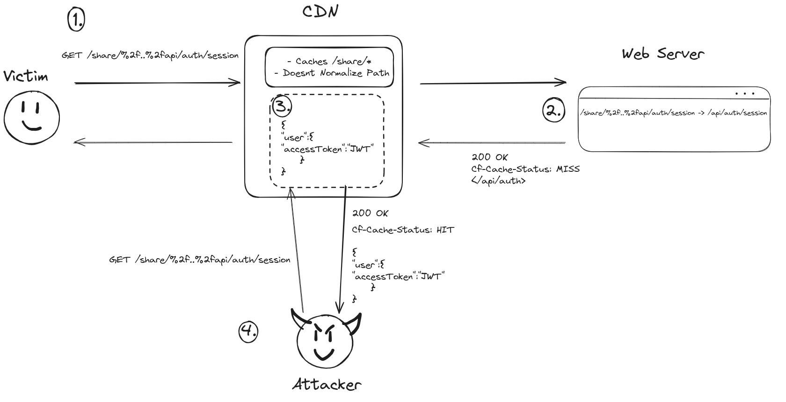

# ChatGPT Account Takeover - Wildcard Web Cache Deception

Here’s how I was able to take over your account in ChatGPT: a [Web Cache Deception](../../Dev,%20ICT%20&%20Cybersec/Web%20&%20Network%20Hacking/Web%20Cache%20Deception.md) vulnerability. The impact of this was critical, as it lead to the leak of user’s auth tokens and subsequently, an account takeover. 

In this writeup, I will explain how I was able to abuse a [Path Traversal](../../Dev,%20ICT%20&%20Cybersec/Web%20&%20Network%20Hacking/Path%20Traversal.md) URL parser confusion to achieve what I like to call a “wildcard” cache deception vulnerability. 

Additionally, this bug uses a similar concept to the [Web Cache Poisoning](../../Dev,%20ICT%20&%20Cybersec/Web%20&%20Network%20Hacking/Web%20Cache%20Poisoning.md) vulnerability I found in [Glassdoor](https://nokline.github.io/bugbounty/2022/09/02/Glassdoor-Cache-Poisoning.html) last year, which allows us to cache “un-cacheable” files and endpoints. 

## Discovery

While playing around with ChatGPT’s newly implemented “share” feature , I noticed something weird. None of my shared chat links would update as I continued talking with ChatGPT. 

The first thing that came to mind was a caching issue. 

I checked out the URL, and saw that the path did not have a static extension as expected: 
- `https://chat.openai.com/share/CHAT-UUID` 

This meant that there was likely a cache rule that did not rely on the extension of the file, but on its location in the URL’s path. To test this, I checked `https://chat.openai.com/share/random-path-that-does-not-exist` and as expected, it was also cached. 

The cache rule looked something like this: `/share/*` 

Red flag! Relaxed cache rules can be very dangerous, especially with URL parser confusions. 

## Path Traversal Confusion

In a website that uses caching, the request must go through the CDN before it gets to the web server.  URL gets parsed twice, which makes it possible for a URL parser [Confusion Attacks](../../Dev,%20ICT%20&%20Cybersec/Web%20&%20Network%20Hacking/Confusion%20Attacks.md). 

Cloudflare’s CDN *did NOT decode* and *did NOT normalize* a URL encoded path traversal, but the web server did. 

> `https://chat.openai.com/share/%2F..%2Fapi/auth/session?cachebuster=123` 

When the victim goes to `https://chat.openai.com/share/%2F..%2Fapi/auth/session?cachebuster=123`, their auth token will be cached. When the attacker later goes to visit `https://chat.openai.com/share/%2F..%2Fapi/auth/session?cachebuster=123`, they will see the victim’s cached auth token. 

