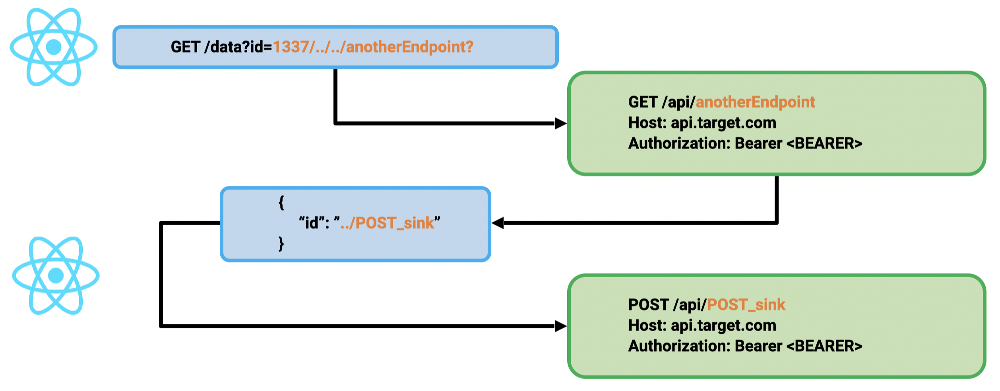

# Exploiting Client-Side Path Traversal to Perform Cross-Site Request Forgery - Introducing CSPT2CSRF

The first reference of CSPT we found was a [bug](https://www.facebook.com/notes/996734990846339/) reported by Philippe Harewood in the Facebook bug bounty program. Since then, we have only found a few references about Client-Side Path Traversal:
- a [tweet](https://x.com/samwcyo/status/1437030056627523590) from Sam Curry back in 2021
- [1-click CSRF](https://gitlab.com/gitlab-org/gitlab/-/issues/365427) in GitLab by Johan Carlsson
- [CSS Injection](https://mr-medi.github.io/research/2022/11/04/practical-client-side-path-traversal-attacks.html) by Medi, nominated in the [Portswigger Top 10 Web hacking techniques of 2022](https://portswigger.net/research/top-10-web-hacking-techniques-of-2022)
- a [CSRF](https://erasec.be/blog/client-side-path-manipulation/) by Antoine Roly from Erasec
- Some other references were found about Client-Side CSRF from OWASP and in [this](https://www.usenix.org/system/files/sec21-khodayari.pdf) research paper by Soheil Khodayari and Giancarlo Pellegrino.

Client Side Path-Traversal has been overlooked for years. While considered by many as a low-impact vulnerability, it can be actually used to force an end user to execute unwanted actions on a web application. 

## CSPT2CSRF with a GET Sink

Some scenarios of exploiting CSPT with a GET sink exist: 
- Using an open redirect to leak sensitive data associated with the source
- Using an open redirect to load malicious data in order to trigger an XSS

In fact it is often possible to chain a CSPT2CSRF having a GET sink with another state-changing CSPT2CSRF.

1. 1st primitive: GET CSPT2CSRF:
	- Source: id param in the query
	- Sink: GET request on the API
2. 2nd primitive: POST CSPT2CSRF:
	- Source: id from the JSON data
	- Sink: POST request on the API

Whitepaper: https://www.doyensec.com/resources/Doyensec_CSPT2CSRF_Whitepaper.pdf

