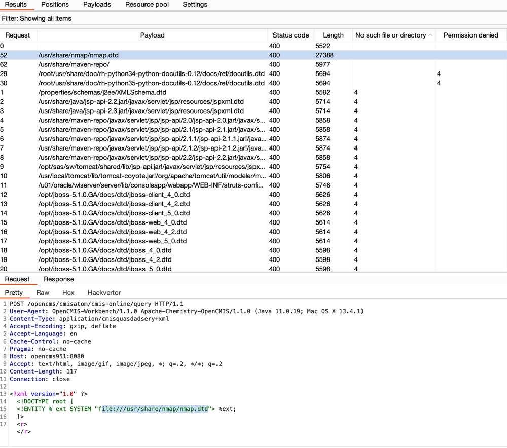
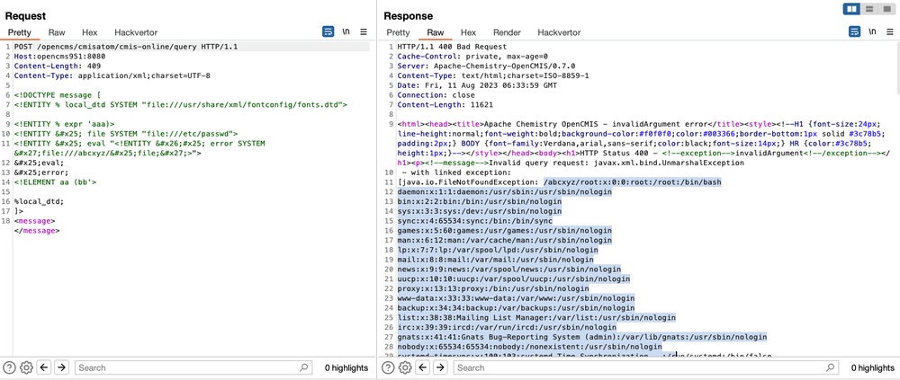

# XXE, You Can Depend on Me


For those wondering ‘what is OpenCMS’? Well, it’s an open-source Java framework developed by Alkacon. Boasting over 500 stars on Github, a short Internet search reveals tens of thousands of installations with various versions in use - [http://www.opencms.org/en/](http://www.opencms.org/en/?ref=labs.watchtowr.com).
[](https://read.readwise.io/read/01hh01zyge3mbghgasfevzgg9e)
#vulnerability-research/todo 

## Mapping the servlets

The first thing we always like to do (as we have obsessively blogged about previously) with any Java application is to take a look at all of the servlets and filters available by examining the `web.xml` . These can be detailed within the `url-pattern` XML tags. [](https://read.readwise.io/read/01hh024eh9710xb2f7kc92x6ns)
 

Above, we can see the `url-pattern` for `/cmisatom/*` is mapped to the servlet class `org.apache.chemistry.opencmis.server.impl.atompub.CmisAtomPubServlet`. 

Just by looking at the classpath we can see it is related to the “Apache Chemistry” library. A quick Google search brings us to the documentation for the endpoint in the context of OpenCMS: [https://documentation.opencms.org/opencms-documentation/interfaces/cmis/index.html](https://documentation.opencms.org/opencms-documentation/interfaces/cmis/index.html?ref=labs.watchtowr.com)

 In short, it provides the ability for remote applications to interact with the file repository of the application’s web root and its relative resources. It is more-or-less a way for headless automation to take place by simulating user presence. [](https://read.readwise.io/read/01hh027a4c15ke3pxykm5f2mt9)

As can be seen below, a number of requests are sent to the target by this ‘TCK’ function. One that caught our attention was the `/query` endpoint, which receives an XML formatted POST request with SQL-like syntax. This syntax is actually Apache Chemistry’s own language (for more info, see [here](https://chemistry.apache.org/docs/cmis-samples/samples/query-examples/index.html?ref=labs.watchtowr.com)). [](https://read.readwise.io/read/01hh02c17wrvp3a42cx7xwn77k)
 

## Triggering the vulnerability
As a quick test, we threw some common payloads from the ‘payloads all the things’ [repository](https://github.com/swisskyrepo/PayloadsAllTheThings/blob/master/XXE?ref=labs.watchtowr.com) at it, and hoped for a quick-and-easy win. Funnily enough, a simple XXE Out of Bounds (OOB) payload works. [](https://read.readwise.io/read/01hh02cgx9a0xy6qhgn0e7829k)

Full request: [](https://read.readwise.io/read/01hh02h540dz7kcxtbd7a5dkgk)
```http
POST /opencms/cmisatom/cmis-online/query HTTP/1.1
Content-Type: application/cmisquery+xml
Host: host
Content-Length: 524
Connection: close

<?xml version='1.0' encoding='UTF-8'?><!DOCTYPE root [<!ENTITY test SYSTEM 'file:///etc/passwd'>]><cmis:query xmlns:cmis="<http://docs.oasis-open.org/ns/cmis/core/200908/>"><cmis:statement>&test;</cmis:statement><cmis:searchAllVersions>false</cmis:searchAllVersions><cmis:includeAllowableActions>false</cmis:includeAllowableActions><cmis:includeRelationships>none</cmis:includeRelationships><cmis:renditionFilter>cmis:none</cmis:renditionFilter><cmis:maxItems>100</cmis:maxItems><cmis:skipCount>0</cmis:skipCount></cmis:query>
```


### Use a local DTD instead of a remote one
Whilst in our lab environment we have a likely quick route to success, we’re aware that in reality, most large enterprises will usually monitor egress traffic and block fetching external DTD’s, so perhaps we can do better? Posing the question to ourselves, can we sidestep the requirement for an HTTP fetch by including a DTD file which already exists on the server itself?

Whilst it's straight forward for us to find which DTD files exists within our Docker environment, we figured it would be neat to demonstrate from a black box perspective how to discover available DTD's should a target environment differ. [](https://read.readwise.io/read/01hh02e7mfbkhqee2mx4bfvx0t)

For this, we can use the wordlist from the fantastic `dtd-finder` [project](https://github.com/GoSecure/dtd-finder/tree/master/list?ref=labs.watchtowr.com), simply requesting each and filtering error messages. [](https://read.readwise.io/read/01hh02ezm5qer5gzf0pgrb4tw2)
#tools 

As well as the wordlist of DTD files, the `dtd-finder` Github repo also provides corresponding [XXE payloads](https://github.com/GoSecure/dtd-finder/blob/master/list/xxe_payloads.md?ref=labs.watchtowr.com). [](https://read.readwise.io/read/01hh02fte4ygx0k7ddgnmrwkyk)



