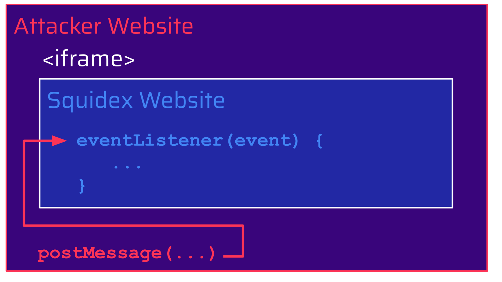

# Who Are You? The Importance of Verifying Message Origins

**Squidex version 7.8.2** and below is prone to **Cross-Site Scripting (XSS)** vulnerability via event listener ([CVE-2023-46252](https://nvd.nist.gov/vuln/detail/CVE-2023-46252)). Attackers can combine this vulnerability with an authenticated **Arbitrary File Write** ([CVE-2023-46253](https://nvd.nist.gov/vuln/detail/CVE-2023-46253)) to gain remote code execution (RCE) on a Squidex instance
> [View Highlight](https://read.readwise.io/read/01hsjwbmrjvffm2w1mf765q77w)

Although the event listener checks the source of the event (`event.source`), it is indeed missing a check of its origin (`event.origin`). Because of this as well as the lack of [X-Frame-Options](https://developer.mozilla.org/en-US/docs/Web/HTTP/Headers/X-Frame-Options) and [Content-Security-Policy](https://developer.mozilla.org/en-US/docs/Web/HTTP/Headers/Content-Security-Policy), a malicious website can include the Squidex website in an iframe and use the `postMessage` [^postmessage] method to trigger the execution of the event listener in the context of the included Squidex website:
> [View Highlight](https://read.readwise.io/read/01hsjweec3dgwqearp417fv77n)

>[^postMessage]: [PostMessage and EventListener](../../Dev,%20ICT%20&%20Cybersec/Dev,%20scripting%20&%20OS/JavaScript%20&%20NodeJS.md#PostMessage%20and%20EventListener)

The `SquidexFormField` class is for example used in the [editor-editorjs.html](https://github.com/Squidex/squidex/blob/7.8.2/backend/src/Squidex/wwwroot/scripts/editor-editorjs.html) file, which can be accessed via the public `wwwroot` folder. It uses the `onValueChanged` method to register a callback function, which passes the value provided from the message event to the `editor.render` function:
> [View Highlight](https://read.readwise.io/read/01hsjwyta8ct2m4prs71v19p4h)

The `editor.render` function used here is part of the [editorjs npm package](https://www.npmjs.com/package/@editorjs/editorjs). Passing an attacker-controlled value to this function introduces a Cross-Site Scripting (XSS) vulnerability. Since the registered message event listener in [`editor-sdk.js`](https://github.com/Squidex/squidex/blob/7.8.2/backend/src/Squidex/wwwroot/scripts/editor-sdk.js) does not verify the origin of the received message, attackers can include the [`editor-editorjs.html`](https://github.com/Squidex/squidex/blob/7.8.2/backend/src/Squidex/wwwroot/scripts/editor-editorjs.html) page in an iframe and send a message to it in order to trigger the execution of arbitrary JavaScript code. This did not only affect self-hosted Squidex instances but also [Squidex Cloud](https://cloud.squidex.io/):

> [View Highlight](https://read.readwise.io/read/01hsjwyz7gkz9vd51az41hba56)

