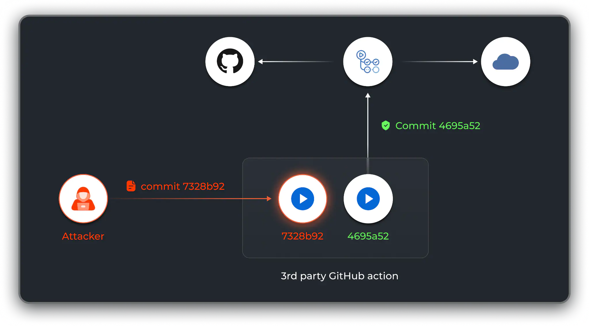
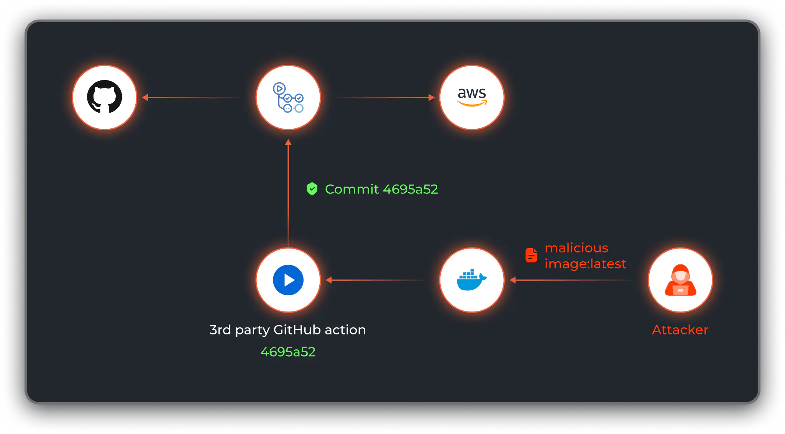

# Unpinnable Actions: How Malicious Code Can Sneak Into Your GitHub Actions Workflows

Action pinning, one of the profound mitigations against [Supply Chain](../../Dev,%20ICT%20&%20Cybersec/Dev,%20scripting%20&%20OS/Supply%20Chain.md) attacks in the [GitHub Actions](../../Dev,%20ICT%20&%20Cybersec/Dev,%20scripting%20&%20OS/GitHub%20Actions.md) ecosystem. 

It turns out, though, that action pinning comes with a downside — a pitfall we call "unpinnable actions" that allows attackers to execute code in GitHub Actions workflows. 

## Action Pinning

[GitHub Actions](../../Dev,%20ICT%20&%20Cybersec/Dev,%20scripting%20&%20OS/GitHub%20Actions.md) offers a powerful way to automate your software development workflow, including running tests, linting code, deploying applications and more. 

When using a third-party GitHub action, it’s important to follow [GitHub's recommendation](https://docs.github.com/en/actions/security-guides/security-hardening-for-github-actions#using-third-party-actions) to pin actions to a specific commit SHA. This practice ensures consistent use of the action’s version, helping to prevent supply chain attacks involving the introduction of malicious code into external software used by your project 

[Want to Pin Your Actions?](Adan%20-%20GitHub%20Actions%20and%20the%20Pinning%20Problem%20What%20100%20Security%20Projects%20Reveal.md#Want%20to%20Pin%20Your%20Actions?)

By pinning your actions to a specific commit SHA, you can guarantee the use of a version you previously audited and approved. 

Pinning the action to a particular SHA also serves the important recommendation of [CICD-SEC-9: Improper Artifact Integrity Validation](https://www.paloaltonetworks.com/cyberpedia/improper-artifact-integrity-validation-cicd-sec9) from the OWASP Top 10 CI/CD Security Risks to ensure integrity across the pipeline. 

Figure 1: GitHub Actions workflow consumes a secure, pinned version of a third-party action. 

So pinning an action to a full commit hash protects us from this type of supply chain attack, right? As we discover in our research, no, this assumption is wrong. 

## How Attackers Abuse Unpinnable Actions

Let’s review actions that, even if pinned, can introduce new code to your [pipeline](https://www.paloaltonetworks.com/cyberpedia/what-is-the-ci-cd-pipeline-and-ci-cd-security), allowing an attacker to execute malicious code and cause serious damage. This can occur with what we call “unpinnable actions”. [^1]  

Let’s review the following workflow as an example: [ref](https://read.readwise.io/read/01jsed5da6azkf2b9ngrazt8er)

We have a workflow named CI that uses a third-party action named `pyupio/safety`. The action is pinned to a full commit hash .

When we head to the [action’s hosting repository](https://github.com/pyupio/safety/blob/9a3b0a6eb17f5d5391b7b198600124db19be375d/action.yml#L53), we can see that this action pulls the latest tag of a docker image named `pyupio/safety-v2-beta`. This image will be run and used as the workflow’s execution environment. 

Docker images use a pinning concept that relies on a docker image digest. The action pulls the latest tag — but it’s mutable and subject to change. While the developer expects a pinned action to consistently execute the exact same code on the same environment, 

The action’s code on GitHub can’t be changed, but the container image can look completely different per execution. 

Attackers who manage to compromise the `pyupio/safety-v2-beta` container image repository can push a new malicious version of the image, overwriting the latest tag. 

Figure 4: An attacker overcomes action pinning by pushing a malicious Docker image with the "latest" tag. 

Three types of actions to bypass action pinning — Docker container, composite and JavaScript. 

### Docker Container Actions

Docker containers can be used to run actions in a specific environment configuration, which proves useful for actions requiring a specific operating system, tool version or dependency. 

It also works when supplying a Dockerfile to the runner, another type of unpinnable Docker action. Installations of unlocked Python packages using pip install and fetching external resources via the wget command without verifying its checksum defies the expected security of actions pinning. 

### Composite Actions

Composite actions suit low-complexity needs by allowing writing Bash commands directly in the action’s yaml file, as well as calling other actions. 

Composite actions can too easily break the concept of action pinning. 

### JavaScript Actions

Compared to the other types of actions, JavaScript actions, or more commonly TypeScript, are a little harder to break the expected security of action pinning, given that JavaScript actions don’t have a process of packages installations in runtime. 

But they can still fetch outside resources at runtime, so you should consider them unpinnable actions. 

## 5 Best Practices to Protect Against Compromised Third-Party Actions

1. As with all security domains, the base of protective measures is visibility. Achieve a full continuous mapping of all actions in use, as well as the various actions and dependencies used by each action. 

2. While pinning an action is far from a holistic measure, it does provide protection from a direct compromise of the action’s repo. We recommend pinning all actions in use within your organization. 

3. Implement strict [PBAC (Pipeline-Based Access Controls)](https://www.paloaltonetworks.com/cyberpedia/pipeline-based-access-controls-cicd-sec5) in your CI workflows by limiting permissions and access of the CI agent 

4. If you still want to use an “unpinnable action”, exercise the option to fork the action's repository and lock the dependencies to create a safer, immutable version of the action. 

5. If you create actions on your own, make them “pinnable”: Make sure that each dependency and external resource in use by the action is locked to a specific immutable version. 

[^1]: [Adan - GitHub Actions and the Pinning Problem What 100 Security Projects Reveal](Adan%20-%20GitHub%20Actions%20and%20the%20Pinning%20Problem%20What%20100%20Security%20Projects%20Reveal.md)

