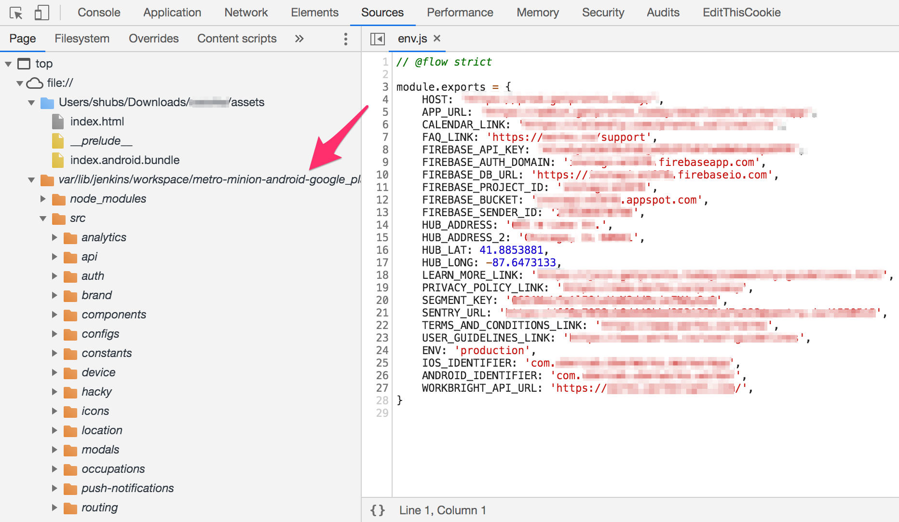

# Expanding the Attack Surface: React Native Android Applications

React Native is a mobile application framework that is most commonly used to develop applications for Android and iOS by enabling the use of React and native platform capabilities. [](https://read.readwise.io/read/01jsm10ppzwe05ws0cg07q0zdw)

The end goal of this blog post is to be able to go from the APK to the React Native JavaScript that can be analysed further for API routes and sensitive credentials being leaked. [](https://read.readwise.io/read/01jsm12bd2t1qbfccwt8pdkq73)

Most of the time, the core logic of the application lies in the React JavaScript that can be obtained without needing to use dex2jar. [](https://read.readwise.io/read/01jsm1399rqqcek7n36nh0p3j8)

## Obtaining JavaScript from a React Native APK

For this example, I’m going to be extracting the JavaScript from the following React Native application: [](https://read.readwise.io/read/01jsm140ktmap80s9cydc3hkzs)
- [com.react_native_examples](https://apkpure.com/react-native-examples/com.react_native_examples) 

```sh
unzip React\ Native\ Examples_v1.0_apkpure.com.apk -d ReactNative
```

Browse to the newly created ReactNative folder, and find the `assets` folder. Inside this folder, it should contain `index.android.bundle`. This file will contain all of the React JavaScript in a minified format. [](https://read.readwise.io/read/01jsm14w5rhgmapt7azxev4q97)

### The power of map files

If you are able to find a file called `index.android.bundle.map`, you will be able to analyse the source code in an unminified format. `map` files contain the source mapping that allows you to map minified identifiers. [](https://read.readwise.io/read/01jsm15jsgrpeb8exj8czy1ng6)

You can take advantage of this by creating a file named `index.html` in the same directory with the following within it:
```html
<script src="index.android.bundle"></script>
```

Save this file and then open it in Google Chrome. [](https://read.readwise.io/read/01jsm16vte62n75jnpe1rx8k0h)

*Analysing index.android.bundle in Chrome DevTools taking advantage of an included map file* [](https://read.readwise.io/read/01jsm17vxgvfqr1jvb0d48m040)

You can also use [webpacl-exploder](https://spaceraccoon.github.io/webpack-exploder/) to automate the process.

### The search for sensitive credentials and endpoints

A pattern that is popular with React Native applications, is the use of a third party database such as [Firebase](../../Dev,%20ICT%20&%20Cybersec/Dev,%20scripting%20&%20OS/Firebase.md). [](https://read.readwise.io/read/01jsm188g4wwjrrqkz3nd7b20w)

The following strings can be grepped for in order to extract the Firebase API key from the `index.android.bundle`:  [](https://read.readwise.io/read/01jsm195dy7y22kyyeey4tvct8)
```
FIREBASE_API_KEY
FIREBASE_AUTH_DOMAIN
FIREBASE_DB_URL
FIREBASE_BUCKET
apiKey
```

In addition to finding Firebase credentials, the `index.android.bundle` file can also be analysed for API endpoints. [](https://read.readwise.io/read/01jsm19m9xymwhafgez40rz95q)

## Interfacing with Firebase

The following Python script can be used to interface with the Firebase database. Before using this script, install pyrebase using pip install pyrebase. [](https://read.readwise.io/read/01jsm1a3s0mnq2yz26ezfgn9h6)
```py
import pyrebase
config = {
"apiKey": "FIREBASE_API_KEY",
"authDomain": "FIREBASE_AUTH_DOMAIN_ID.firebaseapp.com",
"databaseURL": "https://FIREBASE_AUTH_DOMAIN_ID.firebaseio.com",
"storageBucket": "FIREBASE_AUTH_DOMAIN_ID.appspot.com",
}
firebase = pyrebase.initialize_app(config)
db = firebase.database()
print(db.get())
```

To test other actions on the database, such as writing to the database, refer to the Pyrebase documentation which can be found [here](https://github.com/thisbejim/Pyrebase). [](https://read.readwise.io/read/01jsm1an8w6jpf1qzaag897v5a)
