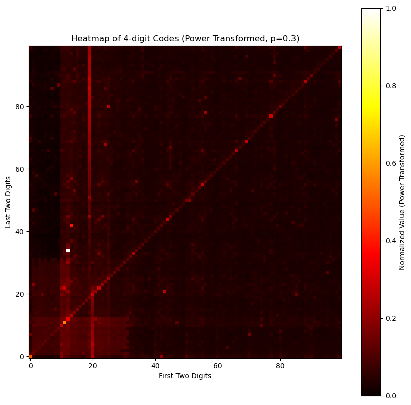
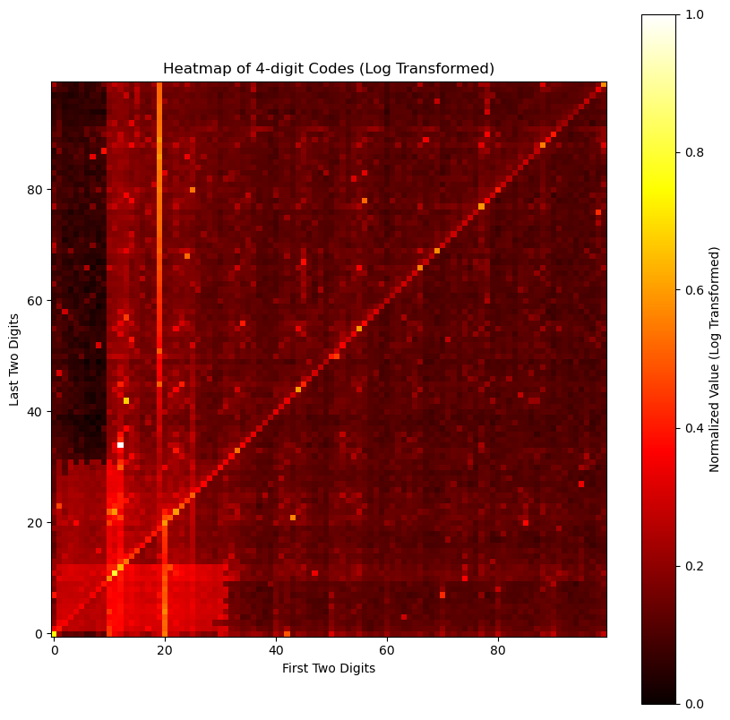

# GitHub - Slon104/Common-PIN-Analysis-from-haveibeenpwned.com: 

I Have Gathered Data From haveibeenpwned.com for Every Common PIN and How Often It Is Used. I Am Sharing With You a Complete Wordlist Sorted by the Most Popular PINs First. Feel Free to Download It and Test Your Favorite PIN to See How Popular It Is Among Everybody.

## Popular PIN Codes3-Digit PINs

Below is a list of the most popular 3-digit PIN codes:
`123`, `666`, `111`, `100`, `000`, `777`, `321`, `555`, `333`, `456`
[Download 3-digit PIN wordlist](https://github.com/Slon104/Common-PIN-Analysis-from-haveibeenpwned.com/blob/main/Word%20Lists/3%20PIN%20by%20Slon104.txt)

### 4-Digit PINs

Below is a list of the most popular 4-digit PIN codes:
`1234`, `1111`, `0000`, `1342`, `1212`, `2222`, `4444`, `1122`, `1986`, `2020`
[Download 4-digit PIN wordlist](https://github.com/Slon104/Common-PIN-Analysis-from-haveibeenpwned.com/blob/main/Word%20Lists/4%20PIN%20by%20Slon104.txt)

### 6-Digit PINs

Below is a list of the most popular 6-digit PIN codes:
`123456`, `111111`, `123123`, `000000`, `123321`, `654321`, `666666`, `121212`, `112233`, `555555`
[Download 6-digit PIN wordlist](https://github.com/Slon104/Common-PIN-Analysis-from-haveibeenpwned.com/blob/main/Word%20Lists/6%20PIN%20by%20Slon104.txt) 

