# Encoding Differentials: Why Charset Matters

```http
HTTP/1.1 200 OK
Server: Some Server
Content-Type: text/html
Content-Length: 1337

<!DOCTYPE html>
<html>
<head><title>Some Page</title></head>
<body>
...
```

If you have doubts about the `Content-Type` header, you are right. There is only a minor imperfection here: the header is **missing** a `charset` attribute. [](https://read.readwise.io/read/01j5xba0w3har0r7mcqzswd8ht)

Pre-requisites: 
- [Character Encodings 101](../../Dev,%20ICT%20&%20Cybersec/Dev,%20scripting%20&%20OS/Character%20Encodings%20101.md)
- [HTML Parsing Background](../../Dev,%20ICT%20&%20Cybersec/Dev,%20scripting%20&%20OS/HTML.md#HTML%20Parsing%20Background)

## Encoding Differentials

The purpose of character encoding is to translate characters into a computer-processable byte sequence. [](https://read.readwise.io/read/01j5xbhpeaqvzxrnf09948g0tw)

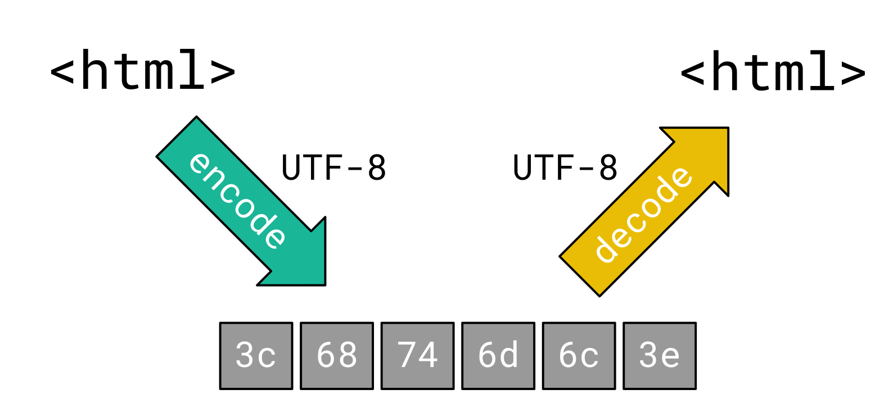

If there is a **mismatch** between the character encoding used for encoding and decoding, the receiver may *see* different characters:

 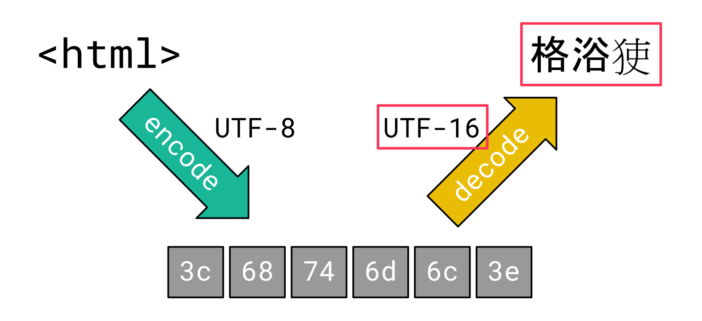


Such a mismatch between the character encoding used for encoding and decoding is what we refer to as *Encoding Differential*.[](https://read.readwise.io/read/01jk8tay2qm6799dez2t06mw0m)

For a web application, this becomes vital when user-controlled data is sanitized to prevent [Cross-Site Scripting (XSS)](../../Dev,%20ICT%20&%20Cybersec/Web%20&%20Network%20Hacking/Cross-Site%20Scripting%20(XSS).md) vulnerabilities. If the character encoding that the browser assumes is different from what the web server intended, this could theoretically break the sanitization and lead to [XSS](../../Dev,%20ICT%20&%20Cybersec/Web%20&%20Network%20Hacking/Cross-Site%20Scripting%20(XSS).md). [](https://read.readwise.io/read/01j5xbjpd6kxzzmpcqfdet4r6n)

Even Google was prone to an issue like this [back in 2005](https://seclists.org/fulldisclosure/2005/Dec/att-1107/google_xss_211205.txt#:~:text=Google%27s%20404%20NOT%20FOUND%20mechanism). Google’s 404 page did not provide charset information, which could be exploited by inserting a [UTF-7](https://en.wikipedia.org/wiki/UTF-7) XSS payload. In UTF-7, HTML special characters like angle brackets are encoded differently from ASCII which can be leveraged to bypass sanitization: [](https://read.readwise.io/read/01j5xbkfgjg647d8847tvghnkh)
```html
+ADw-script+AD4-alert(1)+ADw-+AC8-script+AD4-
```


Although there are still a lot of other supported character encodings, most of these are not really useful from an attacker’s point of view. All **HTML special characters** like angle brackets and quotes are **ASCII only** and since most character encodings are ASCII-compatible, there is **no difference** for these characters. 

Even for UTF-16, which is not ASCII-compatible due to its fixed amount of two bytes per character, it is usually not possible to smuggle ASCII characters, because their corresponding byte representation is the same, just with a trailing (little-endian) or leading (big-endian) zero byte. [](https://read.readwise.io/read/01j5xbmxryp35yd1nncxcjd4cj)

However, there is a particularly interesting encoding: **ISO-2022-JP**.[](https://read.readwise.io/read/01j5xbn12npftnfq2kn8gn3xyd)

## ISO-2022-JP

Particularly interesting about this encoding is that it supports certain **escape sequences** to **switch between different character sets**. [](https://read.readwise.io/read/01j5xbnfw7saed23tqvt3cqcxr)

For example, if a byte sequence contains the bytes `0x1b`, `0x28`, `0x42`, these bytes are not decoded to a character but instead indicate that all following bytes should be decoded using ASCII. 

In total, there are four different escape sequences that can be used to switch between the character sets:[](https://read.readwise.io/read/01j5xbp2banh9ejbvc7knjcne4)
- ASCII
- JIS X 0201 1976
- JIS X 0208 1978
- JIS X 0208 1983
 
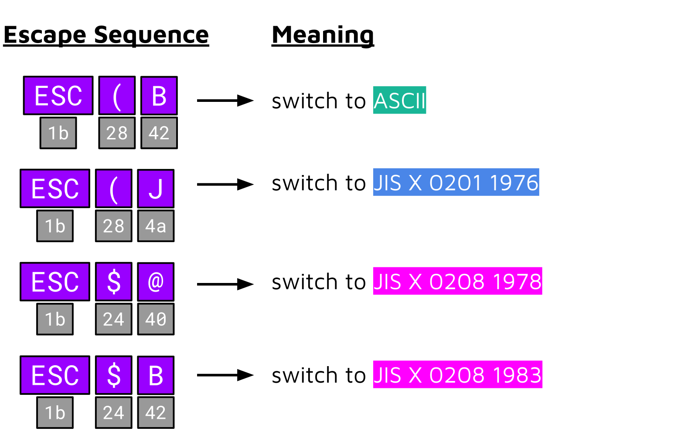

There is another catch: at the time of writing, **Chrome (Blink) and Firefox (Gecko) auto-detect this encoding.** A single occurrence of one of these escape sequences is usually enough to convince the auto-detection algorithm that the HTTP response body is encoded with ISO-2022-JP.[](https://read.readwise.io/read/01j5xbpxw5hw7210c1b3nhm3wh)

## Exploitation techniques

Two different exploitation techniques exists that attackers may use when they can make the browser assume an ISO-2022-JP charset. 

Depending on the capabilities of the attacker, this can for example be achieved by:
- directly controlling the `charset` attribute in the `Content-Type` header
- or by inserting a `<meta>` tag via an [HTML and CSS Injection](../../Dev,%20ICT%20&%20Cybersec/Web%20&%20Network%20Hacking/HTML%20and%20CSS%20Injection.md) vulnerability.
- If a web server provides an invalid `charset` attribute or none at all, there are usually no other prerequisites since attackers can easily switch the charset to ISO-2022-JP via **auto-detection**. [](https://read.readwise.io/read/01j5xbqyth8ppvw095g0ph6nxv)

### Negating Backslash Escaping

The scenario for this technique is that **user-controlled data** is placed **in a JavaScript string**:
 
```js
var str = "USER_INPUT";
```

 Let’s imagine a website that accepts *two* query parameters called `search` and `lang`. The first parameter is reflected in a *plaintext* context [^1] and the second parameter (`lang`) is inserted into a *JavaScript string*:
 
 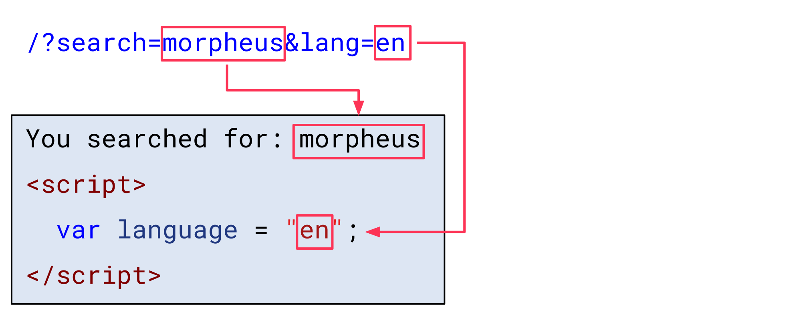
 
 HTML special characters in the `search` parameter are HTML-encoded, and the `lang` parameter is properly sanitized by escaping double quotes (`"`) and backslashes (`\`). Thus, it is not possible to break out of the string context and inject JavaScript code:

```html
/?search=morpheus&lang=en";alert(1)//
<html>

You searched: morpheus
<script>
	var language = "en\";alert(1)//";
</script>
```
 
The default mode for ISO-2022-JP is ASCII. This means that all bytes of the received HTTP response body are decoded with ASCII and the resulting HTML document looks like what we would expect:
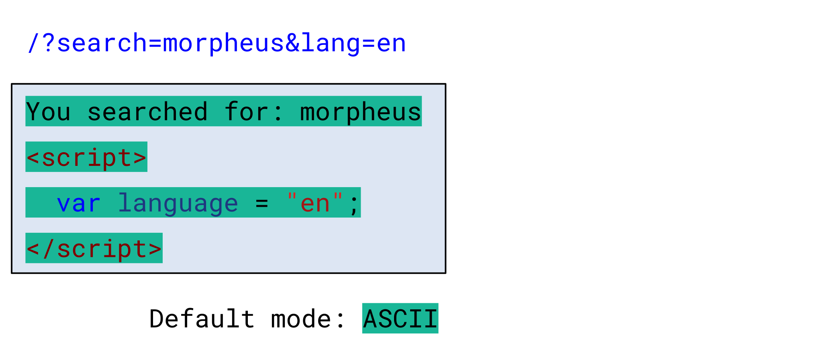

Now, let’s assume an attacker inserts the escape sequence to switch to the JIS X 0201 1976 charset in the `search` parameter (`0x1b`, `0x28`, `0x4a`):

```html
/?search=%1b(J&lang=en";alert(1)//
<html>

You searched: \x1b(J
<script>
	var language = "en\";alert(1)//";
</script>
```
 
 The browser now decodes all bytes following this escape sequence with JIS X 0201 1976:

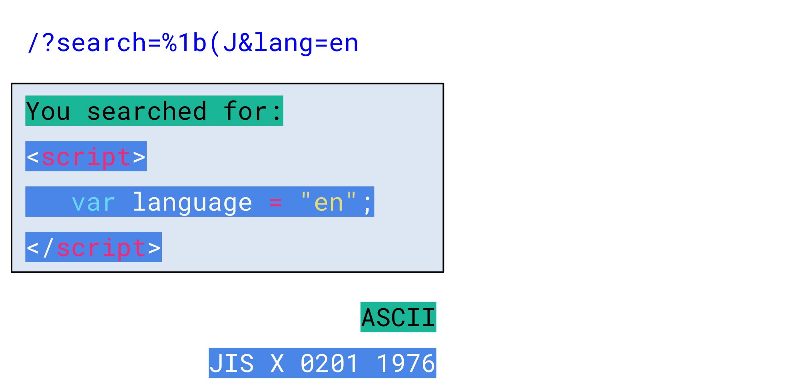

This still results in the same characters as before, since JIS X 0201 1976 is *mainly* ASCII-compatible. However, if we closely inspect [its code table](https://en.wikipedia.org/wiki/JIS_X_0201#Codepage_layout), we can notice that there are two exceptions (highlighted in yellow):
 

As we can see, this still results in the same characters as before, since JIS X 0201 1976 is *mainly* ASCII-compatible. However, if we closely inspect [its code table](https://en.wikipedia.org/wiki/JIS_X_0201#Codepage_layout), we can notice that there are two exceptions (highlighted in yellow):

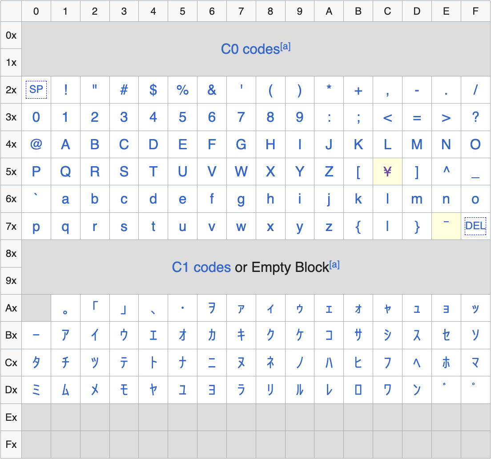
 
The byte `0x5c` is mapped to the yen character (`¥`) and the byte `0x7e` to the overline character (`‾`). This is different from ASCII, where `0x5c` is mapped to the backslash character (`\`) and `0x7e` to the tilde character (`~`).

This means that when the web server tries to escape a double quote in the `lang` parameter with a backslash, the browser does not *see* a backslash anymore, but instead a yen sign:

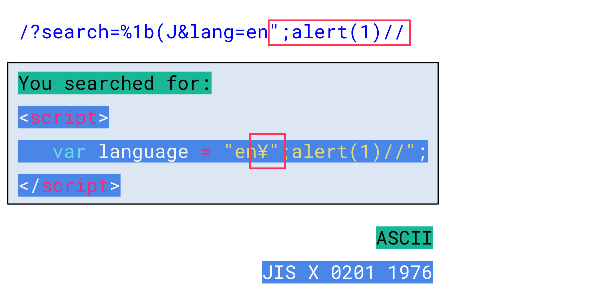
Accordingly, the inserted double quote actually designates the end of the string and allows an attacker to inject arbitrary JavaScript code:[](https://read.readwise.io/read/01j5xbxmx0veycksxxk6cf8y11)

```html
/?search=%1b(J&lang=en";alert(1)//
<html>

You searched: 
<script>
	var language = "en¥";alert(1)//";
</script>
```

Although this technique is quite powerful, it is limited to bypassing sanitization in a JavaScript context since a backslash character does not have special meaning in HTML. [](https://read.readwise.io/read/01jk8vb01k69an42jvrq6v6n6w)

### Breaking HTML Context

The scenario for this second technique is that an attacker can control values in **two different HTML contexts**. A common use case would be a website that supports markdown. For example, let’s consider the following markdown text:

```md
 or 
```
 
The resulting HTML code looks like this:

```html
 or 
```
 
 Essential for this technique is that an attacker can control values in two different HTML contexts. In this case, these are:
 - Attribute context (image description/source)
 - Plaintext context (text surrounding images)
 
 By default, ISO-2022-JP is in ASCII mode and the browser *sees* the HTML document as expected:

 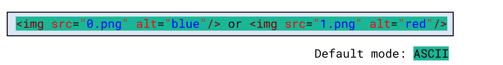
 Now, let’s assume an attacker inserts the escape sequence to switch the charset to JIS X 0208 1978 in the first image description:

 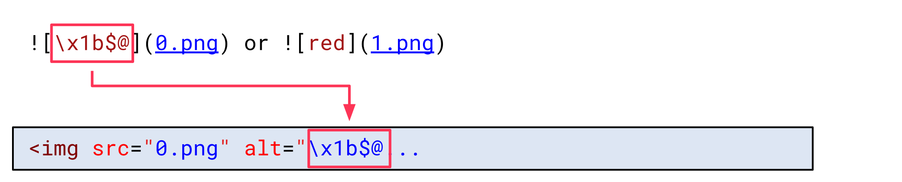
 
 
This makes the browser decode all bytes following with JIS X 0208 1978. This charset uses a fixed amount of 2 bytes per character and is not ASCII-compatible. This effectively breaks the HTML document:

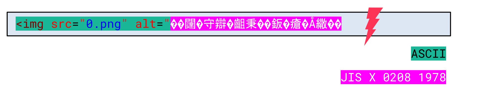
 
However, a second escape sequence can be inserted in the plaintext context between both images to switch the charset back to ASCII:
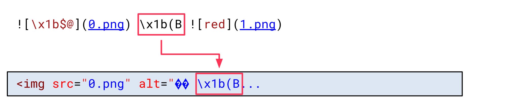
This way, all the following bytes are decoded using ASCII again:

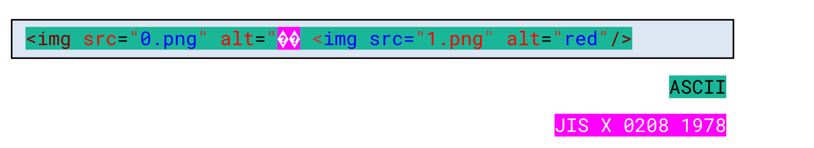
We can notice that something changed. The beginning of the second `img` tag is now part of the `alt` attribute value:

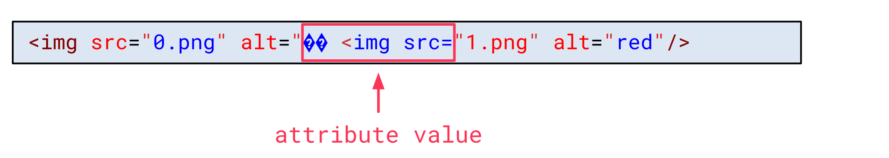
 
The reason for this is that the 4 bytes in between both escape sequences were decoded using JIS X 0208 1978. This also **consumed the closing double-quote** of the attribute value:

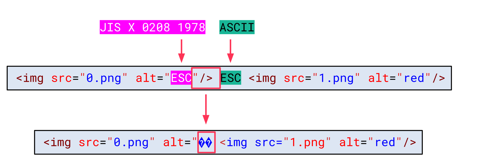

Final exploit:
```md
 \x1b(B //)
```
```html

```


[^1]: [Different content parsing types](../../Dev,%20ICT%20&%20Cybersec/Dev,%20scripting%20&%20OS/HTML.md#Different%20content%20parsing%20types)
