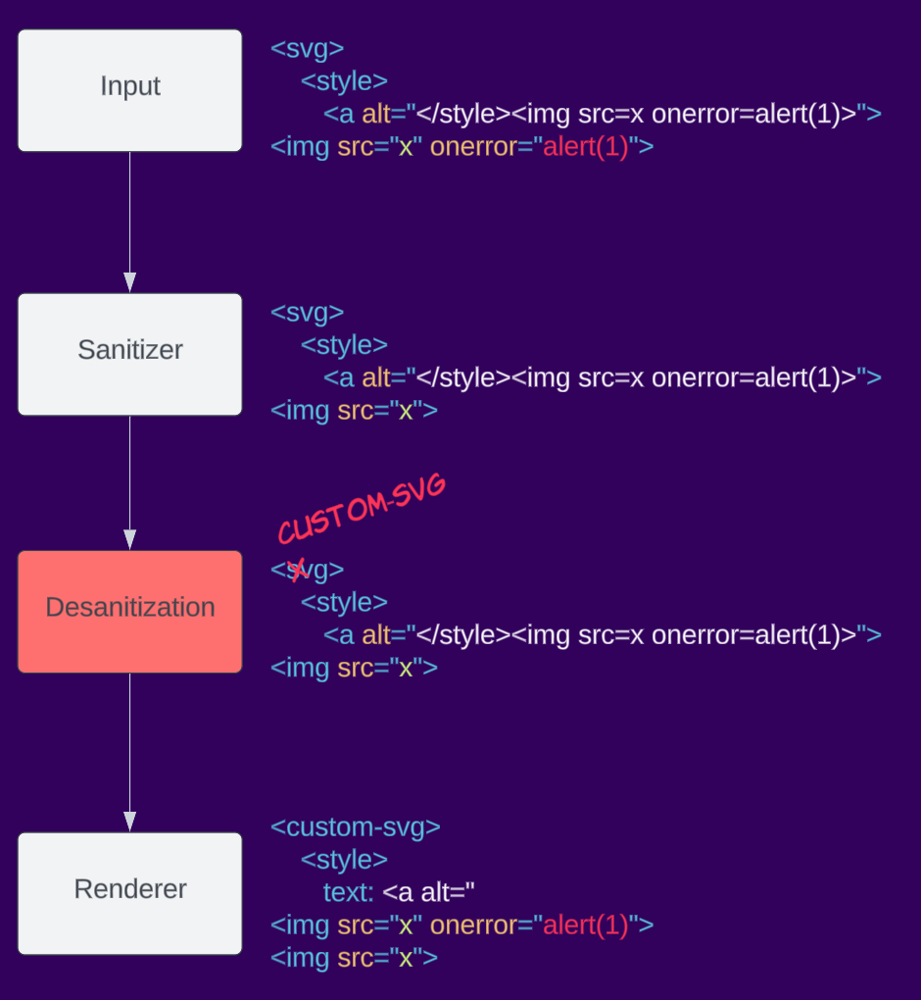
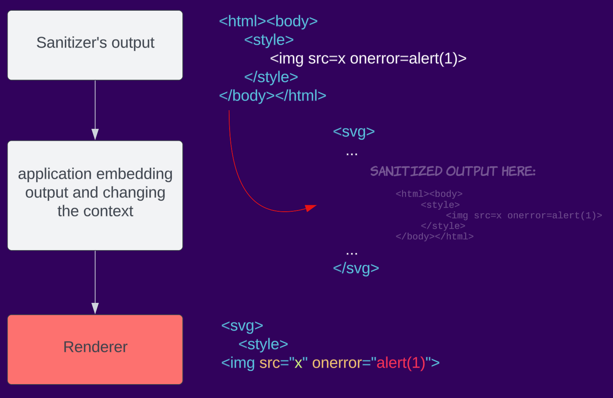

# mXSS: The Vulnerability Hiding in Your Code


```cardlink
url: https://www.youtube.com/watch?v=aczTceXp49U
title: "MXSS Explained: Server Side HTML Sanitizers are Doomed to Fail with this XSS!"
description: "XSS has been around forever, but Mutation XSS (MXSS) makes it even trickier to stop even with all the defenses! In this video, we’ll break down why server-si..."
host: www.youtube.com
favicon: https://www.youtube.com/s/desktop/ba56c95d/img/logos/favicon_32x32.png
image: https://i.ytimg.com/vi/aczTceXp49U/maxresdefault.jpg
```

In recent years, the mutation class of XSS has become feared for bypassing sanitizers, such as DOMPurify, Mozilla bleach, Google Caja, and more… [](https://read.readwise.io/read/01jn6d870db955qrzv31fa5egb)

To make things easier, we've developed an [mXSS cheatsheet](https://sonarsource.github.io/mxss-cheatsheet/) [](https://read.readwise.io/read/01jn6dgnqz5fmjege07verzz9t)
*(We also explored this topic in our Insomnihack 2024 talk: [Beating The Sanitizer: Why You Should Add mXSS To Your Toolbox](https://www.youtube.com/watch?v=g3yzTQnIgtE).) [](https://read.readwise.io/read/01jn6d8gfw089pz049y5nrhnn0)*

>[!question]
>*But what is mXSS?*

## Background on sanitizers

The goal of an HTML sanitizer is to ensure that user-generated content, such as text input or data obtained from external sources, does not pose any security risks or disrupt the intended functionality of a website. [](https://read.readwise.io/read/01jn6daxk00zq8vmb94adh0rts)

One of the main challenges in implementing an HTML sanitizer lies in the complex nature of HTML itself. HTML is a versatile language with a wide range of elements, attributes, and potential combinations that can affect the structure and behavior of a webpage. Parsing and analyzing HTML code accurately while preserving its intended functionality can be a daunting task. [](https://read.readwise.io/read/01jn6db8vdap5nf28fbqdjc1n4)

### Understand HTML, mutations, and parsing

Understanding HTML's structure and how it works is crucial since mXSS (aka mutation Cross-Site Scripting) attacks utilize quirks and intricacies of [HTML](../../Dev,%20ICT%20&%20Cybersec/Dev,%20scripting%20&%20OS/HTML.md). [](https://read.readwise.io/read/01jn6dbwkhddpy6m9x70r0fxnf) 

HTML can tolerate broken markup how is this relevant?

The M in mXSS stands for “[Mutation](../../Dev,%20ICT%20&%20Cybersec/Dev,%20scripting%20&%20OS/HTML.md#Mutation)”. mXSS takes advantage of this behavior in order to bypass sanitization.

HTML5 introduced new ways to integrate specialized content within web pages. Two key examples are the `<svg>` and `<math>` elements. These elements leverage distinct namespaces, meaning they follow [different parsing rules](../../Dev,%20ICT%20&%20Cybersec/Dev,%20scripting%20&%20OS/HTML.md#Different%20content%20parsing%20types) compared to standard HTML. [](https://read.readwise.io/read/01jn6dqcrscbc2t5rtwhk3xmcw)

## From Mutations to Vulnerabilities

 Often times the mXSS term is used in a broad way when covering various sanitizer bypasses. For better understanding, we will split the general term “mXSS” into 4 different subcategories: [](https://read.readwise.io/read/01jn6e0bbx93rxkbj8brxne2b8)

- Parser differentials
- Parsing round trip
- Desanization
- Context-dependent

### Parser differentials

Though parser differentials can be referred to as usual sanitizer bypass, sometimes it is referred to as mXSS. Either way, an attacker can take advantage of a parser mismatch between the sanitizer’s algorithm vs the renderer’s (e.g. browser). [](https://read.readwise.io/read/01jn6e2b1s1813h5hczenqnas1)

Let’s take for example the [noscript](https://html.spec.whatwg.org/multipage/scripting.html#the-noscript-element) element. [](https://read.readwise.io/read/01jn6e43sfrzsc5nnj0jy19s6t) Depending on whether JavaScript is disabled or enabled the body of the `noscript` element is rendered differently. It is logical that JavaScript would not be enabled in the sanitizer stage but will be in the renderer. This behavior is not wrong by definition but could cause [bypasses](https://checkmarx.com/blog/vulnerabilities-discovered-in-mozilla-bleach/) such as: `<noscript><style></noscript>` [](https://read.readwise.io/read/01jn6e4jypp95jv2jp898863b1)

JS not enabled:
```html
- #document
    - <html>
        - <head>
            - <noscript>
                - <style>
                    - #text: "</noscript>"
        - <body />
```

JS enabled:
```html
- #document
    - <html>
        - <head>
            - <noscript>
                - #text: "<style>"
        - <body>
            - 
```

Many other parser differentials, such as different HTML versions, content type mismatches, and more, could occur. [](https://read.readwise.io/read/01jn6e4qmwtapjd42xnwfe90nh)


### Parsing round trip

Parsing round trip is a well-known and [documented](https://html.spec.whatwg.org/multipage/parsing.html#serialising-html-fragments) phenomenon, that says: “It is possible that the output of this algorithm if parsed with an [HTML parser](https://html.spec.whatwg.org/multipage/parsing.html#html-parser), will not return the original tree structure. Tree structures that do not roundtrip a serialize and reparse step can also be produced by the [HTML parser](https://html.spec.whatwg.org/multipage/parsing.html#html-parser) itself, although such cases are typically non-conforming.” [](https://read.readwise.io/read/01jn6e5n3d963n12fstgd78g3j)

Meaning that according to the number of times we parse an HTML markup the resulting DOM tree could change. [](https://read.readwise.io/read/01jn6e5w86cbsa9naz93rg6xxd)

Attackers can use this behaviour to create namespace confusion between the sanitizer and the renderer resulting in bypasses such as:
 `<form><math><mtext></form><form><mglyph><style></math>`
 
 Credit [@SecurityMB](https://twitter.com/SecurityMB), covered in-depth [here](https://research.securitum.com/mutation-xss-via-mathml-mutation-dompurify-2-0-17-bypass/). [](https://read.readwise.io/read/01jn6ebz4sd55d6ayf1hbrd31k)

### Desanitization

Desanitization is a crucial mistake made by applications when interfering with the sanitizer’s output before sending it to the client, essentially undoing the work of the sanitizer. [](https://read.readwise.io/read/01jn6ect2hqtr85akznank1dww)

Here is an example of desanitization: [](https://read.readwise.io/read/01jn6epbqncs8wpr1c2vjzwtb5)



### Context-dependent

HTML parsing is complex and can be different depending on the context. For example, parsing a whole document is different from fragment parsing in Firefox. [](https://read.readwise.io/read/01jn6eqn314cafzgzgq2svmpg6)

Dealing with the change from sanitizing to rendering in the browser, developers might mistakenly change the context in which the data is rendered causing parsing differential and eventually bypassing the sanitizer. [](https://read.readwise.io/read/01jn6er48fv6fhn6c77bt1rajt)

For example, an application sanitizes an input, but when embedding it into the page, it encapsulates it in SVG, changing the context to an SVG namespace.
 


## mXSS Case Studies

- [Reply to calc: The Attack Chain to Compromise Mailspring (CVE-2023-47479)](https://www.sonarsource.com/blog/reply-to-calc-the-attack-chain-to-compromise-mailspring/)
- [Pitfalls of Desanitization: Leaking Customer Data from osTicket](https://www.sonarsource.com/blog/pitfalls-of-desanitization-leaking-customer-data-from-osticket/)
- [Code Vulnerabilities Put Proton Mails at Risk](https://www.sonarsource.com/blog/code-vulnerabilities-leak-emails-in-proton-mail/)
- [Remote Code Execution in Tutanota Desktop due to Code Flaw](https://www.sonarsource.com/blog/remote-code-execution-in-tutanota-desktop-due-to-code-flaw/)
- [Flatt Security XSS Challenge - Writeup](blig.one%20-%20Flatt%20Security%20XSS%20Challenge%20-%20Writeup.md)

