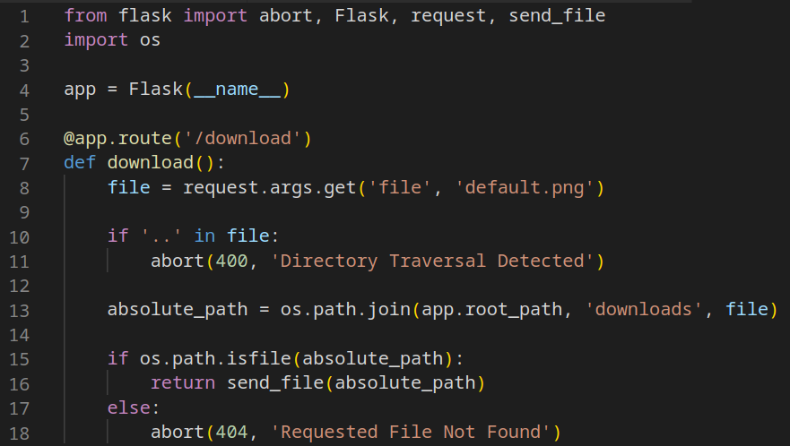

# `os.path.join()` bug

## Code

Ok, so after 2 "looks insecure but isn't" code examples I threw a curveball and gave you something that looks secure but actually contains a significant vulnerability.

 Even still, some people were convinced that directory traversal was possible. So far, nobody has come up with a PoC for that. As weird as it looks, r**ejecting file paths containing ".." is actually relatively strong at preventing traversal attacks, at least in Python.**
 
 Some users suggested that URL encoding, or double URL encoding would bypass this check. A single URL encoding pass would change literally nothing, since web servers automatically URL decode values prior to passing them to application code.
 
 While a double-URL encoding would indeed bypass the check, it would fail at line 15 when the constructed path is checked to see if a file exists on the filesystem. Since this path still contains URL encoded periods, no directory traversal actually occurs.
 
 However, plenty of people solved this correctly! 

## Bug 

 The flaw is the use of `os.path.join` to create the absolute path.
 Many people assume that `os.path.join` works in a similar way to a regular string `join` (concatenating each value with a delimiter). However, `os.path.join` has a quirk where **if any of the values provided to it is an absolute path, everything which came before it is dropped**.
 
 This means that:
-  `os.path.join("/root", "tmp")` -"/root/tmp"
-  `os.path.join("/root", "/tmp")` -"/tmp"
 
 Since we control the last value, we can actually just provide a full, absolute path to whatever we want to access:
 `/download?file=/etc/passwd`
 
 There are a few ways to avoid this vulnerability, but in Flask the best is probably using the `send_from_directory()` function instead of `send_file()`. This checks if the requested file actually exists in a specific directory before returning it to the user.
[View Tweet](https://twitter.com/0xTib3rius/status/1729534880336207918)

