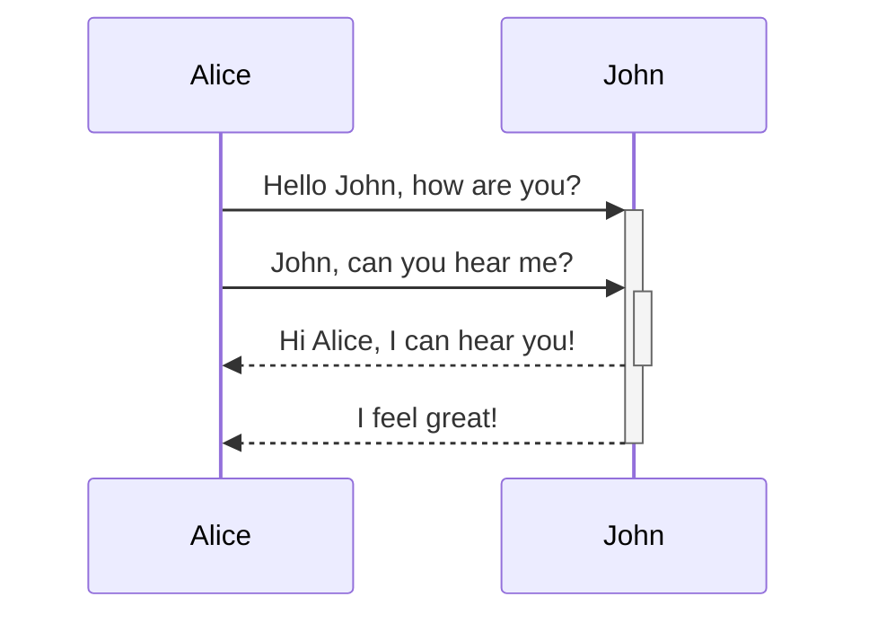

# Header 1
## Header 2
### Header 3
#### Header 4
##### Header 5
###### Header 6
---
## General fomratting
Bullet points:
- **Bold**
- *Italic*
	- ***Bold + Italic***
- ~~crossed~~ text

<mark style="background: #FFF3A3A6;">Yellow highlight</mark>
<mark style="background: #ADCCFFA6;">Blue highlight</mark>
<mark style="background: #ABF7F7A6;">Cyan highlight</mark>
<mark style="background: #FF5582A6;">Red highlight</mark>
<mark style="background: #FFB86CA6;">Orange highlight</mark>
<mark style="background: #FFB8EBA6;">Pink highlight</mark>
<mark style="background: #D2B3FFA6;">Purple highlight</mark>
<mark style="background: #CACFD9A6;">Grey highlight</mark>
<mark style="background: #BBFABBA6;">Green highlight</mark>

Number points:
1. Test
2. Test 
	1. Test 3
	2. Test 4
3. Test 5

Task list:
- [x] #tags, [links](), **formatting** supported
- [ ] list syntax required (any unordered or ordered list supported)
- [x] this is a complete item
- [?] this is also a complete item (works with every character)
- [ ] this is an incomplete item
- [ ] tasks can be clicked in Preview to be checked off

## Tags

```cardlink
url: https://help.obsidian.md/Editing+and+formatting/Tags
title: "Tags - Obsidian Help"
description: "Tags - Obsidian Help"
host: help.obsidian.md
favicon: https://publish-01.obsidian.md/access/f786db9fac45774fa4f0d8112e232d67/favicon.ico
```


#template #teamplate/nested-tag #teamplate/nested-second-tag


---
## Image and resized image


---
## Links
http://obsidian.md - automatic!
[Obsidian](http://obsidian.md)
---
## Block quotes, callouts and codes
> Human beings face ever more complex and urgent problems, and their effectiveness in dealing with these problems is a matter that is critical to the stability and continued progress of society.

\- Doug Engelbart, 1961

Text inside `backticks` on a line will be formatted like code.

```js 
function fancyAlert(arg) { if(arg) { $.facebox({div:'#foo'}) } } 
```
All supported language syntax: https://prismjs.com/#supported-languages

	Text indented with a tab is formatted like this, and will also look like a code block in preview. 

> [!note] 
> Lorem ipsum dolor sit amet

> [!abstract] 
> Aliases: `summary`, `tldr`

> [!info] 
> Lorem ipsum dolor sit amet

> [!todo] 
> Lorem ipsum dolor sit amet

> [!tip] 
>Aliases: `hint`, `important`

> [!done] 
> Aliases: `check`, `success`

> [!question] 
> Aliases: `help`, `faq`

> [!warning] 
> Aliases: `caution`, `attention`

> [!fail] 
> Aliases: `failure`, `missing`

> [!danger] 
> Aliases: `error`

> [!bug]
> Lorem ipsum dolor sit amet

> [!example]
> Lorem ipsum dolor sit amet

> [!quote] 
> Lorem ipsum dolor sit amet

> [!quote]- Custom titled callout closed by default
> Lorem ipsum dolor sit amet

---

## Footnotes
Here's a simple footnote,[^1] and here's a longer one.[^bignote]

[^1]: meaningful!

[^bignote]: Here's one with multiple paragraphs and code.

    Indent paragraphs to include them in the footnote.
    `{ my code }`
    Add as many paragraphs as you like.

---
## Tables

|First Header | Second Header|
|------------ | ------------|
|Content from cell 1 | Content from cell 2|
|Content in the first column | Content in the second column|

---
## Advanced
### Math
$$\begin{vmatrix}a & b\\ c & d \end{vmatrix}=ad-bc$$
You can also do inline math like $e^{2i\pi} = 1$ .

### Comments
%% Comments%%

%%
multi
line
comments
%%

### Diagram
Obsidian uses [Mermaid](https://mermaid-js.github.io/) to render diagrams and charts. Mermaid also provides [a helpful live editor](https://mermaid-js.github.io/mermaid-live-editor).  
Mermaid provides the following diagram types:

-   Flowchart
-   Sequence diagram
-   Class Diagram
-   State Diagram
-   Entity Relationship Diagram
-   User Journey
-   Gantt
-   Pie Chart
-   Requirement Diagram


---

## Embed
